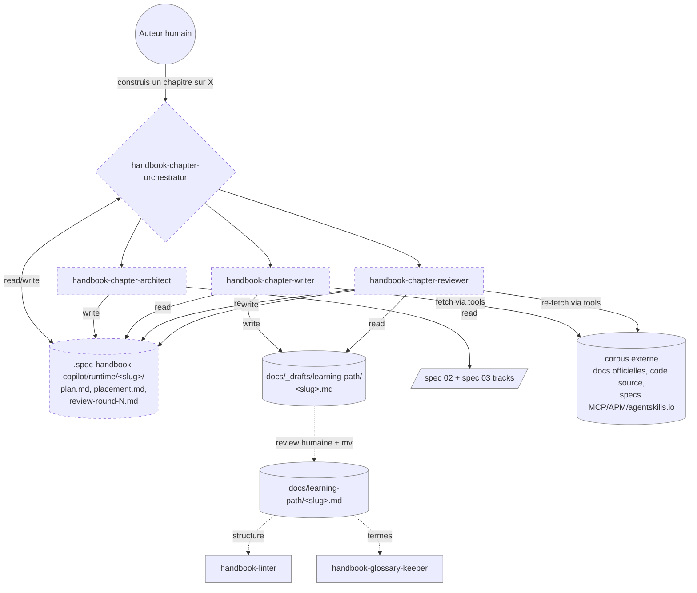
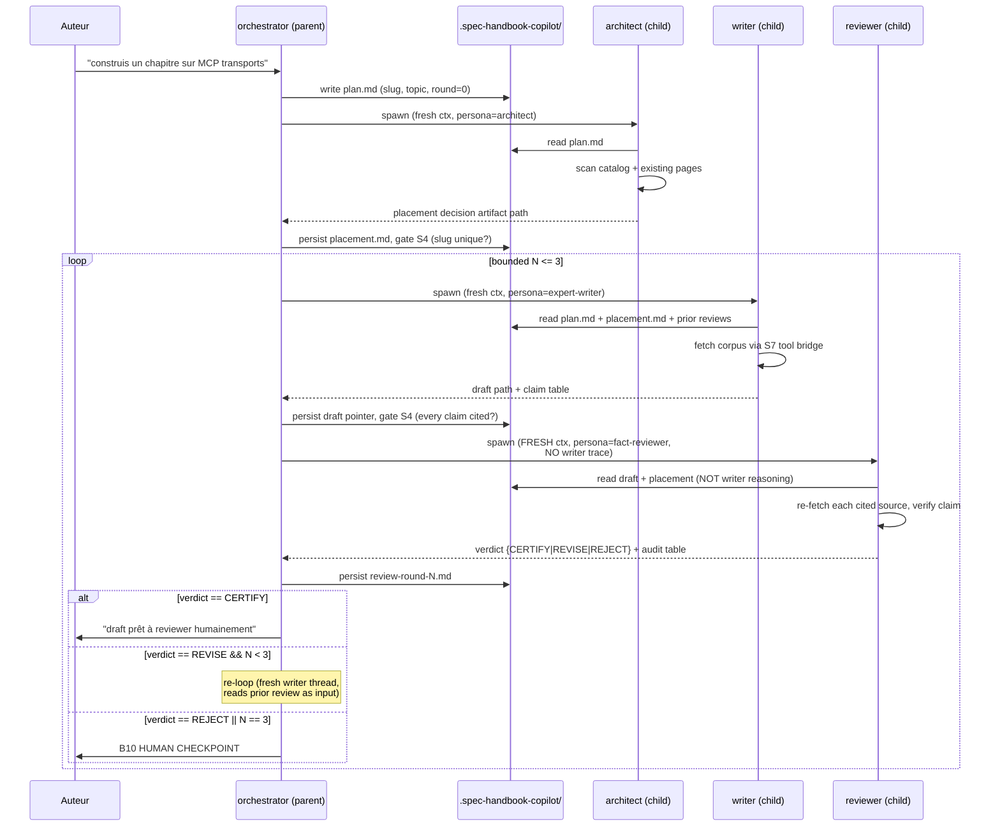
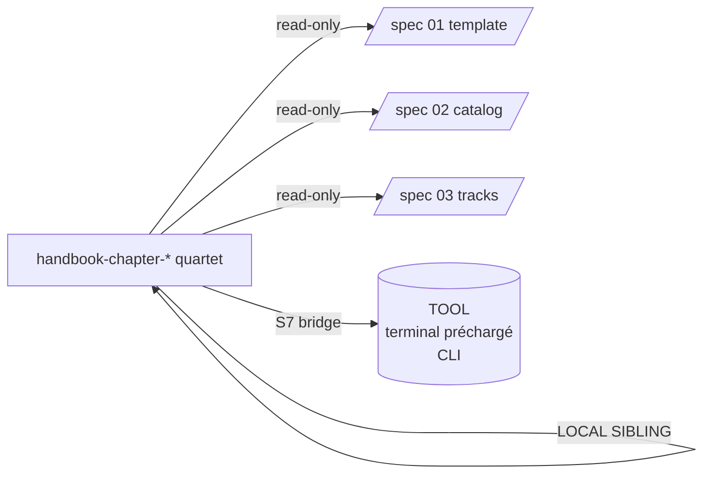

# Handbook Copilot — Genesis handoff packet

**Date** : 2026-05-27
**Source de vérité** : ce fichier. Toute exécution (étape 7+) recharge ce
plan avant chaque draft et après chaque spawn (truth #1, substrate
concept 6).
**Statut** : DESIGN END (étape 6). Aucun module rédigé. Le coder thread
prend la main à l'étape 7a.

---

## Step 1 — Intent + scope + dispatch descriptions

### Capacité utilisateur

Construire un handbook francophone pour développeurs où **chaque
chapitre est rédigé par un expert hyper-grounded ET expliqué
simplement**, **chaque fait est vérifié** contre une source citée, et
**chaque nouveau chapitre est placé au meilleur endroit** dans la
taxonomie existante (ordre de pré-requis, complexité, track).

### Frontière (ce qui N'EST PAS dans ce design)

- N'enseigne pas à l'apprenant final (c'est `copilot-mentor`,
  spec 07).
- N'audite pas la conformité structurelle (c'est `handbook-linter`,
  spec 14 — toujours valable en aval).
- Ne maintient pas le glossaire (c'est `handbook-glossary-keeper`,
  spec 16).
- Ne couvre pas l'ingestion de catalogues fixes (c'est
  `handbook-module-writer`, spec 13).

### Justification SoC vs specs 13-16

Les specs existantes couvrent : `module-writer` (catalogue figé),
`linter` (structure), `eval-builder` (evals d'agents publics),
`glossary-keeper` (glossaire). AUCUNE ne couvre :

1. **Placement** d'un sujet arbitraire dans la taxonomie.
2. **Grounding factuel** d'un expert (citations vérifiables).
3. **Fact-checking adversarial** indépendant.

R3 EXTRACT s'applique : extraire le concern « rédiger un chapitre
inédit » de `module-writer` (qui suppose une row de spec 02
préexistante) vers un pipeline dédié.

### Dispatch descriptions (FORCED, ≤1024 char)

#### `handbook-chapter-architect`

> Use when locating where a new handbook chapter should sit in the
> French Copilot handbook taxonomy before any drafting happens.
> Reads the modules catalog and tracks specs, scans existing pages
> under `docs/learning-path/`, then proposes either an INSERT
> position (between two existing modules), a REPLACE position
> (supersedes an outdated module), or a NEW-TRACK position (extends
> the catalog). Outputs a placement decision with rationale,
> pre-requisite chain, complexity rating, target word count, and
> the slug + path the writer must use. Activate on "où placer le
> chapitre sur X", "trouve la bonne position pour un module sur Y",
> "place un nouveau chapitre", or before invoking
> `handbook-chapter-writer` for a topic not in the catalog. Never
> writes to `docs/`; only emits a placement plan to
> `.spec-handbook-copilot/runtime/<slug>/placement.md`.

(927 caractères)

#### `handbook-chapter-writer`

> Use when drafting a French handbook chapter as a domain expert
> who explains simply. Loads a placement plan from
> `.spec-handbook-copilot/runtime/<slug>/placement.md`, then fetches the
> authoritative corpus for the topic (official docs, source code,
> specs) via real tool calls — never from training recall.
> Produces a draft in `docs/_drafts/learning-path/<slug>.md`
> following the 7-section template, with EVERY factual claim
> tagged by a citation block pointing to a fetched source.
> Calibrates voice: expert-level depth, beginner-accessible
> phrasing, progressive diffs over images. Activate on "rédige
> le chapitre sur X", "drafte le module sur Y avec sources",
> "écris la page handbook pour Z". Refuses if no placement plan
> exists for the slug. Never overwrites a published module.

(932 caractères)

#### `handbook-chapter-reviewer`

> Use when fact-checking a drafted handbook chapter before it
> ships. Loads the draft from `docs/_drafts/learning-path/` and
> the placement plan from `.spec-handbook-copilot/runtime/<slug>/`. For
> every cited claim, re-fetches the cited source independently and
> verifies the claim matches what the source actually says.
> Detects: unsupported assertions, cherry-picked quotes, outdated
> facts, version mismatches, pedagogical gaps (concepts used
> before introduction). Emits a verdict
> (CERTIFY / REVISE / REJECT) plus a per-claim audit table to
> `.spec-handbook-copilot/runtime/<slug>/review-round-N.md`. Activate on
> "review le chapitre X", "fact-check le draft Y", "valide
> module Z avant publication". Never edits the draft itself.

(881 caractères)

#### `handbook-chapter-orchestrator`

> Use when producing a brand-new handbook chapter end-to-end from
> a topic prompt. Drives the placement → write → review pipeline,
> persists the plan and state under
> `.spec-handbook-copilot/runtime/<slug>/`, gates between stages on
> deterministic checks, and runs a bounded alignment loop
> (max 3 rounds) between writer and reviewer until verdict is
> CERTIFY. Escalates to human checkpoint when rounds exhaust or
> reviewer rejects. Activate on "construis un chapitre sur X",
> "ajoute un module handbook sur Y", "produis la page handbook
> pour Z". This is the only dispatch entry point users should
> need; the three sub-agents are invoked from here, not directly.

(773 caractères)

### Invocation modes

| Agent | Mode | Caller |
|---|---|---|
| `handbook-chapter-orchestrator` | DISCOVERY | utilisateur |
| `handbook-chapter-architect` | FORCED (sub) | orchestrator |
| `handbook-chapter-writer` | FORCED (sub) | orchestrator |
| `handbook-chapter-reviewer` | FORCED (sub) | orchestrator |

---

## Step 2 — Component diagram



---

## Step 3 — Thread / sequence diagram



Single-writer interlock : seul `orchestrator` écrit dans
`.spec-handbook-copilot/runtime/<slug>/`. Les enfants écrivent leurs
artefacts dans leurs propres fichiers nommés ; l'orchestrator
agrège.

---

## Step 3.1 — Tradeoff check

Tension résolue : panel multi-lentilles (un fact-checker + un cold
reader pédago en parallèle) vs reviewer unique. Choix = **reviewer
unique fact-checker** + cold-reader pédagogique délégué à l'humain
(via `handbook-linter` aval + review humaine de merge). Justification
(matrice `pattern-tradeoffs.md` #2 « gate types ») : le fact-check
exige un re-fetch déterministe ; ajouter un second reviewer pédago
en parallèle ne réduit pas l'erreur factuelle et complique
l'arbitrage. La pédagogie est gated par l'humain au merge, pas par
l'agent. Si l'usage révèle des dérives pédagogiques systémiques,
escalader vers A1 PANEL en R3 EXTRACT futur.

---

## Step 3.5 — Composition decision

| Module | Mode | Justification |
|---|---|---|
| `handbook-chapter-orchestrator` | INLINE (agent file) | Body < 200 lignes ; pas de réutilisation cross-project |
| `handbook-chapter-architect` | LOCAL SIBLING | Concern isolé, spawn child thread frais |
| `handbook-chapter-writer` | LOCAL SIBLING | Idem ; persona expert distincte |
| `handbook-chapter-reviewer` | LOCAL SIBLING | Idem ; fresh-context obligatoire (A7) |
| Gabarit de chapitre (spec 01) | EXTERNAL via lecture | Déjà existant, source de vérité ailleurs |
| Catalog (spec 02) | EXTERNAL via lecture | Idem ; lu par architect uniquement |
| Outils de fetch (curl, gh, etc.) | TERMINAL préchargé | S7 EXTENSION PATH : terminal préchargé ; pas besoin de CLI custom |



Pas d'EXTERNAL MODULE déclaré → **aucun adapter de module-system
requis à l'étape 7b**.

---

## Step 4 — SoC pass

| Module | Concern unique | Anti-overlap vérifié |
|---|---|---|
| orchestrator | Séquencer + persister état | Ne fetch pas, ne rédige pas |
| architect | Décider placement | N'écrit pas dans `docs/`, ne rédige pas le chapitre |
| writer | Rédiger avec citations | Ne décide pas la place, ne juge pas ses propres faits |
| reviewer | Vérifier chaque fait contre source citée | N'édite jamais le draft |

R-pattern triggers : aucun déclenchement (pas de body multi-lens,
pas de conjonction « and » dans les descriptions, pas de
co-invocation systématique non-orchestrée).

Dispatch-collision check vs specs 13-16 :

- `module-writer` (spec 13) : déclenche sur « drafte module N » d'un
  catalogue fixe. Le nouveau `chapter-writer` déclenche sur
  « rédige le chapitre sur X » (sujet libre). Frontière nette.
- `linter` (spec 14) : structure. `reviewer` ici : faits. Disjoint.
- `eval-builder` / `glossary-keeper` : domaines orthogonaux.

Pas de FUSE candidat (lentilles distinctes). Pas de PHANTOM
DEPENDENCY (tout est LOCAL SIBLING).

---

## Step 5 — Compliance check

| Axe | Statut |
|---|---|
| PROSE Progressive Disclosure | OK (corpus chargé lazy par writer) |
| PROSE Reduced Scope | OK (4 agents, 1 concern chacun) |
| PROSE Orchestrated Composition | OK (orchestrator = facade S3) |
| PROSE Safety Boundaries | OK (S4 entre stages, B10 sortie de boucle) |
| PROSE Explicit Hierarchy | OK (single-writer interlock) |
| Truth #1 attention decay | OK (B8 ATTENTION ANCHOR via reload plan) |
| Truth #2 context explicit | OK (artefacts persistés, pas de mémoire tacite) |
| Truth #5 plan before exec | OK (ce packet existe avant tout draft) |
| Truth #6 harness bridge | OK (S7 pour fetch corpus) |
| MODULE ENTRYPOINT `name` regex | OK (4 noms en kebab-case, ≤64 char) |
| MODULE ENTRYPOINT description ≤1024 | OK (927/932/881/773) |
| Body budget ≤500 lignes / ≤5000 tokens | À VÉRIFIER en step 8 |
| ASCII only | OK (vérifier au draft) |

Aucun BLOCKER. Aucun HIGH ouvert.

---

## Step 6 — Handoff packet (cette section)

### Interface sketch par module

#### `handbook-chapter-orchestrator`

- **In** : prompt utilisateur nommant un sujet.
- **Out** : draft validé dans `docs/_drafts/` + état complet sous
  `.spec-handbook-copilot/runtime/<slug>/`.
- **Deps** : invoke architect, writer, reviewer ; read/write
  `.spec-handbook-copilot/`.
- **Tools** : `read_file`, `create_file`, `replace_string_in_file`,
  spawn sub-agents.

#### `handbook-chapter-architect`

- **In** : `plan.md` contenant le sujet et l'objectif pédagogique.
- **Out** : `placement.md` avec slug, position (INSERT/REPLACE/
  NEW-TRACK), pré-requis, complexité, word count cible,
  justification.
- **Deps** : lecture spec 02, spec 03, scan `docs/learning-path/`.
- **Tools** : `read_file`, `file_search`, `grep_search`.

#### `handbook-chapter-writer`

- **In** : `plan.md` + `placement.md` + (optionnel)
  `review-round-{N-1}.md`.
- **Out** : `docs/_drafts/learning-path/<slug>.md` + claim table
  inline dans le draft (chaque assertion = lien vers source).
- **Deps** : S7 bridge (terminal préchargé pour curl/gh/grep sur
  corpus).
- **Tools** : `read_file`, `create_file`, `run_in_terminal`
  (fetch), `fetch_webpage`.

#### `handbook-chapter-reviewer`

- **In** : draft + `placement.md` (PAS les notes du writer).
- **Out** : `review-round-N.md` avec verdict + audit table par
  claim (claim / source citée / source ré-fetched / verdict
  ligne).
- **Deps** : S7 bridge identique au writer (re-fetch
  indépendant).
- **Tools** : `read_file`, `create_file`, `run_in_terminal`,
  `fetch_webpage`.

### Module composition table

(Voir step 3.5 ci-dessus.)

### External modules required

**Aucun.** Tous les agents sont LOCAL SIBLING. Pas d'adapter
module-system à charger à l'étape 7b.

### Declared target set

`common-only`. Aucun affordance per-harness justifié. La portabilité
sera vérifiée à l'étape 7a avant tout draft.

### Layout fichiers

```
.github/agents/
  handbook-chapter-orchestrator.agent.md   (nouveau)
  handbook-chapter-architect.agent.md      (nouveau)
  handbook-chapter-writer.agent.md         (nouveau)
  handbook-chapter-reviewer.agent.md       (nouveau)
  handbook-module-writer.agent.md          (existant, conservé)
  handbook-linter.agent.md                 (existant, conservé)
  handbook-eval-builder.agent.md           (existant, conservé)
  handbook-glossary-keeper.agent.md        (existant, conservé)

.spec-handbook-copilot/                    (VERSIONNÉ dans git)
  2026-05-27-initial-design/
    plan.md                                (ce fichier — design global daté)
  YYYY-MM-DD-<change>/                     (futures itérations du design)
    plan.md
  runtime/<slug>/                          (état d'exécution par chapitre)
    plan.md                                (état d'un chapitre)
    placement.md                           (sortie architect)
    review-round-1.md                      (sortie reviewer R1)
    review-round-2.md                      (sortie reviewer R2)
    review-round-3.md                      (sortie reviewer R3)
```

`.spec-handbook-copilot/` est **versionné dans git** (décidé
2026-05-27) pour permettre revue en PR de chaque itération de
design ET trace complète de chaque pipeline d'exécution (placement
+ rounds de review). Chaque nouvelle itération du design ouvre un
sous-dossier daté `YYYY-MM-DD-<change>/`. L'exécution runtime
écrit sous `runtime/<slug>/`, séparé des artefacts de design.

### Evals plan

#### Content evals (3 fixtures, jouées with_skill vs without_skill)

1. « Construis un chapitre sur les MCP transports (stdio vs HTTP) »
   → attendu : placement après module 06 ; draft cite la spec
   modelcontextprotocol.io ; verdict CERTIFY en ≤ 2 rounds.
2. « Ajoute un chapitre sur les hooks Claude Code »
   → attendu : placement NEW-TRACK (hors track Copilot) OU REJECT
   au stade architect (hors scope du handbook Copilot).
3. « Rédige un module sur les regex en Python »
   → attendu : REJECT au stade architect (hors scope handbook
   Copilot), pas de draft généré.

Si `with_skill` et `without_skill` produisent des chapitres
indistinguables sur fixture 1, redesign : la valeur ajoutée est le
grounding factuel + le fact-check, pas la prose.

#### Trigger evals (~20, split 60/40 train/val)

Should-trigger (orchestrator) :
- « construis un chapitre sur X »
- « ajoute un module handbook sur Y »
- « produis la page handbook pour Z »
- « j'ai besoin d'un chapitre sur les agents APM »
- « écris-moi un module sur les workflows GH Actions agentic »

Should-NOT-trigger :
- « explique-moi les skills » → `copilot-mentor` (spec 07)
- « drafte le module 03 » → `handbook-module-writer` (spec 13, row
  fixe du catalogue)
- « audite le module 7 » → `handbook-linter` (spec 14)
- « ajoute X au glossaire » → `handbook-glossary-keeper` (spec 16)

Ship gate : ≥ 0.5 rate sur should-trigger validation split,
< 0.5 sur should-NOT-trigger.

### Compliance findings ouverts

Aucun. Step 5 clean.

### TODO list (steps 7-8, à exécuter par le coder thread)

- [ ] **7a** Portability check : charger
      `runtime-affordances/common.md` ; vérifier que spawn
      sub-agents + fresh-context + file persistence + terminal
      tool-call sont tous common. Si oui → cible `common-only`
      confirmée, pas d'adapter per-harness.
- [ ] **7b.1** Drafter `handbook-chapter-orchestrator.agent.md`
      (RELOAD ce plan avant).
- [ ] **7b.2** Drafter `handbook-chapter-architect.agent.md`
      (RELOAD ce plan).
- [ ] **7b.3** Drafter `handbook-chapter-writer.agent.md`
      (RELOAD ce plan ; inclure persona GROUNDED EXPERT BRIEFING
      avec corpus pointers explicites).
- [ ] **7b.4** Drafter `handbook-chapter-reviewer.agent.md`
      (RELOAD ce plan ; insister FRESH CONTEXT + WARM-CONTEXT
      anti-pattern à proscrire dans la procédure).
- [ ] **7b.5** Confirmer que `.spec-handbook-copilot/` est bien
      versionné (décidé 2026-05-27 : OUI, dans git, sous-dossiers
      datés pour design + `runtime/<slug>/` pour exécution).
- [ ] **8a** Lint chaque `.agent.md` : description ≤ 1024,
      ASCII, body ≤ 500 lignes / 5000 tokens, `name` matche le
      nom de fichier.
- [ ] **8b** Vérifier qu'aucun module n'inline les autres (S1
      COMPOSED MODULE, pas de hidden coupling).
- [ ] **8c** Run 3 content evals + ~20 trigger evals ; ship gate
      validation passe.
- [ ] **8d** REAL-TASK REFINEMENT : exécuter le pipeline sur
      fixture 1 (chapitre MCP transports), capturer la trace,
      réviser ce plan depuis ce qui s'est réellement passé.

### Dépendances entre todos

7a → 7b.* (en parallèle entre eux après 7a) → 8a (en parallèle par
fichier) → 8b → 8c → 8d.

---

## DESIGN ENDS HERE.

Le coder thread (étape 7) recharge ce fichier AVANT chaque draft
de module et après chaque retour de sub-agent. Tout écart par
rapport à ce packet est traité comme un bug du draft, pas comme
une amélioration.
