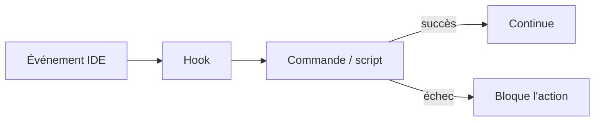

# 105 — Hooks — automatismes événementiels

**Durée** : 30 min · **Complexité** : ⭐⭐ · **Pré-requis** : [Module 103 — Skills](./103-skills.md)

> Un *skill* se déclenche quand tu le demandes. Un *hook* se déclenche quand un *événement* se produit — sans que tu aies à y penser.

## Pourquoi ce module

Tu sais créer des skills qui s'activent conditionnellement. Mais certaines tâches doivent s'exécuter *systématiquement* à chaque sauvegarde, chaque commit ou après chaque appel d'outil — sans que tu aies besoin de le demander dans le chat.

Un `hook` résout ce problème. C'est une commande ou un script que Copilot exécute automatiquement en réponse à un événement IDE. À la fin de ce module, tu sais :

- expliquer ce qu'est un hook et en quoi il diffère d'un `skill` et d'une instruction ;
- configurer les trois types de hooks : `onSave`, `preCommit`, `postToolUse` ;
- placer tes hooks dans `.github/hooks/` pour les partager avec l'équipe ;
- vérifier qu'un hook se déclenche bien sur son événement, sans intervention manuelle.

## Pré-requis

- [Module 103 — Skills](./103-skills.md)
- VS Code avec l'extension GitHub Copilot activée.
- Un dépôt Git avec au moins un fichier source.

## Concepts clés

### Qu'est-ce qu'un hook ?

Un *hook* est un automatisme événementiel. Contrairement à un *skill* (activé par le routeur sémantique en réponse à ta demande), un hook s'exécute *automatiquement* quand un événement précis se produit dans l'IDE. Aucune interaction dans le *chat* n'est nécessaire.

Le principe tient en deux mots :

- **Événement** — quelque chose se passe (fichier sauvegardé, commit déclenché, outil appelé).
- **Réaction** — une commande s'exécute immédiatement, sans intervention.



### Les trois types de hooks

| Hook | Événement déclencheur | Cas d'usage typique |
|---|---|---|
| `onSave` | Un fichier est sauvegardé | Linter, formateur, vérification de types |
| `preCommit` | Un commit est sur le point d'être créé | Validation du message, vérification des tests |
| `postToolUse` | Un *tool* Copilot a terminé son exécution | Validation du résultat, formatage, nettoyage |

#### `onSave`

Le hook `onSave` s'exécute chaque fois qu'un fichier est sauvegardé. C'est le point d'entrée le plus simple pour un premier hook.

```json
{
  "github.copilot.chat.codeGeneration.hooks": {
    "onSave": ["npx eslint --fix ${file}"]
  }
}
```

La variable `${file}` est remplacée par le chemin du fichier sauvegardé. Le hook exécute le linter sur ce fichier à chaque Ctrl+S.

#### `preCommit`

Le hook `preCommit` s'exécute *avant* qu'un commit ne soit finalisé. Si la commande échoue (code de retour non nul), le commit est bloqué.

```json
{
  "github.copilot.chat.codeGeneration.hooks": {
    "preCommit": ["npx commitlint --edit"]
  }
}
```

#### `postToolUse`

Le hook `postToolUse` s'exécute après qu'un *tool* Copilot (comme `replace_string_in_file` ou `create_file`) a terminé son travail. C'est le hook le plus avancé — il permet de valider ou transformer le résultat d'un outil automatiquement.

```json
{
  "github.copilot.chat.codeGeneration.hooks": {
    "postToolUse": ["npx prettier --write ${file}"]
  }
}
```

Tout fichier modifié par un outil passe par Prettier sans que tu aies à le demander.

### Placement et partage

Les hooks se configurent dans `.vscode/settings.json` sous la clé `github.copilot.chat.codeGeneration.hooks`. Puisque ce fichier est versionné, chaque membre de l'équipe bénéficie des mêmes automatismes.

Pour des hooks plus complexes, externalise la logique dans des scripts versionnés :

```text
.github/
  hooks/
    on-save.sh
    pre-commit.sh
```

Référence ensuite le script dans la configuration :

```json
{
  "github.copilot.chat.codeGeneration.hooks": {
    "onSave": [".github/hooks/on-save.sh ${file}"]
  }
}
```

L'avantage : le script est testable, réutilisable et peut contenir de la logique conditionnelle (linter différent selon l'extension du fichier, par exemple).

### Hook vs skill vs instruction

| Critère | Instruction | Skill | Hook |
|---|---|---|---|
| Déclenchement | Toujours chargé | Routeur sémantique | Événement IDE |
| Intervention humaine | Non | Oui (`prompt`) | Non |
| Nature | Règle permanente | Procédure conditionnelle | Automatisme événementiel |
| Exemple | « Utilise vitest » | « Rédige un commit message » | « Lint au save » |

**Règle simple** : si l'action doit se produire *à chaque occurrence d'un événement*, c'est un hook. Si elle doit se produire *quand l'utilisateur le demande*, c'est un `skill`. Si elle doit s'appliquer en permanence comme contexte, c'est une [instruction](./101-instructions.md).

## Mise en pratique

### Étape 1 — Un premier hook `onSave`

Ajoute un hook qui exécute ESLint sur chaque fichier sauvegardé :

```diff
+ // .vscode/settings.json
+ {
+   "github.copilot.chat.codeGeneration.hooks": {
+     "onSave": ["npx eslint --fix ${file}"]
+   }
+ }
```

Sauvegarde un fichier TypeScript contenant une erreur de lint. Le hook doit corriger l'erreur automatiquement.

### Étape 2 — Ajouter un hook `preCommit`

Complète la configuration avec la validation du message de commit :

```diff
  // .vscode/settings.json
  {
    "github.copilot.chat.codeGeneration.hooks": {
      "onSave": ["npx eslint --fix ${file}"],
+     "preCommit": ["npx commitlint --edit"]
    }
  }
```

Tente un commit avec le message « wip ». Si `commitlint` est configuré pour imposer Conventional Commits, le hook bloque le commit.

### Étape 3 — Un hook `postToolUse` pour le formatage

Ajoute un hook qui formate automatiquement tout fichier modifié par Copilot :

```diff
  // .vscode/settings.json
  {
    "github.copilot.chat.codeGeneration.hooks": {
      "onSave": ["npx eslint --fix ${file}"],
      "preCommit": ["npx commitlint --edit"],
+     "postToolUse": ["npx prettier --write ${file}"]
    }
  }
```

Demande à Copilot de créer un nouveau fichier. Une fois le fichier créé, Prettier s'applique automatiquement — sans que tu aies à le demander dans le *chat*.

### Étape 4 — Externaliser dans un script

Pour un hook conditionnel, externalise la logique :

```diff
+ #!/usr/bin/env bash
+ # .github/hooks/on-save.sh
+ set -euo pipefail
+
+ FILE="$1"
+ EXTENSION="${FILE##*.}"
+
+ case "$EXTENSION" in
+   ts|tsx) npx eslint --fix "$FILE" && npx prettier --write "$FILE" ;;
+   css|scss) npx stylelint --fix "$FILE" ;;
+   md) npx markdownlint --fix "$FILE" ;;
+ esac
```

Puis référence-le dans la configuration :

```diff
  {
    "github.copilot.chat.codeGeneration.hooks": {
-     "onSave": ["npx eslint --fix ${file}"],
+     "onSave": [".github/hooks/on-save.sh ${file}"],
      "preCommit": ["npx commitlint --edit"],
      "postToolUse": ["npx prettier --write ${file}"]
    }
  }
```

## Pièges et anti-patterns

- **Hook trop lent** — Un hook `onSave` qui lance une suite de tests complète bloque l'éditeur à chaque sauvegarde. Garde les hooks rapides (moins de 2 secondes). Pour les validations lourdes, préfère `preCommit`.
- **Hook silencieux qui échoue** — Si ton script ne gère pas les erreurs (`set -euo pipefail` manquant), un échec passe inaperçu. Assure-toi que les erreurs sont visibles dans le terminal.
- **Duplication avec les hooks Git natifs** — Si tu as déjà un `.git/hooks/pre-commit` (ou Husky / lint-staged) qui fait la même chose que ton hook Copilot `preCommit`, la commande s'exécute deux fois. Choisis un seul mécanisme.
- **Hook qui modifie la logique** — Un `postToolUse` qui reformate agressivement peut casser le résultat d'un outil. Limite les hooks post-outil au formatage cosmétique (indentation, espaces en fin de ligne), pas à la réécriture de logique.
- **Trop de hooks** — Chaque hook ajoute de la latence. Trois hooks bien ciblés valent mieux que dix hooks génériques.

## Exercice ⭐⭐

**Énoncé** — Configure deux hooks dans un projet existant :

1. Un hook `onSave` qui exécute un linter sur le fichier sauvegardé.
2. Un hook `preCommit` qui valide le format du message de commit.

**Étapes guidées** :

1. Ouvre un projet avec ESLint et `commitlint` configurés (ou installe-les : `npm i -D eslint @commitlint/cli @commitlint/config-conventional`).
2. Ajoute la configuration des hooks dans `.vscode/settings.json` sous la clé `github.copilot.chat.codeGeneration.hooks`.
3. Introduis volontairement une erreur de lint dans un fichier TypeScript et sauvegarde-le — vérifie que le hook corrige l'erreur.
4. Tente un commit avec un message qui ne respecte pas Conventional Commits — vérifie que le hook bloque le commit.
5. Corrige le message et vérifie que le commit passe.

**Critère de réussite** : les deux hooks se déclenchent automatiquement sur leur événement respectif, sans intervention dans le `chat`.

## Validation

Tu peux passer au module suivant si :

- [ ] Ton projet contient au moins un hook configuré dans `.vscode/settings.json`.
- [ ] Le hook `onSave` se déclenche à chaque sauvegarde et exécute la commande attendue.
- [ ] Le hook `preCommit` bloque un commit invalide et laisse passer un commit valide.
- [ ] Tu sais expliquer la différence entre un hook, un `skill` et une instruction en une phrase chacun.

## Pour aller plus loin

- [Module 103 — Skills](./103-skills.md) : les skills s'activent sur demande — les hooks s'activent sur événement. Les deux sont complémentaires.
- [Module 209 — Plugins](../02-composition/209-plugins.md) : les plugins peuvent embarquer des hooks pré-configurés pour une équipe.
- [Module 208 — Workflows](../02-composition/208-workflows.md) : combiner hooks + skills + agents dans un flux orchestré.
- [Module 313 — Tester ses primitives](../03-ingenierie-de-contexte/313-evals.md) : tester qu'un hook se déclenche correctement avec des evals binaires.

## Sources

- [GitHub Copilot — Customizing agent mode](https://docs.github.com/en/copilot/customizing-copilot/customizing-agent-mode) — documentation officielle sur la configuration des hooks.
- [VS Code — Workspace settings](https://code.visualstudio.com/docs/getstarted/settings) — référence sur `.vscode/settings.json`.
- [Conventional Commits](https://www.conventionalcommits.org/) — spécification utilisée dans les exemples `preCommit`.

## Module suivant

**Suivant** : [106 — MCP — extensions outils](./106-mcp.md)
