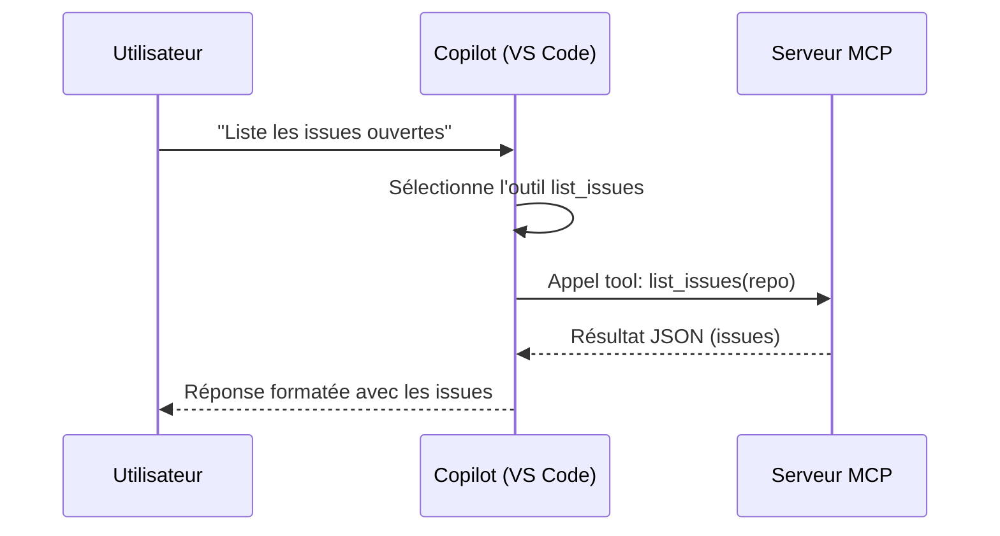

# 106 — MCP — extensions outils

Durée estimée : 90 min

> Un `skill` dit à Copilot *comment* procéder. Un serveur `MCP` lui donne un *outil exécutable* qu'il peut appeler pour obtenir de vraies données.

## Pourquoi ce module

Dans les modules précédents, tu as appris à guider Copilot avec des instructions, des skills et des agents. Ces primitives contrôlent ce que le modèle *dit* — elles influencent sa logique, son ton, sa structure. Mais elles ne lui donnent pas accès à des données extérieures ni la capacité d'agir sur des systèmes tiers.

Imagine que tu veuilles demander à Copilot de lister les issues ouvertes de ton dépôt GitHub, de lire un fichier distant, ou de vérifier l'état d'une page web. Aucun skill ne peut faire cela : un skill est une procédure textuelle, pas un pont vers une API. Il manque un mécanisme pour connecter Copilot à des outils *exécutables*.

C'est le rôle de *MCP* (*Model Context Protocol*). MCP est un protocole ouvert qui permet à un client (ici VS Code) de communiquer avec des serveurs d'outils. Chaque serveur expose une liste de `tool` que Copilot peut appeler pendant une conversation. Le modèle décide quand appeler un outil, formule la requête, reçoit la réponse, et l'intègre dans sa réponse finale.

À la fin de ce module, tu sais :

- Expliquer ce qu'est MCP et pourquoi il complète les skills.
- Configurer un serveur MCP dans VS Code via `mcp.json`.
- Connecter des serveurs courants (GitHub, filesystem, fetch).
- Appliquer les bonnes pratiques de sécurité (permissions, secrets).
- Choisir entre MCP et skill selon le besoin.
- Évaluer le coût d'un outil MCP par rapport à un appel CLI natif.

:::danger Risque de cybersécurité
Un serveur MCP est un **processus exécutable** qui tourne sur ta machine (ou sur un serveur distant) avec les permissions que tu lui accordes. Contrairement à un skill — qui n'est que du texte et dont les capacités dépendent uniquement des outils que tu as accepté de donner à l'agent — un serveur MCP **s'exécute en dehors du périmètre de Copilot**. Il peut :

- lire et écrire des fichiers sur ton système ;
- exécuter des commandes arbitraires ;
- envoyer des données vers des serveurs tiers ;
- exfiltrer des secrets injectés via les variables d'environnement.

Un skill ne peut rien faire de tout cela : il guide le raisonnement de Copilot, mais Copilot reste contraint par la liste d'outils (`tools`) que tu as configurée dans l'agent. Un serveur MCP, lui, possède ses propres permissions — indépendamment de ce que tu autorises côté Copilot.

**Ne connecte jamais un serveur MCP que tu n'as pas audité.** Privilégie les serveurs officiels (`@modelcontextprotocol/*`, `@anthropic/*`) et vérifie le code source avant d'utiliser un serveur communautaire. En cas de doute, **ne l'utilise pas** — un skill ou un appel CLI natif est presque toujours une alternative plus sûre.
:::

## Pré-requis

- [Module 104 — Agents personnalisés](./104-agents.md)
- VS Code avec l'extension GitHub Copilot activée.
- Node.js installé (v18+ recommandé).
- Un dépôt GitHub avec au moins quelques issues ouvertes (pour l'exercice).
- Un `token` GitHub avec le scope `repo` (tu en créeras un si nécessaire).

## Concepts clés

### Qu'est-ce que MCP ?

*MCP* (*Model Context Protocol*) est un protocole standardisé qui connecte un modèle de langage à des sources de données et des outils externes. Le principe est simple : un **serveur MCP** expose des outils via une interface normalisée, et un **client MCP** (VS Code) les met à disposition de Copilot.

Quand Copilot reçoit ta demande, il consulte la liste des outils disponibles. S'il juge qu'un outil peut l'aider, il formule un appel structuré, le client transmet la requête au serveur, et la réponse revient dans le contexte de la conversation.



### Architecture : client et serveurs

VS Code agit comme client MCP. Tu peux y connecter plusieurs serveurs simultanément, chacun exposant ses propres outils. Par exemple :

| Serveur | Outils exposés | Cas d'usage |
|---|---|---|
| `@modelcontextprotocol/server-github` | `list_issues`, `create_issue`, `search_repositories` | Interagir avec l'API GitHub |
| `@modelcontextprotocol/server-filesystem` | `read_file`, `write_file`, `list_directory` | Accéder au système de fichiers hors workspace |
| `@anthropic/server-fetch` | `fetch` | Récupérer le contenu d'une URL |
| `@anthropic/server-playwright` | `navigate`, `screenshot`, `click` | Automatiser un navigateur |

Chaque serveur est un processus indépendant. VS Code le lance, communique avec lui via `stdio` ou `sse`, et l'arrête quand tu fermes l'éditeur.

### Le fichier `mcp.json`

La configuration MCP se fait dans le fichier `.vscode/mcp.json` de ton dépôt (ou dans les settings utilisateur pour une configuration globale). Ce fichier déclare les serveurs à démarrer et leurs paramètres.

Voici la structure minimale pour connecter le serveur GitHub :

```json
{
  "servers": {
    "github": {
      "type": "stdio",
      "command": "npx",
      "args": [
        "-y",
        "@modelcontextprotocol/server-github"
      ],
      "env": {
        "GITHUB_PERSONAL_ACCESS_TOKEN": "${input:github-token}"
      }
    }
  }
}
```

Détaillons chaque champ :

- **`type`** : le mode de transport. `stdio` est le plus courant — VS Code lance le processus et communique via stdin/stdout.
- **`command`** et **`args`** : la commande qui démarre le serveur. Ici, `npx` télécharge et exécute le package directement.
- **`env`** : les variables d'environnement passées au serveur. La syntaxe `${input:github-token}` déclenche une invite de saisie dans VS Code — tu n'exposes jamais le token en clair dans le fichier.

### Quand MCP plutôt qu'un skill ?

La distinction est nette :

| Critère | Skill | MCP |
|---|---|---|
| Nature | Procédure textuelle | Outil exécutable |
| Données | Aucune donnée externe | Accès API, fichiers, réseau |
| Déclenchement | Sémantique (description) | Appel de fonction structuré |
| Exemple | « Rédige un commit Conventional » | « Liste les issues GitHub ouvertes » |

**Règle simple** : si Copilot a besoin d'*exécuter* quelque chose pour obtenir une information qu'il ne possède pas, c'est un cas MCP. Si tu veux guider *comment* il raisonne ou rédige, c'est un skill.

Les deux se complètent. Un `agent` peut combiner un skill (pour la procédure) et un outil MCP (pour les données). Par exemple, un agent de triage pourrait utiliser le skill `issue-triage` pour appliquer la méthodologie et l'outil `list_issues` pour récupérer les issues à traiter.

### CLI natif vs MCP : le vrai coût

Avant de connecter un serveur MCP, pose-toi la question : **est-ce que Copilot ne peut pas simplement exécuter la commande CLI équivalente via le terminal ?**

Copilot en mode Agent a déjà accès au terminal (`runInTerminal`). Un `gh issue list` ou un `az boards query` donne souvent le même résultat qu'un outil MCP — sans les coûts supplémentaires.

| Critère | CLI natif (`runInTerminal`) | MCP |
|---|---|---|
| Tokens consommés | Faible — commande courte + sortie texte | Élevé — découverte des outils + appel structuré + réponse JSON |
| Surface d'attaque | Audité (CLI officiel installé) | Processus tiers avec accès réseau |
| Dépendance | CLI déjà installé (`gh`, `az`, `git`) | Serveur npm à télécharger et maintenir |
| Latence | Instantané | Démarrage du serveur + protocole |
| Richesse sémantique | Sortie texte à parser | Objets structurés (JSON) |

**Règle simple** : si une CLI officielle existe pour l'action voulue (`gh`, `az`, `git`, `kubectl`), utilise-la via le terminal. Réserve MCP aux cas où tu as besoin d'une intégration structurée que la CLI ne fournit pas — par exemple, un serveur qui expose le schéma d'une base de données ou qui navigue dans un navigateur avec Playwright.

Chaque outil MCP connecté ajoute sa description dans le contexte de Copilot à chaque requête, même si l'outil n'est pas utilisé. Cinq serveurs avec dix outils chacun = 50 descriptions d'outils injectées dans le prompt système à chaque tour. C'est du bruit qui coûte des tokens et qui dilue le signal.

## Démonstration

### Etape 1 — Créer le fichier de configuration

Commence par créer le dossier `.vscode/` s'il n'existe pas, puis ajoute le fichier `mcp.json` :

```diff
+ # .vscode/mcp.json
+
+ {
+   "servers": {
+     "github": {
+       "type": "stdio",
+       "command": "npx",
+       "args": [
+         "-y",
+         "@modelcontextprotocol/server-github"
+       ],
+       "env": {
+         "GITHUB_PERSONAL_ACCESS_TOKEN": "${input:github-token}"
+       }
+     }
+   }
+ }
```

VS Code détecte automatiquement ce fichier et te propose de démarrer le serveur. Une invite apparaît pour saisir ton token GitHub.

### Etape 2 — Vérifier la connexion

Ouvre le panneau `chat` de Copilot en mode Agent et pose une question qui nécessite l'outil GitHub :

```text
Liste les 5 dernières issues ouvertes de ce dépôt.
```

Copilot identifie que la question nécessite l'outil `list_issues`, formule l'appel, et affiche les résultats. Tu vois dans le panneau de conversation un encart indiquant l'outil appelé et les paramètres utilisés.

Si le serveur n'est pas démarré, VS Code affiche un message d'erreur dans la sortie MCP. Vérifie le panneau Output (filtre « MCP ») pour diagnostiquer.

### Etape 3 — Ajouter un second serveur

Tu peux connecter plusieurs serveurs. Ajoutons le serveur `fetch` pour permettre à Copilot de lire des pages web :

```diff
  # .vscode/mcp.json

  {
    "servers": {
      "github": {
        "type": "stdio",
        "command": "npx",
        "args": [
          "-y",
          "@modelcontextprotocol/server-github"
        ],
        "env": {
          "GITHUB_PERSONAL_ACCESS_TOKEN": "${input:github-token}"
        }
-     }
+     },
+     "fetch": {
+       "type": "stdio",
+       "command": "npx",
+       "args": [
+         "-y",
+         "@anthropic/server-fetch"
+       ]
+     }
    }
  }
```

Maintenant, Copilot peut à la fois interroger GitHub et récupérer le contenu d'une URL. Essaie :

```text
Résume le contenu de la page https://modelcontextprotocol.io/introduction.
```

### Sécurité : permissions, scopes et secrets

La sécurité MCP repose sur trois niveaux :

**1. Le token et ses scopes.** Ne donne jamais un token avec plus de permissions que nécessaire. Pour lister des issues publiques, le scope `public_repo` suffit. Pour des dépôts privés, utilise `repo` — mais jamais `admin:org` sauf besoin explicite.

**2. Les variables d'entrée.** La syntaxe `${input:nom}` évite de stocker un secret en clair dans `mcp.json`. VS Code demande la valeur à chaque démarrage du serveur. Pour un usage partagé en équipe, documente les variables attendues dans le README du projet.

**3. La validation des appels.** VS Code affiche une confirmation avant le premier appel d'un outil dans une session. Tu peux configurer le comportement dans les settings :

```json
{
  "chat.mcp.toolCallConfirmation": "always"
}
```

Les valeurs possibles sont `always` (confirmation systématique), `once` (une fois par outil par session), et `never` (aucune confirmation — à réserver aux serveurs de confiance).

**Bonne pratique** : ajoute `.vscode/mcp.json` au dépôt pour que l'équipe partage la même configuration. Les secrets restent sur chaque poste grâce aux variables `${input:}`. Ne commite jamais un token en dur — même dans un dépôt privé.

## Exercice ⭐⭐⭐

**Enoncé** — En 20 minutes, tu vas connecter le serveur MCP GitHub à ton projet et utiliser Copilot pour interagir avec les issues de ton dépôt.

**Etapes guidées** :

1. Crée un fichier `.vscode/mcp.json` dans ton dépôt avec la configuration du serveur `@modelcontextprotocol/server-github`.
2. Génère un *Personal Access Token* GitHub avec le scope `repo` (Settings > Developer settings > Personal access tokens > Fine-grained tokens).
3. Ouvre le panneau `chat` en mode Agent.
4. Demande : « Liste les issues ouvertes de ce dépôt ».
5. Vérifie que Copilot appelle l'outil `list_issues` et affiche les vraies issues.
6. Demande : « Crée une issue intitulée "Test MCP" avec le label "test" ».
7. Vérifie sur GitHub que l'issue a bien été créée.
8. Supprime l'issue de test manuellement sur GitHub.

**Critere de réussite** : Copilot appelle les outils MCP et retourne des données réelles de l'API GitHub — pas des données inventées.

## Validation

Tu peux passer au module suivant si :

- [ ] Ton dépôt contient un fichier `.vscode/mcp.json` fonctionnel.
- [ ] Le serveur GitHub MCP démarre sans erreur dans VS Code.
- [ ] Copilot appelle l'outil `list_issues` et affiche les vraies issues de ton dépôt.
- [ ] Tu sais expliquer la différence entre un `tool` MCP et un `skill`.
- [ ] Tu n'as pas commité de token en clair dans ton dépôt.

## Pour aller plus loin

- **Autres serveurs MCP** : explore le registre officiel sur [modelcontextprotocol.io](https://modelcontextprotocol.io) pour découvrir les serveurs communautaires (bases de données, Slack, Jira, etc.).
- **Serveurs MCP custom** : tu peux créer ton propre serveur MCP en TypeScript avec le SDK `@modelcontextprotocol/sdk`. C'est le levier ultime pour connecter Copilot à une API interne.
- **MCP dans un agent** : combine un `.agent.md` avec des outils MCP pour créer un agent spécialisé qui a accès à des données externes. Par exemple, un agent de triage qui lit les issues GitHub et applique une méthodologie de priorisation.
- [Module 312 — Autoresearch](../03-ingenierie-de-contexte/312-autoresearch.md) : la méthodologie rigoureuse pour créer des skills qui fonctionnent — applicable aussi pour valider qu'un outil MCP est bien exploité par Copilot.
- [Module 208 — Workflows](../02-composition/208-workflows.md) : orchestrer skills, agents et outils MCP dans un flux métier complet.
- [Module 311 — Tokens, hallucinations et sobriété](../03-ingenierie-de-contexte/311-tokens-contexte.md) : comprendre l'impact des outils MCP sur la consommation de tokens et la qualité des réponses.

**Suivant** : [312 — Autoresearch](../03-ingenierie-de-contexte/312-autoresearch.md)
