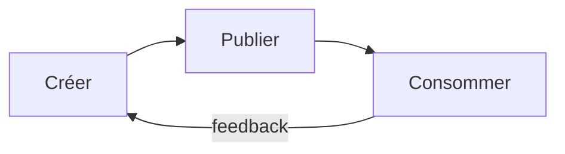

# 207 — APM — installer et partager

Durée estimée : 60 min

> Tu sais créer des skills et des agents. Mais comment les partager entre projets — ou consommer ceux publiés par d'autres ? C'est le rôle d'APM.

## Pourquoi ce module

Dans les modules précédents, tu as créé des skills et des agents directement dans le dossier `.agents/` de ton dépôt. Cette approche fonctionne tant que tu travailles seul sur un seul projet. Dès que tu veux réutiliser un skill dans un autre dépôt, tu te retrouves à copier-coller des fichiers manuellement — avec les problèmes classiques de synchronisation : quelle version est à jour ? Qui a corrigé le bug ? Comment savoir si une nouvelle version est disponible ?

APM (Agent Package Manager) résout ce problème. C'est un gestionnaire de paquets dédié aux primitives agentiques — skills, agents, prompts. Il permet de déclarer des dépendances vers des primitives publiées dans d'autres dépôts GitHub, de les installer en une commande, et de les versionner par commit SHA ou tag Git.

Le mécanisme est volontairement simple : un fichier `apm.yml` à la racine du dépôt, une commande `apm install`, et une convention de nommage `<owner>/<repo>/<kind>/<name>`. Pas de registre centralisé, pas de publication complexe — GitHub est le registre.

À la fin de ce module, tu sais :

- décrire le rôle d'un fichier `apm.yml` et ses deux clés principales ;
- installer une primitive distante avec `apm install` ;
- publier tes propres primitives pour qu'elles soient consommables par d'autres ;
- versionner une dépendance par commit SHA ou tag Git ;
- distinguer le cycle complet : créer, publier, consommer.

## Pré-requis

- [Module 104 — Agents personnalisés](../01-fondations/104-agents.md)
- VS Code avec l'extension GitHub Copilot activée.
- Un dépôt Git hébergé sur GitHub.
- APM installé localement (voir la documentation officielle du projet).

## Concepts clés

### Le fichier `apm.yml`

Le fichier `apm.yml` se place à la racine de ton dépôt. Il remplit deux fonctions : déclarer les primitives locales que ton dépôt expose, et lister les dépendances vers des primitives distantes.

Tu ne modifies **jamais** ce fichier à la main. C'est APM qui le gère pour toi :

- `apm install` crée le fichier s'il n'existe pas et ajoute la dépendance ;
- `apm update` met à jour les versions des dépendances existantes ;
- `apm init` initialise un `apm.yml` vide si tu veux juste exposer tes propres primitives.

Le fichier contient deux clés principales :

- **`includes`** — contrôle la découverte des primitives locales. Avec la valeur `auto`, APM scanne automatiquement le dossier `.agents/` et expose tous les skills, agents et prompts qu'il y trouve.
- **`dependencies`** — liste les primitives distantes installées. Chaque entrée contient un `name`, une `source` et une `version`. Cette liste est maintenue par les commandes APM, pas par toi.

`apm.yml` n'est pas nécessaire pour publier une primitive individuelle — un dépôt GitHub contenant un `.agents/skills/<nom>/SKILL.md` est directement installable. En revanche, `apm.yml` est utile quand tu veux exposer une **collection** curée de primitives (plusieurs skills, agents et prompts packagés ensemble) ou quand tu veux déclarer des dépendances vers d'autres dépôts.

### Convention de nommage des sources

L'identifiant d'une primitive distante suit le schéma :

```text
<owner>/<repo>/<kind>/<name>
```

| Segment | Rôle | Exemples |
|---|---|---|
| `owner` | Propriétaire du dépôt | `danielmeppiel`, `my-org` |
| `repo` | Nom du dépôt | `genesis`, `copilot-primitives` |
| `kind` | Type de primitive | `skills`, `agents`, `prompts` |
| `name` | Nom de la primitive | `genesis`, `pair-reviewer` |

Cette convention fonctionne avec **GitHub** et **Azure DevOps**. APM utilise le dépôt Git comme registre distribué : chaque dépôt public contenant des primitives dans `.agents/` est directement installable.

Exemple depuis un dépôt Azure DevOps :

```bash
apm install my-org/copilot-primitives/skills/writing-changelog --target copilot --provider azure-devops
```

Le flag `--provider` indique à APM de résoudre la source depuis `dev.azure.com` au lieu de `github.com`. Le reste du flux (install, update, versioning) est identique.

### La commande `apm install`

Pour installer une primitive distante, tu utilises :

```bash
apm install <owner>/<repo>/<kind>/<name> --target copilot
```

Le flag `--target copilot` indique à APM de placer la primitive dans le dossier `.agents/` de ton workspace, là où Copilot la découvre automatiquement.

Exemple concret :

```bash
apm install danielmeppiel/genesis/skills/genesis --target copilot
```

Après exécution, tu retrouves le skill dans :

```text
.agents/
  skills/
    genesis/
      SKILL.md
```

APM met automatiquement à jour le fichier `apm.yml` pour enregistrer la nouvelle dépendance avec le commit SHA au moment de l'installation. Tu n'as pas besoin de toucher au fichier — c'est ce qui te garantit une installation reproductible.

### Versioning : SHA vs tag

APM supporte deux stratégies de versioning :

**Par commit SHA** — C'est le comportement par défaut. Lors de l'installation, APM enregistre le SHA du commit courant de la branche source. C'est la stratégie la plus sûre : tu sais exactement quel code tu consommes, et rien ne change tant que tu ne fais pas un `apm install` explicite pour mettre à jour.

```yaml
version: a3f7c2e
```

**Par tag Git** — Tu peux fixer la version sur un tag plutôt qu'un SHA. C'est utile quand le mainteneur de la primitive publie des versions sémantiques.

```yaml
version: v1.2.0
```

Pour mettre à jour une dépendance existante, utilise `apm update` :

```bash
apm update danielmeppiel/genesis/skills/genesis
```

APM met à jour le SHA dans `apm.yml` vers le commit le plus récent. Tu peux aussi relancer `apm install` avec le même identifiant — le résultat est identique.

**Par branche** — Tu peux aussi pointer vers une branche (`main`, `develop`), mais c'est déconseillé en production : le contenu change à chaque commit du mainteneur, ce qui casse la reproductibilité.

```yaml
version: main
```

### Le cycle complet : créer, publier, consommer

Le partage de primitives avec APM suit un cycle en trois étapes :



**Créer** — Tu développes un skill ou un agent dans ton dépôt, dans le dossier `.agents/`. Tu le testes localement dans Copilot jusqu'à ce qu'il fonctionne comme attendu.

**Publier** — Tu pousses ton dépôt sur GitHub avec tes primitives dans `.agents/`. C'est tout — le dépôt GitHub *est* le registre. N'importe qui peut installer une primitive individuelle directement avec `apm install`. Pour signaler une version stable, crée un tag Git :

```bash
git tag v1.0.0
git push origin v1.0.0
```

**Consommer** — Dans un autre dépôt, tu exécutes `apm install <owner>/<repo>/<kind>/<name> --target copilot`. Le skill ou l'agent est copié dans `.agents/`, et la dépendance est enregistrée dans `apm.yml`.

## Démonstration

### Étape 1 — Installer un skill distant

Pars d'un dépôt existant ou d'un dépôt neuf. Pas besoin de créer de fichier manuellement — `apm install` s'occupe de tout.

Installe le skill `genesis` depuis le dépôt de Daniel Meppiel :

```bash
apm install danielmeppiel/genesis/skills/genesis --target copilot
```

Vérifie que le fichier est bien apparu :

```bash
ls .agents/skills/genesis/
# SKILL.md
```

Vérifie aussi que `apm.yml` a été créé (ou mis à jour) automatiquement avec la dépendance et son SHA.

### Étape 2 — Utiliser le skill installé

Ouvre VS Code dans le dépôt. Ouvre le panneau Copilot Chat en mode Agent. Le skill `genesis` est maintenant découvert automatiquement par Copilot — il apparaît dans la liste des skills disponibles.

Teste-le en formulant une requête qui correspond à sa description sémantique. Par exemple, si `genesis` est un skill de conception de modules agentiques, demande à Copilot de concevoir un nouveau skill. Le routeur sémantique doit activer `genesis` et suivre sa procédure.

### Étape 3 — Publier tes propres primitives

Pour rendre un skill installable par d'autres, il suffit de le pousser sur GitHub dans le dossier `.agents/skills/<nom>/SKILL.md`. C'est tout — `apm install` sait résoudre le chemin directement depuis le dépôt.

Supposons que tu aies créé un skill `writing-changelog` dans ton dépôt `my-org/copilot-primitives` :

```bash
git add .agents/skills/writing-changelog/SKILL.md
git commit -m "feat: add writing-changelog skill"
git push origin main
```

Optionnel — crée un tag pour marquer une version stable :

```bash
git tag v1.0.0
git push origin v1.0.0
```

N'importe qui peut maintenant installer ton skill avec :

```bash
apm install my-org/copilot-primitives/skills/writing-changelog --target copilot
```

### Étape 4 — Mettre à jour une dépendance

Si le mainteneur de `genesis` publie une correction, mets à jour avec :

```bash
apm update danielmeppiel/genesis/skills/genesis
```

APM télécharge la version la plus récente et met à jour le SHA dans `apm.yml`. Vérifie le diff avant de committer :

```bash
git diff apm.yml
```

Tu verras le champ `version` passer de l'ancien SHA au nouveau.

## Exercice ⭐⭐

**Énoncé** — Installe le skill `genesis` de Daniel Meppiel dans un dépôt neuf et utilise-le dans Copilot.

**Étapes guidées** :

1. Crée un nouveau dépôt Git local :

```bash
mkdir mon-projet-apm && cd mon-projet-apm
git init
```

2. Installe le skill `genesis` (APM crée `apm.yml` automatiquement) :

```bash
apm install danielmeppiel/genesis/skills/genesis --target copilot
```

4. Vérifie la structure créée :

```bash
ls .agents/skills/genesis/SKILL.md
```

4. Vérifie que `apm.yml` a été créé automatiquement avec la dépendance et son SHA.
6. Ouvre le dépôt dans VS Code.
7. Ouvre Copilot Chat en mode Agent.
8. Formule une requête qui devrait déclencher le skill `genesis`. Vérifie que le skill s'active et que sa procédure est suivie.

**Critère de réussite** : `apm install` se termine sans erreur, le fichier `SKILL.md` est présent dans `.agents/skills/genesis/`, et le skill est utilisable dans une conversation Copilot.

## Validation

Tu peux passer au module suivant si :

- [ ] Ton dépôt contient un fichier `apm.yml` avec `includes: auto` et au moins une dépendance.
- [ ] `apm install danielmeppiel/genesis/skills/genesis --target copilot` s'exécute sans erreur.
- [ ] Le fichier `.agents/skills/genesis/SKILL.md` est présent dans ton workspace.
- [ ] Le skill `genesis` apparaît dans la liste des skills détectés par Copilot.
- [ ] Tu sais expliquer la différence entre versioning par SHA et par tag.
- [ ] Tu sais comment publier tes propres primitives en ajoutant un `apm.yml` à ton dépôt.

## Pour aller plus loin

- [Module 313 — Evals](../03-ingenierie-de-contexte/313-evals.md) : vérifier automatiquement que les primitives installées via APM fonctionnent comme attendu.
- [Module 104 — Agents personnalisés](../01-fondations/104-agents.md) : revoir la création d'agents avant de les partager via APM.
- [Module 103 — Skills](../01-fondations/103-skills.md) : revoir la création de skills avant de les distribuer.
- La documentation officielle d'APM pour les options avancées (`apm update`, `apm list`, résolution de conflits).
- `docs/reference/apm-yml-reference.md` — page de référence à créer.
