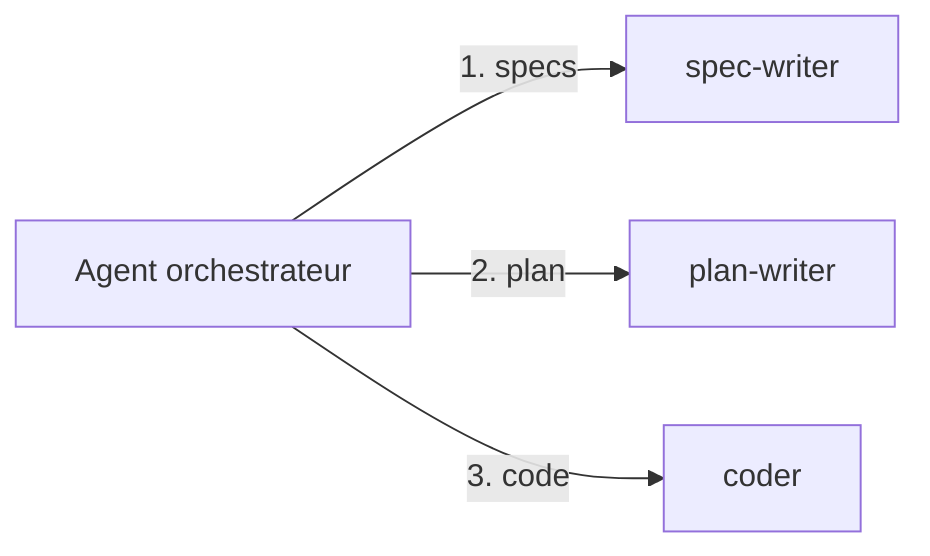
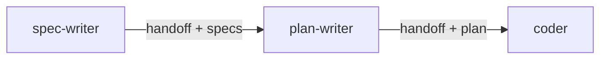

# 208 — Workflows — orchestrer plusieurs primitives

Durée estimée : 60 min

> Un `skill` encapsule un savoir-faire. Un `agent` incarne un rôle. Un *workflow* les compose pour résoudre un problème métier de bout en bout.

## Pourquoi ce module

Tu sais créer des skills et des agents. Mais un objectif métier réel dépasse presque toujours le périmètre d'une seule primitive. Prenons un exemple concret : à partir d'une issue GitHub, tu veux que Copilot génère une spécification, rédige un plan d'implémentation, puis produise le code correspondant. Aucun skill isolé ni agent unique ne peut couvrir cette chaîne de bout en bout sans devenir un monstre monolithique.

Un `workflow` résout ce problème en orchestrant plusieurs primitives dans une séquence cohérente. L'idée centrale est simple : un agent racine pilote le flux et délègue chaque étape à un sous-agent spécialisé via `runSubagent`. Chaque sous-agent a un scope clair, des outils restreints, et une responsabilité unique.

À la fin de ce module, tu sais :

- expliquer ce qu'est un workflow dans l'écosystème Copilot ;
- appliquer le pattern *Outside-In* : un orchestrateur racine qui délègue à des sous-agents ;
- identifier et éviter l'anti-pattern du super-agent monolithique ;
- décomposer un objectif métier en étapes, puis mapper chaque étape sur une primitive ;
- câbler un workflow complet qui enchaîne trois sous-agents.

## Pré-requis

- [Module 103 — Skills](../01-fondations/103-skills.md)
- [Module 104 — Agents personnalisés](../01-fondations/104-agents.md)
- VS Code avec l'extension GitHub Copilot activée.
- Un dépôt Git avec au moins une issue ouverte sur GitHub.

## Concepts clés

### Qu'est-ce qu'un workflow ?

Un workflow est une séquence orchestrée de primitives Copilot (instructions, skills, agents) qu'un `agent` racine coordonne pour atteindre un objectif métier. Le workflow n'est pas un nouveau type de fichier — c'est un **pattern d'organisation** qui s'exprime dans le corps d'un `.agent.md`.

L'agent racine ne fait pas le travail lui-même. Il découpe l'objectif en étapes, délègue chaque étape à un sous-agent spécialisé, récupère le résultat, et passe à l'étape suivante. Chaque sous-agent s'exécute dans son propre contexte, avec ses propres outils et contraintes.



### Le pattern Outside-In

Le terme *Outside-In* vient de l'idée qu'on part de l'objectif global (l'extérieur) pour descendre vers les tâches unitaires (l'intérieur). L'orchestrateur connaît le *quoi* — les sous-agents savent le *comment*.

Ce pattern présente trois avantages :

- **Isolation du contexte** — chaque sous-agent ne reçoit que les informations nécessaires à sa tâche. Le sous-agent qui rédige les specs n'a pas besoin de voir le code, et inversement.
- **Réutilisabilité** — un sous-agent `spec-writer` peut servir dans plusieurs workflows différents. Tu le crées une fois, tu le réutilises partout.
- **Contraintes d'outils par étape** — le sous-agent qui rédige les specs n'a pas besoin de `editFiles`. Le sous-agent qui code n'a pas besoin de `githubRepo`. Chaque agent expose uniquement les outils pertinents pour sa tâche.

### L'anti-pattern : le super-agent monolithique

Le réflexe naturel quand on découvre les agents est de tout mettre dans un seul fichier `.agent.md` :

```markdown
---
name: do-everything
description: "Depuis une issue, génère les specs, le plan, et le code."
tools:
  - codebase
  - editFiles
  - runInTerminal
  - githubRepo
  - fetch
  - runSubagent
---

Tu es un développeur full-stack senior. Quand on te donne une issue :

1. Lis l'issue sur GitHub.
2. Rédige une spécification technique.
3. Crée un plan d'implémentation.
4. Implémente le code.
5. Lance les tests.
6. Rédige le message de commit.
```

Ce super-agent pose plusieurs problèmes :

- **Contexte saturé** — toutes les instructions cohabitent dans le même contexte. À l'étape 4, le modèle traîne encore les consignes de rédaction de specs qui ne servent plus.
- **Outils trop larges** — l'agent a accès à tout, tout le temps. Rien n'empêche l'étape de rédaction de specs de modifier un fichier par accident.
- **Débogage difficile** — quand le résultat est mauvais, tu ne sais pas quelle étape a déraillé. Tout est mélangé dans une seule conversation.
- **Réutilisation impossible** — si tu veux réutiliser la logique de rédaction de specs dans un autre workflow, tu dois copier-coller des sections du super-agent.

### Décomposer en orchestrateur + sous-agents

La solution consiste à extraire chaque responsabilité dans un agent dédié :

| Étape | Sous-agent | Responsabilité | Outils |
|---|---|---|---|
| 1 | `spec-writer` | Lire l'issue et rédiger les specs | `githubRepo` |
| 2 | `plan-writer` | Transformer les specs en plan d'implémentation | `codebase` |
| 3 | `coder` | Implémenter le plan | `codebase`, `editFiles`, `runInTerminal` |

L'orchestrateur n'a qu'un seul outil spécifique : `runSubagent`. Il coordonne la séquence et transmet le résultat d'un sous-agent au suivant.

### La transmission de contexte entre étapes

Un point subtil : chaque sous-agent s'exécute dans une conversation isolée. Il ne voit pas l'historique des étapes précédentes. C'est l'orchestrateur qui fait le pont : il récupère la sortie du sous-agent précédent et la transmet en entrée au sous-agent suivant.

Dans le corps de l'orchestrateur, cela s'exprime en langage naturel :

```markdown
1. Délègue la rédaction des specs à `spec-writer` en lui transmettant
   le contenu de l'issue. Récupère les specs produites.
2. Délègue la rédaction du plan à `plan-writer` en lui transmettant
   les specs. Récupère le plan produit.
3. Délègue l'implémentation à `coder` en lui transmettant le plan.
```

L'orchestrateur joue le rôle de **relais**. Chaque sous-agent reçoit exactement ce dont il a besoin — ni plus, ni moins.

### Alternative : le pattern handoff

Le pattern Outside-In n'est pas la seule façon d'orchestrer un workflow. Le **handoff** propose une approche différente : au lieu d'un orchestrateur central qui délègue, chaque agent **transfère le contrôle** au suivant quand il a terminé son travail.



Dans un handoff :

- Il n'y a **pas d'orchestrateur central**. Chaque agent connaît le suivant dans la chaîne.
- L'agent qui termine son travail passe le relais en transmettant son résultat au suivant.
- Le contexte circule de proche en proche, pas en étoile via un centre.

Le handoff est plus simple à mettre en place pour des chaînes linéaires : A → B → C. Chaque agent a dans ses instructions une consigne du type « quand tu as terminé, délègue à l'agent `plan-writer` via `runSubagent` en lui transmettant ton résultat ».

**Quand choisir quoi ?**

| Critère | Outside-In (orchestrateur) | Handoff (chaîne) |
|---|---|---|
| Topologie | Étoile — un centre coordonne tout | Linéaire — chaque agent connaît le suivant |
| Visibilité | L'orchestrateur voit tout le flux | Chaque agent ne voit que son prédécesseur |
| Branchement conditionnel | Facile — l'orchestrateur décide | Difficile — chaque agent doit gérer la logique |
| Boucle de feedback | L'orchestrateur peut relancer une étape | Il faut remonter la chaîne entière |
| Simplicité | Plus de fichiers à créer | Moins de fichiers, plus autonome |
| Débogage | Centralisé — une seule conversation à inspecter | Distribué — suivre la chaîne d'agent en agent |

**Règle simple** : si ton workflow est une chaîne linéaire sans branchement ni boucle, le handoff est plus léger. Dès que tu as besoin de branchements conditionnels (« si les tests échouent, relancer le codeur ») ou de boucles de feedback (« le reviewer renvoie au codeur »), l'orchestrateur central est préférable.

Les deux patterns peuvent se combiner : un orchestrateur central pour le flux principal, avec des handoffs entre sous-agents quand deux étapes sont toujours séquentielles.

## Démonstration

### Étape 1 — Le super-agent monolithique (point de départ)

Voici le fichier unique que tu vas refactorer. Il fait tout dans un seul agent :

```markdown
<!-- .agents/do-everything.agent.md -->
---
name: do-everything
description: "Depuis une issue GitHub, génère specs + plan + code."
tools:
  - codebase
  - editFiles
  - runInTerminal
  - githubRepo
  - runSubagent
---

Tu es un développeur senior. Quand on te donne un numéro d'issue :

1. Récupère le contenu de l'issue sur GitHub via `githubRepo`.
2. Rédige une spécification technique en Markdown dans `docs/specs/`.
3. Crée un plan d'implémentation avec les fichiers à créer ou modifier.
4. Implémente le code selon le plan.
5. Lance les tests avec `npm test`.
```

### Étape 2 — Extraire le sous-agent `spec-writer`

Crée un premier sous-agent dédié à la rédaction de specs :

```diff
+ # .agents/spec-writer.agent.md
+
+ ---
+ name: spec-writer
+ description: "Rédige une spécification technique à partir d'une issue GitHub."
+ tools:
+   - githubRepo
+ ---
+
+ Tu es un rédacteur technique. On te transmet le contenu d'une issue
+ GitHub. Ta seule tâche est de produire une spécification technique
+ structurée en Markdown.
+
+ ## Format de sortie
+
+ - Titre reprenant le titre de l'issue.
+ - Section "Contexte" résumant le problème.
+ - Section "Exigences" listant les critères d'acceptation.
+ - Section "Hors périmètre" listant ce qui n'est pas couvert.
+
+ Tu ne modifies aucun fichier. Tu ne crées aucun fichier.
+ Tu retournes uniquement le contenu Markdown de la spec.
```

Note que cet agent n'a qu'un seul outil : `githubRepo`. Il ne peut ni écrire de fichiers ni exécuter de commandes.

### Étape 3 — Extraire `plan-writer` et `coder`

Même logique pour les deux autres sous-agents :

```diff
+ # .agents/plan-writer.agent.md
+
+ ---
+ name: plan-writer
+ description: "Transforme une spécification technique en plan d'implémentation."
+ tools:
+   - codebase
+ ---
+
+ Tu es un architecte logiciel. On te transmet une spécification
+ technique. Ta tâche est de produire un plan d'implémentation.
+
+ ## Format de sortie
+
+ Pour chaque fichier à créer ou modifier :
+ - Chemin du fichier.
+ - Description des changements.
+ - Dépendances avec d'autres fichiers.
+
+ Tu ne modifies aucun fichier. Tu retournes uniquement le plan.
```

```diff
+ # .agents/coder.agent.md
+
+ ---
+ name: coder
+ description: "Implémente du code à partir d'un plan d'implémentation."
+ tools:
+   - codebase
+   - editFiles
+   - runInTerminal
+ ---
+
+ Tu es un développeur. On te transmet un plan d'implémentation.
+ Implémente chaque fichier du plan dans l'ordre indiqué.
+
+ ## Contraintes
+
+ - Suis le plan à la lettre. Ne dévie pas du périmètre.
+ - Lance les tests après l'implémentation.
+ - Si un test échoue, corrige et relance.
```

### Étape 4 — Créer l'orchestrateur

Maintenant, remplace le super-agent par un orchestrateur léger :

```diff
- # .agents/do-everything.agent.md (supprimé)

+ # .agents/issue-to-code.agent.md
+
+ ---
+ name: issue-to-code
+ description: "Workflow complet : issue GitHub → specs → plan → code."
+ tools:
+   - runSubagent
+   - githubRepo
+ ---
+
+ Tu es un orchestrateur de workflow. Quand on te donne un numéro
+ d'issue GitHub, tu coordonnes trois sous-agents dans l'ordre :
+
+ ## Workflow
+
+ 1. Récupère le contenu de l'issue via `githubRepo`.
+ 2. Délègue la rédaction des specs à l'agent `spec-writer`
+    en lui transmettant le contenu de l'issue.
+    Récupère les specs produites.
+ 3. Délègue la rédaction du plan à l'agent `plan-writer`
+    en lui transmettant les specs.
+    Récupère le plan produit.
+ 4. Délègue l'implémentation à l'agent `coder`
+    en lui transmettant le plan.
+ 5. Résume le travail accompli : specs, plan, fichiers modifiés.
+
+ ## Règles
+
+ - Tu ne modifies jamais de fichier toi-même.
+ - Tu ne codes jamais toi-même.
+ - Si un sous-agent échoue, rapporte l'erreur et arrête le workflow.
```

La structure finale du dossier `.agents/` :

```text
.agents/
  issue-to-code.agent.md    # orchestrateur
  spec-writer.agent.md      # sous-agent 1
  plan-writer.agent.md      # sous-agent 2
  coder.agent.md            # sous-agent 3
```

### Étape 5 — Tester le workflow

1. Ouvre le panneau `chat` de VS Code.
2. Sélectionne le mode `issue-to-code` dans le sélecteur en haut.
3. Envoie : « Traite l'issue #12. »
4. Observe la séquence : l'orchestrateur appelle `spec-writer`, puis `plan-writer`, puis `coder`.
5. Vérifie que chaque sous-agent reste dans son périmètre : `spec-writer` ne modifie pas de fichier, `coder` ne rédige pas de specs.

## Exercice ⭐⭐

**Énoncé** — Construis un workflow complet qui, depuis une issue GitHub, enchaîne : spécification, planification, implémentation.

**Étapes guidées** :

1. Crée trois sous-agents dans `.agents/` :
   - `spec-writer.agent.md` — lit l'issue, produit une spec Markdown. Outils : `githubRepo` uniquement.
   - `plan-writer.agent.md` — lit la spec, produit un plan. Outils : `codebase` uniquement.
   - `coder.agent.md` — lit le plan, implémente. Outils : `codebase`, `editFiles`, `runInTerminal`.
2. Crée un orchestrateur `issue-to-code.agent.md` qui :
   - Récupère le contenu de l'issue.
   - Délègue chaque étape dans l'ordre via `runSubagent`.
   - Transmet la sortie de chaque étape à l'étape suivante.
   - Ne modifie jamais de fichier lui-même.
3. Ouvre une issue de test dans ton dépôt (ou utilise une issue existante).
4. Active l'agent `issue-to-code` et demande-lui de traiter l'issue.
5. Vérifie que :
   - `spec-writer` produit une spec sans modifier de fichier.
   - `plan-writer` produit un plan sans modifier de fichier.
   - `coder` implémente le plan et lance les tests.

**Critère de réussite** : l'orchestrateur enchaîne les trois sous-agents dans l'ordre, chacun reste dans son scope, et le code final correspond à l'issue de départ.

## Validation

Tu peux passer au module suivant si :

- [ ] Ton dépôt contient un agent orchestrateur et au moins trois sous-agents.
- [ ] L'orchestrateur utilise `runSubagent` pour déléguer à chaque sous-agent.
- [ ] Chaque sous-agent a une liste `tools` restreinte à ce dont il a besoin.
- [ ] Chaque sous-agent a une responsabilité unique clairement définie dans sa `description`.
- [ ] Tu sais expliquer pourquoi un super-agent monolithique pose problème.
- [ ] Le workflow complet enchaîne les trois étapes et produit un résultat cohérent.

## Pour aller plus loin

- [Module 313 — Tester ses primitives](../03-ingenierie-de-contexte/313-evals.md) : mesurer objectivement que chaque sous-agent produit le bon résultat avec des `eval` binaires.
- [Module 311 — Tokens, hallucinations et sobriété LLM](../03-ingenierie-de-contexte/311-tokens-contexte.md) : comprendre pourquoi la décomposition en sous-agents réduit la consommation de tokens.
- [Module 312 — Autoresearch](../03-ingenierie-de-contexte/312-autoresearch.md) : appliquer la discipline d'évaluation itérative à chaque sous-agent du workflow.
- Explore les patterns de workflow plus avancés : boucles de feedback (le relecteur renvoie au codeur), branchements conditionnels (si les tests échouent, relancer l'étape 3), parallélisation (specs et plan en parallèle quand ils sont indépendants).

## Module suivant

**Suivant** : [313 — Tester ses primitives (evals binaires)](../03-ingenierie-de-contexte/313-evals.md)
