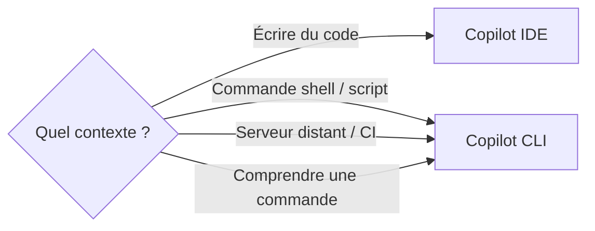

# 210 — Copilot CLI — automatiser depuis le terminal

Durée estimée : 30 min · Complexité : ⭐ · Pré-requis : [Module 100 — Setup & posture](../01-fondations/100-setup-posture.md)

> Tu connais Copilot dans VS Code. Mais que se passe-t-il quand tu n'as pas d'IDE — juste un terminal, un script CI, ou un serveur distant en SSH ? Ou quand ton IDE n'a pas encore rattrapé les dernières fonctionnalités de Copilot ?

## Pourquoi ce module

Copilot n'est pas prisonnier de VS Code. L'extension `gh-copilot` pour le GitHub CLI te donne accès à deux capacités directement depuis le terminal :

- **suggérer une commande** à partir d'une description en langage naturel ;
- **expliquer une commande** que tu ne comprends pas.

Ça couvre un besoin réel. Combien de fois as-tu cherché la bonne syntaxe `find`, hésité sur les flags de `tar`, ou copié-collé un `awk` depuis Stack Overflow sans comprendre ce qu'il fait ? Copilot CLI remplace ce cycle recherche-copier-prier par une interaction directe dans ton terminal.

À la fin de ce module, tu sais :

- installer l'extension `gh-copilot` ;
- utiliser `gh copilot suggest` pour obtenir une commande à partir d'une intention ;
- utiliser `gh copilot explain` pour comprendre une commande existante ;
- créer des alias `ghcs` et `ghce` pour accélérer ton workflow terminal ;
- identifier les situations où le CLI est plus pertinent que l'IDE.

## Pré-requis

- [Module 100 — Setup & posture](../01-fondations/100-setup-posture.md) — Copilot doit être activé sur ton compte GitHub.
- Le GitHub CLI (`gh`) installé et authentifié (`gh auth login`).
- Un terminal Unix (macOS, Linux, WSL) ou PowerShell.

## Concepts clés

### GitHub CLI et les extensions

Le GitHub CLI (`gh`) est l'outil en ligne de commande officiel de GitHub. Il gère les PR, les issues, les releases — et il supporte un système d'extensions. Copilot CLI est une de ces extensions : elle ajoute la sous-commande `gh copilot` à ton installation existante.

L'installation se fait en une ligne :

```bash
gh extension install github/gh-copilot
```

Tu peux vérifier que l'extension est bien installée :

```bash
gh copilot --version
```

Si tu avais déjà installé l'extension, mets-la à jour :

```bash
gh extension upgrade github/gh-copilot
```

### gh copilot suggest — de l'intention à la commande

`gh copilot suggest` transforme une description en langage naturel en une commande shell. Tu décris ce que tu veux faire, Copilot propose la commande correspondante.

```bash
gh copilot suggest "trouve les fichiers de plus de 1MB dans le dossier courant"
```

Copilot te propose une commande — par exemple :

```bash
find . -type f -size +1M
```

Tu as ensuite trois options interactives :

- **Exécuter** la commande directement.
- **Copier** la commande dans le presse-papier.
- **Réviser** la requête pour affiner le résultat.

Le flag `-t` permet de préciser le type de commande attendu :

| Flag | Type | Exemple |
|---|---|---|
| `-t shell` | Commande shell générique | `find`, `grep`, `awk` |
| `-t gh` | Commande GitHub CLI | `gh pr list`, `gh issue create` |
| `-t git` | Commande Git | `git rebase`, `git log` |

Exemple avec un type explicite :

```bash
gh copilot suggest -t git "annule le dernier commit sans perdre les changements"
```

Résultat proposé :

```bash
git reset --soft HEAD~1
```

### gh copilot explain — comprendre une commande existante

`gh copilot explain` fait l'inverse : tu lui passes une commande, et il t'en donne une explication en langage naturel.

```bash
gh copilot explain "tar -xzf archive.tar.gz -C /opt/app --strip-components=1"
```

Copilot décompose chaque flag :

- `tar` — utilitaire d'archivage
- `-x` — extraire les fichiers
- `-z` — décompresser via gzip
- `-f archive.tar.gz` — fichier source
- `-C /opt/app` — répertoire de destination
- `--strip-components=1` — supprimer le premier niveau de répertoire

C'est particulièrement utile pour :

- les commandes copiées depuis une documentation ou un collègue ;
- les one-liners `awk`/`sed` que tu retrouves dans un script six mois plus tard ;
- les commandes `docker` ou `kubectl` avec de nombreux flags.

### Les alias ghcs et ghce

Taper `gh copilot suggest` à chaque fois est verbeux. La pratique recommandée est de créer deux alias dans ton shell :

Pour Bash ou Zsh, ajoute ces lignes à ton `~/.bashrc` ou `~/.zshrc` :

```bash
alias ghcs='gh copilot suggest'
alias ghce='gh copilot explain'
```

Pour Fish :

```bash
alias ghcs 'gh copilot suggest'
alias ghce 'gh copilot explain'
```

Pour PowerShell, ajoute à ton `$PROFILE` :

```powershell
Set-Alias -Name ghcs -Value "gh copilot suggest"
function ghce { gh copilot explain @args }
```

Après avoir rechargé ton shell (`source ~/.zshrc` ou relancer le terminal), tu peux écrire :

```bash
ghcs "liste les 10 plus gros fichiers du dépôt"
ghce "du -sh * | sort -rh | head -10"
```

Deux caractères de moins, mais surtout : ça rend l'outil assez rapide pour devenir un réflexe.

### Quand le CLI est plus pertinent que l'IDE

Copilot dans VS Code et Copilot CLI ne sont pas en concurrence — ils couvrent des contextes différents. Le CLI est le bon choix quand :

- **Tu es en SSH** sur un serveur distant sans environnement graphique.
- **Tu scripts** — un pipeline CI/CD, un Makefile, un script de déploiement. Tu as besoin d'une commande shell, pas d'un fichier source.
- **Tu travailles en terminal-first** — certains développeurs préfèrent `tmux` + `vim` à un IDE complet. Le CLI s'intègre naturellement dans ce workflow.
- **Tu veux une réponse rapide** — ouvrir VS Code, attendre le chargement, lancer le chat, poser la question… parfois, taper `ghcs "..."` dans le terminal actif est simplement plus rapide.
- **Ton IDE est en retard** — IntelliJ, Eclipse, Rider et d'autres IDE intègrent Copilot, mais avec un décalage significatif sur les fonctionnalités. Au moment où VS Code propose les agents, les skills et le mode agent complet, ces IDE n'en supportent souvent qu'une fraction. Le CLI, lui, évolue au même rythme que l'écosystème GitHub — c'est un filet de sécurité quand ton IDE principal ne suit pas.



En revanche, pour écrire du code applicatif (fonctions, classes, tests), l'IDE reste supérieur : il a le contexte du projet, les fichiers ouverts, le langage détecté.

## Démonstration

Tu vas installer Copilot CLI, tester les deux commandes principales, puis configurer tes alias.

### Étape 1 — Installer l'extension

Vérifie d'abord que le GitHub CLI est installé et authentifié :

```bash
gh --version
gh auth status
```

Si `gh auth status` indique que tu n'es pas connecté, lance `gh auth login` et suis les instructions.

Installe ensuite l'extension Copilot :

```bash
gh extension install github/gh-copilot
```

Vérifie l'installation :

```bash
gh copilot --version
```

### Étape 2 — Tester suggest

Lance une première suggestion :

```bash
gh copilot suggest "trouve tous les fichiers .md modifiés dans les 7 derniers jours"
```

Copilot devrait proposer quelque chose comme :

```bash
find . -name "*.md" -mtime -7
```

Essaie avec un type explicite :

```bash
gh copilot suggest -t git "montre les commits du dernier mois avec les fichiers modifiés"
```

### Étape 3 — Tester explain

Prends une commande que tu utilises souvent sans comprendre tous les flags :

```bash
gh copilot explain "rsync -avz --delete --exclude='.git' ./src/ user@server:/opt/app/"
```

Lis l'explication proposée. Vérifie que chaque flag est documenté.

### Étape 4 — Configurer les alias

Ouvre ton fichier de configuration shell :

```bash
# Pour Zsh (macOS par défaut)
echo 'alias ghcs="gh copilot suggest"' >> ~/.zshrc
echo 'alias ghce="gh copilot explain"' >> ~/.zshrc
source ~/.zshrc
```

Vérifie que les alias fonctionnent :

```bash
ghcs "affiche l'espace disque utilisé par dossier, trié par taille"
ghce "df -h | grep '/dev/disk'"
```

## Exercice ⭐

### Énoncé

Crée trois alias dans ton shell et utilise `gh copilot suggest` pour résoudre une vraie tâche de ton quotidien.

1. **Alias de base** — Configure `ghcs` et `ghce` dans ton shell (si ce n'est pas déjà fait depuis la démonstration).

2. **Alias personnalisé** — Crée un troisième alias `ghcsg` qui appelle `gh copilot suggest -t git`. Tu auras ainsi un raccourci dédié aux commandes Git :

   ```bash
   alias ghcsg='gh copilot suggest -t git'
   ```

3. **Résoudre une vraie tâche** — Utilise `ghcs` pour résoudre un problème réel. Voici quelques idées si tu manques d'inspiration :

   - « Trouve les fichiers de plus de 100 Mo dans mon home directory. »
   - « Compresse tous les fichiers .log de plus de 7 jours dans une archive. »
   - « Liste les ports réseau ouverts sur cette machine. »
   - « Renomme tous les fichiers .jpeg en .jpg dans le dossier courant. »

4. **Comprendre le résultat** — Passe la commande proposée par `ghcs` à `ghce` pour vérifier que tu comprends chaque partie avant de l'exécuter.

### Critères de réussite

- Les trois alias (`ghcs`, `ghce`, `ghcsg`) sont persistés dans ton fichier de configuration shell.
- Tu as résolu au moins une tâche réelle avec `ghcs`.
- Tu as vérifié la commande proposée avec `ghce` avant de l'exécuter.

## Validation

Tu utilises `ghcs` et `ghce` sans aide-mémoire. Quand tu as besoin d'une commande shell, ton premier réflexe est de la demander à Copilot CLI plutôt que de chercher sur le web. Tu sais choisir entre l'IDE et le CLI selon le contexte.

Pour vérifier que tu as intégré ce module :

- Tape `ghcs` dans ton terminal. La commande fonctionne sans erreur.
- Explique à un collègue la différence entre `suggest` et `explain`.
- Cite deux situations où le CLI est préférable à l'IDE.

## Pour aller plus loin

- **Documentation officielle** — [GitHub Copilot in the CLI](https://docs.github.com/en/copilot/github-copilot-in-the-cli) couvre les options avancées et les cas d'usage détaillés.
- **Intégration CI** — Explore comment utiliser `gh copilot suggest` dans un pipeline GitHub Actions pour générer des scripts de déploiement.
- **Module 208 — Workflows** — Quand tu combines Copilot CLI avec des `workflow` d'agent, tu peux orchestrer des tâches complexes depuis le terminal. Voir [Module 208 — Workflows](./208-workflows.md).
- **Shell avancé** — Configure des fonctions shell (plutôt que de simples alias) pour ajouter des comportements par défaut, comme toujours préciser `-t shell` :

  ```bash
  ghcs() {
    gh copilot suggest -t shell "$@"
  }
  ```
