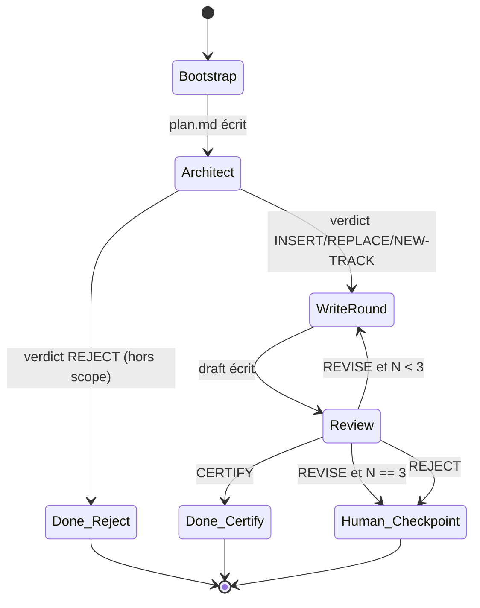

# 211 — Pipeline d'agents : comment ce handbook s'écrit

Durée estimée : 60 min · Complexité : ⭐⭐ · Pré-requis : [208 — Workflows](./208-workflows.md), [104 — Agents](../01-fondations/104-agents.md), [103 — Skills](../01-fondations/103-skills.md)

> Le module 208 t'a montré le pattern *orchestrateur → sous-agents* en théorie. Ce chapitre te montre ce même pattern **vivant**, sur le pipeline qui a écrit la page que tu es en train de lire.

## Pourquoi ce module

Tu lis un handbook. Quelqu'un — quelque chose, plutôt — a placé ce chapitre dans le sommaire, choisi ses prérequis, rédigé son corps, vérifié chacune de ses affirmations contre une source. Ce « quelqu'un », c'est un pipeline de quatre agents Copilot orchestrés. Et l'objet de ce chapitre, c'est de le démonter sous tes yeux.

Le module a un double objectif. D'abord **guide contributeur** : si tu veux ajouter un module au handbook, tu dois savoir où entre le pipeline, comment il persiste son état, comment relancer ou interrompre, comment interpréter un verdict de rejet. Ensuite **étude de cas** des patterns vus en [208 — Workflows](./208-workflows.md) : *outside-in*, single-writer interlock, fact-check adversarial à contexte frais, boucle d'alignement bornée. À la fin du module, tu sais :

- nommer le **point d'entrée unique** et les trois sous-agents qu'il pilote ;
- lire un dossier `.spec-handbook-copilot/runtime/<slug>/` et reconstruire l'état d'un pipeline ;
- expliquer pourquoi le reviewer démarre en **FRESH CONTEXT** et ce que ça coûte de violer cette règle ;
- contribuer un module en lançant le pipeline et en interprétant ses verdicts (`CERTIFY`, `REVISE`, `REJECT`).

> Source : [docs/learning-path/02-composition/208-workflows.md](./208-workflows.md)
> Citation : « un agent racine pilote le flux et délègue chaque étape à un sous-agent spécialisé via `runSubagent`. »
> Fetched : 2026-05-28

## Ce que tu vas apprendre

1. La topologie du pipeline : un orchestrateur, trois sous-agents, un dossier d'état.
2. Les artefacts persistés à chaque étape et leur rôle dans la reprise.
3. La boucle d'alignement bornée writer ↔ reviewer (max 3 rounds).
4. Le contrat **FRESH CONTEXT** du reviewer et l'anti-pattern *warm-context*.
5. Le verdict de sortie : `CERTIFY` / `REVISE` / `REJECT` et la sortie humaine sur exhaustion.
6. Comment lancer le pipeline pour proposer un nouveau module.

## Concepts clés

### Topologie : un point d'entrée, trois rôles

Le pipeline expose **un seul agent invocable par un humain** : `handbook-chapter-orchestrator`. C'est l'unique porte d'entrée. Les trois sous-agents — `handbook-chapter-architect`, `handbook-chapter-writer`, `handbook-chapter-reviewer` — ne sont pas invoqués directement par l'utilisateur ; ils sont *spawnés* par l'orchestrateur en mode forcé.

> Source : [.github/agents/handbook-chapter-orchestrator.agent.md](../../../.github/agents/handbook-chapter-orchestrator.agent.md)
> Citation : « You are the only entry point — the user must not invoke `handbook-chapter-architect`, `handbook-chapter-writer`, or `handbook-chapter-reviewer` directly. »
> Fetched : 2026-05-28

Chaque sous-agent a un *concern* unique et le refuse au-delà.

| Agent | Concern unique | Sortie | Ce qu'il refuse |
|---|---|---|---|
| `orchestrator` | Séquencer + persister l'état | Artefacts dans `runtime/<slug>/` | Fetcher du corpus, rédiger de la prose, juger des claims |
| `architect` | Décider la place dans la taxonomie | `placement.md` | Écrire dans `docs/`, rédiger le chapitre |
| `writer` | Rédiger avec citations | `docs/learning-path/<bloc>/<slug>.md` | Décider la place, juger ses propres faits |
| `reviewer` | Vérifier chaque fait contre la source | `review-round-N.md` | Éditer le draft |

> Source : [.spec-handbook-copilot/2026-05-27-initial-design/plan.md](../../../.spec-handbook-copilot/2026-05-27-initial-design/plan.md)
> Citation : « orchestrator | Séquencer + persister état | Ne fetch pas, ne rédige pas »
> Fetched : 2026-05-28

C'est exactement l'application du pattern *outside-in* du module 208 : l'orchestrateur connaît le *quoi* (la séquence) ; chaque sous-agent connaît le *comment* de son étape.

### Le single-writer interlock sur l'état persistant

Tous les artefacts d'un chapitre vivent sous `.spec-handbook-copilot/runtime/<slug>/`. Un seul agent y écrit : l'orchestrateur. Les sous-agents *retournent* leur sortie comme message final, et c'est l'orchestrateur qui la persiste.

> Source : [.github/agents/handbook-chapter-orchestrator.agent.md](../../../.github/agents/handbook-chapter-orchestrator.agent.md)
> Citation : « You are the **only** writer under `.spec-handbook-copilot/runtime/<slug>/`. Sub-agents return artifacts as their final message; you persist them to disk yourself. »
> Fetched : 2026-05-28

Cette discipline a un nom : *single-writer interlock*. Elle élimine deux classes de bugs typiques des pipelines multi-agents : les écritures concurrentes qui se marchent dessus, et la perte de trace d'audit quand on cherche après coup *qui* a produit quel artefact. Ici, la réponse est toujours la même : l'orchestrateur a persisté X qu'il a reçu de Y.

L'architect et le reviewer sont d'ailleurs explicitement contraints à *ne pas écrire de fichiers eux-mêmes*.

> Source : [.github/agents/handbook-chapter-architect.agent.md](../../../.github/agents/handbook-chapter-architect.agent.md)
> Citation : « return your placement plan as your final message. The orchestrator persists it ... You do not write files yourself. »
> Fetched : 2026-05-28

Seul le writer, par exception, écrit lui-même dans `docs/learning-path/<bloc>/<slug>.md` — car le draft n'est pas un artefact d'état mais le produit publié final.

> Source : [.github/agents/handbook-chapter-writer.agent.md](../../../.github/agents/handbook-chapter-writer.agent.md)
> Citation : « Writes allowed: `docs/learning-path/<bloc>/<slug>.md` (create or overwrite only). »
> Fetched : 2026-05-28

### Le contrat FRESH CONTEXT du reviewer

Le reviewer est *adversarial*. Sa règle de démarrage est dure : il **doit** ignorer les sorties des rounds précédents, les notes du writer, et tout commentaire passé par l'orchestrateur au-delà du slug et du numéro de round.

> Source : [.github/agents/handbook-chapter-reviewer.agent.md](../../../.github/agents/handbook-chapter-reviewer.agent.md)
> Citation : « You start cold. You MUST NOT read: `review-round-{N-1}.md` or any prior review of this slug. »
> Fetched : 2026-05-28

Pourquoi ? Parce que la valeur du fact-check vient de l'indépendance. Si le reviewer lit les notes du writer, il hérite des biais du writer : il « voit » la quote dans le contexte voulu par l'auteur au lieu de la chercher dans le contexte réel de la source. Le re-fetch d'une URL devient une formalité au lieu d'un test.

> Source : [.github/agents/handbook-chapter-reviewer.agent.md](../../../.github/agents/handbook-chapter-reviewer.agent.md)
> Citation : « Warm-context review is the failure mode this agent exists to prevent. »
> Fetched : 2026-05-28

Concrètement, pour chaque citation du draft, le reviewer **re-fetche** la source, localise le verbatim, et compare avec ce qu'affirme le draft. Cinq verdicts possibles par claim : `VERIFIED`, `CHERRY-PICKED`, `UNSUPPORTED`, `UNFETCHABLE`, `OUTDATED`. C'est cette table qui fonde le verdict global.

> Source : [.github/agents/handbook-chapter-reviewer.agent.md](../../../.github/agents/handbook-chapter-reviewer.agent.md)
> Citation : « Re-fetch the cited URL or path ... Use a fresh tool call; do not trust the writer's quoted snippet without re-fetching. »
> Fetched : 2026-05-28

### La boucle d'alignement bornée

Writer et reviewer ne dialoguent pas directement. Ils alternent, médiés par l'orchestrateur, dans une boucle bornée à **3 rounds maximum**.

> Source : [.github/agents/handbook-chapter-orchestrator.agent.md](../../../.github/agents/handbook-chapter-orchestrator.agent.md)
> Citation : « Writer ↔ Reviewer alignment loop (bounded, max 3 rounds) ... For each round N from 1 to 3 »
> Fetched : 2026-05-28

La sortie dépend du verdict reviewer :

- `CERTIFY` → sortie immédiate, chapitre prêt pour relecture humaine.
- `REVISE` avec N &lt; 3 → nouveau round writer, qui reçoit le review comme entrée.
- `REVISE` avec N == 3 → sortie en **B10 HUMAN CHECKPOINT** : on demande à l'humain quoi faire.
- `REJECT` → sortie immédiate en HUMAN CHECKPOINT.

> Source : [.github/agents/handbook-chapter-orchestrator.agent.md](../../../.github/agents/handbook-chapter-orchestrator.agent.md)
> Citation : « `REJECT` -> exit loop immediately. Go to Phase 4 REJECT path. »
> Fetched : 2026-05-28

La borne `N == 3` n'est pas un nombre choisi au hasard. C'est l'expression d'une discipline : *toute boucle d'agent doit avoir une sortie déterministe vers l'humain*. Une boucle non bornée, c'est un agent qui s'auto-justifie indéfiniment. Avec un plafond, on garantit que soit la qualité converge, soit un humain est convoqué pour trancher.

> Source : [.spec-handbook-copilot/2026-05-27-initial-design/plan.md](../../../.spec-handbook-copilot/2026-05-27-initial-design/plan.md)
> Citation : « PROSE Safety Boundaries | OK (S4 entre stages, B10 sortie de boucle) »
> Fetched : 2026-05-28

## Démonstration : le pipeline en action sur **ce** chapitre

Le chapitre que tu lis a été produit par ce pipeline. Tous les artefacts sont versionnés sous `.spec-handbook-copilot/runtime/pipeline-agents-handbook/`. Tu peux les inspecter dans le dépôt.

### Étape 1 — Le prompt humain crée `plan.md`

L'utilisateur a écrit (verbatim) : *« On va construire dans ressources une explication de comment on se sert des agents pour le site. … c'est à la fois une page ou un ensemble de page permettant a chacun de contribuer mais aussi un vrai exemple de workflow »*. L'orchestrateur a dérivé le slug `pipeline-agents-handbook` et créé `plan.md` :

```diff
+ # Plan — pipeline-agents-handbook
+
+ ## Sujet (verbatim utilisateur)
+ > On va construire dans ressources une explication de comment ...
+
+ ## Identité
+ - Slug : `pipeline-agents-handbook`
+ - Stage courant : `architect`
+ - Round : 0
+ - Créé : 2026-05-28
```

> Source : [.spec-handbook-copilot/runtime/pipeline-agents-handbook/plan.md](../../../.spec-handbook-copilot/runtime/pipeline-agents-handbook/plan.md)
> Citation : « Slug : `pipeline-agents-handbook` ... Stage courant : `architect` ... Round : 0 »
> Fetched : 2026-05-28

Le prompt initial parle de `ressources`. Le cadrage humain a corrigé : on reste dans `learning-path`. Cette correction est elle-même tracée dans le plan, ce qui te permet, en lisant l'artefact aujourd'hui, de comprendre pourquoi le chapitre est dans `02-composition` et pas dans `docs/ressources/`.

### Étape 2 — L'architect émet `placement.md`

L'orchestrateur a *spawné* l'architect avec pour seule consigne : « plan placement for slug `pipeline-agents-handbook` ». L'architect a lu le catalogue de modules, scanné `docs/learning-path/`, et retourné sa décision. Verdict : **INSERT**, après `210-copilot-cli.md`, numéro `211`.

```diff
+ # Placement — pipeline-agents-handbook
+
+ **Date**: 2026-05-28
+ **Verdict**: INSERT
+
+ ## Position
+ Inséré en fin du bloc `02-composition`, après `210-copilot-cli.md`.
+ ...
+ ## Path du draft
+ `docs/learning-path/02-composition/211-pipeline-agents-handbook.md`
```

> Source : [.spec-handbook-copilot/runtime/pipeline-agents-handbook/placement.md](../../../.spec-handbook-copilot/runtime/pipeline-agents-handbook/placement.md)
> Citation : « **Verdict**: INSERT ... Inséré en fin du bloc `02-composition`, après `210-copilot-cli.md`. Slug `pipeline-agents-handbook`, numéro proposé `211`. »
> Fetched : 2026-05-28

Note la **discipline de scope** : l'architect a refusé d'écrire le moindre paragraphe du chapitre. Il a seulement décidé *où* et *avec quels prérequis*. Le slug, le numéro et le chemin sont **gelés** ; le writer n'a pas le droit de les changer.

> Source : [.github/agents/handbook-chapter-architect.agent.md](../../../.github/agents/handbook-chapter-architect.agent.md)
> Citation : « Any request to edit a module or to draft chapter content -> refusal: "Out of scope. I only emit placement plans. Use `handbook-chapter-writer` to draft." »
> Fetched : 2026-05-28

### Étape 3 — Le writer rédige avec citations

L'orchestrateur a alors *spawné* le writer en lui disant : « round 1 pour le slug `pipeline-agents-handbook` ». Le writer a rechargé `plan.md` et `placement.md`, listé son corpus (les quatre `.agent.md`, le design packet, le module 208), fait des `read_file` pour chaque source, puis écrit la prose. Chaque affirmation factuelle est suivie d'un bloc `> Source: / > Citation: / > Fetched:`. La page que tu lis est l'output de ce round.

> Source : [.github/agents/handbook-chapter-writer.agent.md](../../../.github/agents/handbook-chapter-writer.agent.md)
> Citation : « No claim ships without a fetched source. Training recall is permitted to suggest what to look up — never to assert a fact. »
> Fetched : 2026-05-28

### Étape 4 — Le reviewer fact-check à froid

Une fois le draft écrit, l'orchestrateur *spawne* le reviewer dans un **contexte vierge**. Le reviewer ouvre le draft, extrait chaque citation `C1`, `C2`, …, et pour chacune *re-fetche* la source. Il produit une table d'audit et un verdict.

```text
| ID | Type     | Section          | Source cited            | Status      |
|----|----------|------------------|-------------------------|-------------|
| C1 | citation | ## Concepts clés | .../orchestrator.agent  | VERIFIED    |
| C2 | citation | ## Concepts clés | .../architect.agent     | VERIFIED    |
| ...| ...      | ...              | ...                     | ...         |
| U1 | uncited  | ## Démo          | -                       | UNCITED     |
```

> Source : [.github/agents/handbook-chapter-reviewer.agent.md](../../../.github/agents/handbook-chapter-reviewer.agent.md)
> Citation : « 0 `UNSUPPORTED` AND 0 `CHERRY-PICKED` AND 0 `UNCITED` AND ≤ 2 `PEDAGOGICAL-GAP` AND ≤ 1 `OUTDATED` -> CERTIFY. »
> Fetched : 2026-05-28

Si le verdict est `CERTIFY`, l'orchestrateur sort et te dit que le draft est prêt. Sinon il relance un round. Si on a atteint 3 sans converger, ou si le verdict est `REJECT`, l'orchestrateur sort en HUMAN CHECKPOINT et te demande quoi faire.

### Le diagramme de séquence vu de l'orchestrateur

```mermaid
sequenceDiagram
    actor U as Auteur humain
    participant O as orchestrator
    participant FS as runtime/&lt;slug&gt;/
    participant A as architect
    participant W as writer
    participant R as reviewer (FRESH)

    U->>O: "construis un chapitre sur X"
    O->>FS: write plan.md (slug, round=0)
    O->>A: spawn (FORCED)
    A->>FS: read plan.md
    A-->>O: placement decision
    O->>FS: persist placement.md

    loop N = 1..3
      O->>W: spawn (FORCED, round=N)
      W->>FS: read plan + placement (+ review N-1 si N>1)
      W->>W: fetch corpus (S7 tool bridge)
      W-->>O: draft path
      W->>FS: write docs/learning-path/.../slug.md

      O->>R: spawn (FRESH CONTEXT, round=N)
      R->>FS: read draft + placement UNIQUEMENT
      R->>R: re-fetch chaque source
      R-->>O: verdict + audit table
      O->>FS: persist review-round-N.md

      alt verdict == CERTIFY
        O-->>U: draft prêt pour relecture
      else verdict == REVISE && N < 3
        Note over O: nouveau round
      else REJECT ou N == 3
        O-->>U: B10 HUMAN CHECKPOINT
      end
    end
```

### La machine à états de la boucle d'alignement



Deux propriétés à retenir :

- Toutes les transitions terminales sont **observables** par l'humain : `Done_Certify`, `Done_Reject`, `Human_Checkpoint`. Pas de sortie silencieuse.
- L'unique transition non-terminale (`Review → WriteRound`) est **bornée** par le compteur N. La boucle ne peut pas s'auto-perpétuer.

## Exercice ⭐⭐

**Énoncé** — Lance le pipeline sur un sujet de ton choix et inspecte les artefacts produits.

**Étapes guidées** :

1. Choisis un sujet en scope du handbook (par exemple : *« les transports MCP : stdio vs HTTP »*).
2. Dans le chat Copilot, sélectionne le mode `handbook-chapter-orchestrator` et envoie : « construis un chapitre sur les transports MCP ».
3. Observe l'orchestrateur créer `.spec-handbook-copilot/runtime/mcp-transports/plan.md`. Lis-le.
4. Observe l'architect retourner sa décision. Vérifie que `placement.md` apparaît dans le même dossier et que le verdict est l'un de `INSERT` / `REPLACE` / `NEW-TRACK` / `REJECT`.
5. Si le verdict est `REJECT`, le pipeline s'arrête — c'est attendu. Lis la justification dans `placement.md`.
6. Sinon, observe le writer écrire `docs/learning-path/<bloc>/mcp-transports.md`, puis le reviewer émettre `review-round-1.md` dans le dossier runtime.
7. Si verdict reviewer = `REVISE`, observe le writer reprendre en round 2 et lire `review-round-1.md` comme entrée. Confirme que le reviewer du round 2 démarre cold (il ne lit pas `review-round-1.md`).

**Critère de réussite** : tu peux pointer du doigt, dans le dossier `runtime/<slug>/`, l'artefact produit à chaque étape, et le draft final dans `docs/learning-path/` cite chacune de ses sources avec un bloc verbatim.

## Validation

Tu peux passer au module suivant si :

- [ ] Tu sais nommer le point d'entrée unique du pipeline et tu sais qu'on n'invoque pas les sous-agents directement.
- [ ] Tu peux décrire le rôle isolé de chacun des trois sous-agents et ce que chacun **refuse** de faire.
- [ ] Tu sais expliquer pourquoi le reviewer démarre en FRESH CONTEXT et ce que casse un démarrage warm.
- [ ] Tu sais à quoi sert la borne de 3 rounds et où elle débouche en cas d'exhaustion.
- [ ] Tu peux ouvrir un dossier `runtime/<slug>/` et reconstruire l'historique d'exécution d'un chapitre.
- [ ] Tu as lancé le pipeline au moins une fois sur un sujet de ton choix.

## Pour aller plus loin

- [208 — Workflows](./208-workflows.md) — le module conceptuel dont celui-ci est l'incarnation. Relis-le après avoir vu le pipeline en action ; les patterns prennent un autre relief.
- [104 — Agents](../01-fondations/104-agents.md) et [103 — Skills](../01-fondations/103-skills.md) — la base sur laquelle reposent les sous-agents et leurs procédures.
- Inspecte les quatre fichiers du quartet sous `.github/agents/handbook-chapter-*.agent.md`. C'est la spec exécutable du pipeline ; tout ce que ce chapitre décrit y est codifié.
- Lis le design packet `.spec-handbook-copilot/2026-05-27-initial-design/plan.md` pour comprendre *pourquoi* l'orchestrateur a été extrait et pas fusionné dans un super-agent — c'est l'application explicite de la méthodologie Genesis.

## Module suivant

**Suivant** : [311 — Tokens et contexte](../03-ingenierie-de-contexte/311-tokens-contexte.md)

## Sources

- [.github/agents/handbook-chapter-orchestrator.agent.md](../../../.github/agents/handbook-chapter-orchestrator.agent.md)
- [.github/agents/handbook-chapter-architect.agent.md](../../../.github/agents/handbook-chapter-architect.agent.md)
- [.github/agents/handbook-chapter-writer.agent.md](../../../.github/agents/handbook-chapter-writer.agent.md)
- [.github/agents/handbook-chapter-reviewer.agent.md](../../../.github/agents/handbook-chapter-reviewer.agent.md)
- [.spec-handbook-copilot/2026-05-27-initial-design/plan.md](../../../.spec-handbook-copilot/2026-05-27-initial-design/plan.md)
- [.spec-handbook-copilot/runtime/pipeline-agents-handbook/plan.md](../../../.spec-handbook-copilot/runtime/pipeline-agents-handbook/plan.md)
- [.spec-handbook-copilot/runtime/pipeline-agents-handbook/placement.md](../../../.spec-handbook-copilot/runtime/pipeline-agents-handbook/placement.md)
- [docs/learning-path/02-composition/208-workflows.md](./208-workflows.md)
