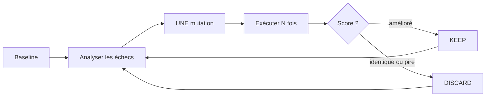

# 312 — Autoresearch — méthodologie de skill

Durée estimée : 120 min

> Un skill qui n'a jamais été évalué est un stub déguisé. La méthodologie autoresearch laisse un agent optimiser tes skills en boucle autonome — par mutations mesurables.

## Pourquoi ce module

Tu sais créer un `skill` depuis le module 03. Tu sais connecter des outils MCP depuis le module 06. Mais une question reste ouverte : comment savoir si ton skill *marche vraiment* ?

La plupart des skills écrits à la première itération fonctionnent entre 40 et 60 % du temps — 60 % étant déjà un très bon score initial. Le reste du temps, tu obtiens du bruit, des formats approximatifs, des étapes sautées. La solution n'est pas de réécrire le skill de zéro. C'est de laisser un agent l'exécuter des dizaines de fois, scorer chaque sortie, et resserrer le prompt jusqu'à ce que le score monte.

Cette approche s'appelle *autoresearch*, inspirée de la méthodologie d'Andrej Karpathy (boucles d'expérimentation autonomes). Au lieu d'optimiser du code d'entraînement ML, on optimise des prompts de skills.

À la fin de ce module, tu sais :

- appliquer le cycle complet : baseline, mutation, eval, keep/discard ;
- écrire 3 à 6 `eval` binaires qui testent un skill de manière reproductible ;
- lire un dashboard de progression et un `changelog` structuré ;
- décider quand arrêter d'itérer — rendements décroissants et plateau de score comme critères.

## Pré-requis

- [Module 103 — Skills](../01-fondations/103-skills.md) — tu dois savoir créer un `SKILL.md` avec une description de déclenchement et une procédure.
- [Module 106 — MCP](../01-fondations/106-mcp.md) — tu dois comprendre comment Copilot interagit avec des outils et des sources de données.
- VS Code avec l'extension GitHub Copilot activée.
- Un dépôt Git contenant au moins un skill existant à améliorer.

## Concepts clés

### Le problème : le skill-stub

Un skill-stub, c'est un `SKILL.md` qui a l'air correct mais qui échoue en pratique. Les symptômes sont variés :

- Copilot ignore une étape de la procédure.
- Le skill se déclenche dans un contexte où il ne devrait pas.
- Le résultat produit ne respecte pas le format attendu.
- La procédure est ambiguë et Copilot l'interprète différemment selon le contexte.

Le problème fondamental : tu ne détectes ces défauts que *par hasard*, en utilisant le skill au fil de l'eau. Sans évaluation systématique, chaque correction est un coup de dé — tu fixes un cas et tu en casses un autre sans le savoir.

### Le cycle autoresearch

La méthodologie autoresearch est une **boucle autonome** que tu lances et que l'agent exécute sans intervention. Le cycle :



**1. Baseline** — Exécuter le skill tel quel, plusieurs fois (5 par défaut), sur 3 à 5 scénarios de test. Scorer chaque sortie. C'est l'expérience #0.

**2. Analyser les échecs** — Quels evals échouent le plus ? Lire les sorties qui ont échoué. Identifier le pattern : problème de formatage ? Instruction manquante ? Directive ambiguë ?

**3. UNE mutation** — Changer **une seule chose** dans le `SKILL.md`. Pas cinq à la fois — tu ne saurais pas ce qui a aidé.

**4. Exécuter N fois** — Relancer le skill sur les mêmes scénarios. Scorer.

**5. Keep ou discard** — Si le score s'améliore : **KEEP**, c'est la nouvelle baseline. Si le score stagne ou baisse : **DISCARD**, revert au `SKILL.md` précédent.

**6. Répéter** jusqu'à ce que le score plafonne sur 3 expériences consécutives (rendements décroissants), que le budget d'expériences soit atteint, ou que tu arrêtes manuellement. En pratique, les skills bien travaillés convergent entre 70 et 85 % — viser 95 %+ est irréaliste pour la plupart des tâches.

### Les eval binaires

Un `eval` binaire est un critère de qualité pour un skill. Il se formule comme une question oui/non appliquée à chaque sortie du skill.

Format structuré :

```text
EVAL 1 : Commit type présent
Question : Le message commence-t-il par un type Conventional Commits ?
Pass : Le premier mot est feat, fix, docs, style, refactor, test ou chore
Fail : Le message ne commence pas par un type valide
```

**3 à 6 evals, c'est le sweet spot.** Plus de 6, et le skill se met à réciter les critères au lieu de vraiment s'améliorer.

Quatre critères définissent un bon eval :

| Critère | Définition | Mauvais exemple | Bon exemple |
|---|---|---|---|
| Binaire | Le verdict est PASS ou FAIL, jamais « partiel » | « Notez la lisibilité de 1 à 7 » | « Le message est-il sur une seule ligne ? » |
| Spécifique | Assez précis pour être cohérent d'une exécution à l'autre | « Le texte est-il lisible ? » | « Tous les mots sont-ils correctement orthographiés ? » |
| Non-gameable | Le skill ne peut pas tricher pour passer | « Moins de 200 mots » (optimise la brièveté au détriment du contenu) | « Le scope est présent et pertinent » |
| Dérivé du domaine | Teste un comportement métier | « La ligne 3 matche la regex X » | « Le changelog contient la date » |

**Score max = nombre d'evals × runs par expérience.** Avec 4 evals et 5 runs, le max est 20. Chaque expérience produit un score et un pourcentage de réussite.

### L'anatomie d'un fichier eval

Les evals et les artefacts autoresearch vivent dans un dossier dédié à la racine du dépôt :

```text
.autoresearch/
  writing-commit-message/
    dashboard.html       # dashboard live (auto-refresh 10s)
    results.json         # données pour le dashboard
    results.tsv          # journal de score par expérience
    changelog.md         # log de chaque mutation
    SKILL.md.baseline    # skill original avant optimisation
```

Le `dashboard.html` est une page HTML auto-contenue (CSS + JS inline, Chart.js via CDN) qui se rafraîchit toutes les 10 secondes en lisant `results.json`. Tu la visualises dans ton navigateur pendant que l'agent travaille — tu vois le score progresser en temps réel.

Le `results.tsv` enregistre chaque expérience :

```text
experiment	score	max_score	pass_rate	status	description
0	8	20	40.0%	baseline	original skill — no changes
1	12	20	60.0%	keep	ajout instruction scope multi-module
2	12	20	60.0%	discard	test layout left-to-right — aucune amélioration
3	15	20	75.0%	keep	ajout exemple concret de scope
```

### Le changelog : mémoire du processus

Le changelog enregistre chaque expérience — qu'elle soit gardée ou rejetée. C'est l'artefact le plus précieux : n'importe quel agent futur (ou modèle plus puissant) peut reprendre le travail là où tu l'as laissé.

Format strict :

```markdown
## Experiment 1 — keep

**Score :** 12/20 (60 %)
**Change :** Ajout d'une instruction explicite pour le scope multi-module.
**Reasoning :** L'eval 3 échouait systématiquement — le skill ne précisait pas comment choisir le scope quand le diff touche plusieurs modules.
**Result :** Eval 3 passe désormais. Eval 5 stable.
**Failing outputs :** Eval 4 échoue encore sur les diffs vides.
```

```markdown
## Experiment 2 — discard

**Score :** 12/20 (60 %)
**Change :** Ajout d'une règle de layout left-to-right.
**Reasoning :** Tentative d'améliorer la lisibilité du message.
**Result :** Aucune amélioration. La mutation ajoute de la complexité sans bénéfice.
**Failing outputs :** Mêmes échecs qu'avant.
```

Le changelog vit dans le dossier autoresearch du skill :

```text
.autoresearch/
  writing-commit-message/
    changelog.md
    ...
```

### Quand arrêter : la règle des 3 passes

Le critère d'arrêt : **95 %+ de taux de réussite sur 3 expériences consécutives**.

Pourquoi 95 % et pas 100 % ? Parce que le comportement d'un modèle de langage n'est pas déterministe. Un skill peut atteindre 100 % par chance sur une passe et redescendre à 85 % sur la suivante. Trois passes consécutives à 95 %+ indiquent que les rendements décroissants sont atteints.

La boucle s'arrête aussi si :

- Tu atteins le budget d'expériences (si tu en as fixé un).
- Tu arrêtes manuellement l'agent.
- L'agent n'a plus d'idées de mutation (il relit les sorties, tente de combiner des mutations précédentes, essaie de simplifier).

## Démonstration

Reprenons le skill `writing-commit-message` du module 03 et appliquons le cycle autoresearch.

### Etape 1 — Le draft initial (v1)

Le skill existe déjà. C'est notre point de départ :

```markdown
# writing-commit-message

Use when the user asks to write, draft, or generate a commit message.

## Procedure

1. Read the staged diff with `git diff --cached`.
2. Write a commit message following Conventional Commits format:
   - `type(scope): description` on the first line.
   - Types allowed: `feat`, `fix`, `docs`, `style`, `refactor`, `test`, `chore`.
3. Keep the first line under 72 characters.
4. Add a body only if the diff touches more than one concern.
```

### Etape 2 — Écrire 10 evals binaires

On définit 10 cas couvrant nominaux, limites et négatifs :

| # | Cas | Type |
|---|---|---|
| 01 | Ajout d'une fonction simple | Nominal |
| 02 | Correction d'un bug avec scope | Nominal |
| 03 | Modification de documentation | Nominal |
| 04 | Refactoring sans changement fonctionnel | Nominal |
| 05 | Diff touchant 5 fichiers dans 3 modules | Limite |
| 06 | Diff vide (rien de stagé) | Limite |
| 07 | Requête ambiguë (« aide-moi avec ce code ») | Négatif |
| 08 | Suppression d'un fichier entier | Limite |
| 09 | Première ligne du message > 72 caractères | Nominal (contrainte) |
| 10 | Changement de test uniquement | Nominal |

### Etape 3 — Première passe d'eval

On exécute chaque cas. Résultat : **7/10 PASS**.

Échecs observés :

- **Eval 05** — Le scope est `misc` au lieu du module principal. FAIL.
- **Eval 06** — Copilot invente un diff au lieu de signaler qu'il n'y a rien à commiter. FAIL.
- **Eval 09** — La première ligne fait 78 caractères. FAIL.

### Etape 4 — Changelog et mutation (v2)

On documente et on corrige :

```markdown
## 2026-05-27 10:00 — v1 — draft initial

Skill `writing-commit-message` existant (module 03). Evals : 7/10 PASS.
Échecs : 05 (scope multi-fichier), 06 (diff vide), 09 (longueur > 72).
```

Mutations appliquées au skill :

```diff
  ## Procedure
  
  1. Read the staged diff with `git diff --cached`.
+ 1b. If the diff is empty, reply: "Nothing is staged. Run `git add` first." and STOP.
  2. Write a commit message following Conventional Commits format:
     - `type(scope): description` on the first line.
     - Types allowed: `feat`, `fix`, `docs`, `style`, `refactor`, `test`, `chore`.
-3. Keep the first line under 72 characters.
+    - If the diff spans multiple modules, use the most-modified module as scope.
+ 3. Keep the first line under 72 characters. Count characters before responding.
  4. Add a body only if the diff touches more than one concern.
```

### Etape 5 — Seconde passe d'eval (v2)

On relance les 10 evals. Résultat : **10/10 PASS**.

On relance une seconde passe complète : **10/10 PASS**.

Le changelog final :

```markdown
## 2026-05-27 10:00 — v1 — draft initial

Evals : 7/10 PASS. Échecs : 05, 06, 09.

## 2026-05-27 10:30 — v2 — 3 échecs → ajout garde diff vide, règle scope multi-module, comptage explicite

- Ajout étape 1b : arrêt si diff vide.
- Ajout règle scope : module le plus modifié.
- Étape 3 : instruction explicite de compter les caractères.
Evals : 10/10 PASS (2 passes consécutives). Skill stable.
```

Le skill est déclaré stable. Le changelog documente le chemin parcouru — n'importe qui dans l'équipe peut comprendre *pourquoi* chaque instruction existe.

## Exercice ⭐⭐⭐

**Enoncé** — Prends un skill existant dans ton dépôt (ou le skill `writing-commit-message` du module 03) et applique le cycle autoresearch complet.

**Etapes guidées** :

1. Choisis un skill existant ou crée-en un simple.
2. Crée un dossier `evals/` dans le répertoire du skill.
3. Écris 10 fichiers eval binaires couvrant :
   - 4 cas nominaux,
   - 3 cas limites,
   - 3 cas négatifs.
4. Exécute la première passe. Note le score (ex. : 6/10 PASS).
5. Crée un fichier `CHANGELOG.md` à la racine du skill.
6. Documente la v1 dans le changelog avec le format `## YYYY-MM-DD HH:MM — v1 — observation`.
7. Applique une mutation au skill pour corriger les échecs.
8. Documente la mutation dans le changelog : `## YYYY-MM-DD HH:MM — v2 — observation → mutation`.
9. Relance les 10 evals. Itère jusqu'à 10/10 PASS.
10. Quand tu atteins 100 %, relance une seconde passe complète pour confirmer la stabilité.

**Critère de réussite** : les 10 evals passent à 100 % sur 2 passes consécutives, et le changelog retrace chaque mutation avec son motif.

## Validation

Tu peux passer au module suivant si :

- [ ] Ton skill possède un dossier `evals/` avec au moins 10 fichiers eval binaires.
- [ ] Chaque eval a un input, un comportement attendu et un verdict PASS/FAIL.
- [ ] Les evals couvrent des cas nominaux, limites et négatifs.
- [ ] Le fichier `CHANGELOG.md` existe et utilise le format `## YYYY-MM-DD HH:MM — vN — observation → mutation`.
- [ ] Le changelog explique chaque mutation et son motif.
- [ ] Le skill atteint 100 % des evals sur 2 passes consécutives.
- [ ] Tu sais expliquer les 4 critères d'un bon eval : binaire, indépendant, reproductible, dérivé du domaine.

## Pour aller plus loin

- [Module 208 — Workflows](../02-composition/208-workflows.md) : orchestrer plusieurs skills testés dans un flux métier complet.
- [Module 313 — Tester ses primitives](./313-evals.md) : aller plus loin avec des evals automatisés et des métriques de couverture.
- [Module 311 — Tokens, hallucinations et sobriété](./311-tokens-contexte.md) : comprendre pourquoi un skill trop long ou ambigu dégrade les résultats et consomme inutilement du contexte.
- **Appliquer autoresearch aux agents** : la même discipline fonctionne pour les fichiers `.agent.md`. Remplace « skill » par « agent » et adapte tes evals au rôle de l'agent.
- **Automatiser les evals** : pour les équipes avancées, les evals peuvent être scriptés en CI pour vérifier qu'un skill ne régresse pas après un merge.

**Suivant** : [208 — Workflows](../02-composition/208-workflows.md)
