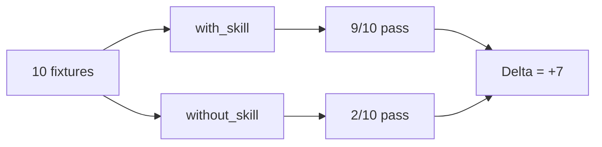

# 313 — Tester ses primitives (evals binaires)

Durée estimée : 60 min · Complexité : ⭐⭐⭐ · Pré-requis : [Module 104 — Skills](../01-fondations/104-skills.md)

> Tu sais créer un `skill`. Mais comment prouver qu'il fonctionne — et qu'il continue de fonctionner après chaque modification ?

## Pourquoi ce module

Un `skill` sans test est une promesse non vérifiée. Tu l'écris, tu le charges, tu lances une conversation — et tu *crois* qu'il fonctionne parce que la réponse a l'air correcte. Mais dès que tu modifies la description, ajoutes une étape à la procédure, ou changes le modèle sous-jacent, tu n'as aucun filet de sécurité.

Les `eval` binaires résolvent ce problème. Une eval est une assertion booléenne : « étant donné ce prompt, le skill a-t-il produit le comportement attendu ? ». Oui ou non, pas de zone grise. C'est l'équivalent d'un test unitaire pour du code classique, mais adapté au monde non-déterministe des LLM.

À la fin de ce module, tu sais :

- concevoir une `eval` binaire pour n'importe quel skill ou agent ;
- construire des `fixtures` de prompts avec leurs sorties attendues ;
- mesurer le delta entre `with_skill` et `without_skill` ;
- stocker tes evals dans un dossier `evals/` versionné avec ton code.

## Pré-requis

- [Module 104 — Skills](../01-fondations/104-skills.md) — tu dois savoir créer et déclencher un skill.
- Un dépôt Git contenant au moins un skill fonctionnel (par exemple `writing-commit-message` créé au module 03).
- VS Code avec l'extension GitHub Copilot activée.

## Concepts clés

### Qu'est-ce qu'une eval binaire ?

Une *eval binaire* (*binary eval*) est une assertion booléenne sur le comportement d'un agent ou d'un skill. Tu poses une question, tu observes la sortie, et tu vérifies une condition stricte : la sortie contient-elle un format précis ? Le skill s'est-il déclenché ? La réponse respecte-t-elle une contrainte donnée ?

Le résultat est toujours `pass` ou `fail` — jamais « plutôt bien » ou « acceptable ». Cette rigueur binaire est essentielle : elle rend les résultats comparables d'une exécution à l'autre et permet de détecter les régressions.

### Anatomie d'une fixture

Une `fixture` est un couple (entrée, assertion). L'entrée est un prompt que tu envoies à l'agent. L'assertion décrit ce que tu attends dans la sortie.

```yaml
# evals/writing-commit-message/fixtures.yml

fixtures:
  - name: "feat-simple"
    prompt: "Rédige un message de commit pour l'ajout d'un bouton de connexion."
    assertions:
      - type: contains
        value: "feat"
      - type: matches
        pattern: "^(feat|fix|docs|style|refactor|test|chore)\\(.+\\): .+"

  - name: "fix-typo"
    prompt: "Écris un commit pour la correction d'une faute de frappe dans le README."
    assertions:
      - type: contains
        value: "fix"
      - type: max_length
        value: 72
```

Chaque fixture isole un scénario. Les assertions sont des vérifications mécaniques : présence d'un mot-clé, correspondance avec une expression régulière, longueur maximale. Pas de jugement subjectif.

### Types d'assertions

Les evals binaires reposent sur un jeu restreint d'assertions :

| Type | Description | Exemple |
|---|---|---|
| `contains` | La sortie contient une chaîne | `"feat"` |
| `not_contains` | La sortie ne contient pas une chaîne | `"TODO"` |
| `matches` | La sortie correspond à une regex | `^feat\(.+\):` |
| `max_length` | La sortie ne dépasse pas N caractères | `72` |
| `starts_with` | La sortie commence par une chaîne | `"fix("` |
| `triggered` | Le skill a été activé par le routeur | `true` |

L'assertion `triggered` est particulière : elle ne vérifie pas le contenu de la sortie, mais le fait que le routeur sémantique ait chargé le skill. C'est la plus fondamentale — si le skill ne se déclenche pas, aucune autre assertion n'a de sens.

### with_skill vs without_skill : mesurer le delta

Le coeur de la méthode. Tu exécutes le même jeu de fixtures dans deux configurations :

- **`with_skill`** — le skill est présent dans `.agents/skills/`. L'agent a accès à la procédure.
- **`without_skill`** — le skill est absent (renommé ou déplacé). L'agent répond avec ses connaissances générales.



Le delta mesure la valeur ajoutée du skill. Un delta élevé prouve que le skill enseigne quelque chose que le modèle ne sait pas faire seul. Un delta nul ou négatif signifie que le skill est inutile — ou pire, qu'il dégrade les réponses.

**Règle pratique** : un skill qui n'améliore pas le score d'au moins 30 % ne justifie pas sa place dans le contexte.

### Structure du dossier evals/

Les evals vivent à côté du code, dans un dossier `evals/` à la racine du dépôt :

```text
evals/
  writing-commit-message/
    fixtures.yml
    results/
      2026-05-27-with-skill.json
      2026-05-27-without-skill.json
```

Le dossier `results/` contient les rapports d'exécution horodatés. Tu les versionnes pour suivre l'évolution dans le temps — une régression apparaît immédiatement dans le diff.

```diff
+ # evals/writing-commit-message/fixtures.yml
+ 
+ fixtures:
+   - name: "feat-simple"
+     prompt: "Rédige un message de commit pour l'ajout d'un bouton de connexion."
+     assertions:
+       - type: contains
+         value: "feat"
+       - type: matches
+         pattern: "^(feat|fix|docs|style|refactor|test|chore)\\(.+\\): .+"
```

### Rédiger de bonnes fixtures

Trois principes guident la conception des fixtures :

**1. Couvrir les cas nominaux et les cas limites.** Ne te contente pas de tester `feat` et `fix`. Teste aussi un commit multi-scope, un diff vide, un diff qui touche uniquement de la documentation.

**2. Une intention par fixture.** Chaque fixture vérifie un comportement précis. Si tu combines cinq assertions dans une seule fixture, tu ne sais pas laquelle échoue ni pourquoi.

**3. Prompts réalistes.** Écris les prompts comme un vrai utilisateur les écrirait — avec des formulations variées, des fautes éventuelles, des demandes implicites. Si tes fixtures sont trop « propres », tu testes un scénario qui n'arrivera jamais.

```yaml
  # Cas limite : prompt ambigu
  - name: "ambigu-sans-verbe"
    prompt: "commit message pour les changements"
    assertions:
      - type: triggered
        value: true
      - type: matches
        pattern: "^(feat|fix|docs|style|refactor|test|chore)"
```

### Exécuter les evals

L'exécution d'une eval suit un cycle en trois temps :

1. **Préparer l'environnement** — active ou désactive le skill selon le mode (`with_skill` / `without_skill`).
2. **Envoyer chaque fixture** — soumets le prompt à l'agent dans une conversation isolée.
3. **Vérifier les assertions** — compare la sortie aux assertions de la fixture, produis un verdict `pass` / `fail`.

Le rapport final agrège les résultats :

```yaml
# evals/writing-commit-message/results/2026-05-27-with-skill.json

run: "with_skill"
date: "2026-05-27"
total: 10
passed: 9
failed: 1
details:
  - fixture: "feat-simple"
    status: pass
  - fixture: "fix-typo"
    status: pass
  - fixture: "multi-scope"
    status: fail
    reason: "Missing scope in commit message"
```

## Démonstration

Tu vas créer un jeu d'evals pour le skill `writing-commit-message` du module 03.

### Etape 1 — Créer le dossier d'evals

```diff
+ # evals/writing-commit-message/fixtures.yml
+ 
+ fixtures:
+   - name: "feat-bouton"
+     prompt: "Rédige un message de commit pour l'ajout d'un bouton de connexion."
+     assertions:
+       - type: contains
+         value: "feat"
+       - type: matches
+         pattern: "^feat\\(.+\\): .+"
+ 
+   - name: "fix-typo-readme"
+     prompt: "Écris un commit pour la correction d'une faute dans le README."
+     assertions:
+       - type: contains
+         value: "fix"
+       - type: max_length
+         value: 72
```

### Etape 2 — Exécuter en mode with_skill

Lance les fixtures avec le skill actif. Pour chaque fixture, ouvre une nouvelle conversation dans Copilot et soumets le prompt. Note le résultat de chaque assertion.

Résultat attendu :

```yaml
run: "with_skill"
total: 2
passed: 2
```

Le skill charge la procédure Conventional Commits. L'agent produit des messages conformes.

### Etape 3 — Exécuter en mode without_skill

Renomme temporairement le dossier du skill :

```bash
mv .agents/skills/writing-commit-message .agents/skills/_disabled-writing-commit-message
```

Relance les mêmes fixtures. Sans la procédure, l'agent produit des messages dans un format libre — souvent correct sur le fond, mais rarement conforme au format Conventional Commits.

```yaml
run: "without_skill"
total: 2
passed: 0
```

### Etape 4 — Comparer le delta

Restaure le skill :

```bash
mv .agents/skills/_disabled-writing-commit-message .agents/skills/writing-commit-message
```

Le delta est `+2` sur 2 fixtures. Sur un jeu complet de 10 fixtures, tu observeras typiquement un delta de `+7` ou plus — preuve que le skill apporte une valeur mesurable.

### Etape 5 — Versionner les résultats

```diff
+ # evals/writing-commit-message/results/2026-05-27-with-skill.json
+ 
+ {
+   "run": "with_skill",
+   "date": "2026-05-27",
+   "total": 2,
+   "passed": 2,
+   "failed": 0
+ }
```

Commite les fixtures *et* les résultats. Le jour où tu modifies le skill, tu relances les evals et tu compares avec le rapport précédent.

## Exercice ⭐⭐⭐

**Enoncé** — Crée 10 evals pour le skill `writing-commit-message`, mesure le delta avant/après.

**Etapes guidées** :

1. Crée le dossier `evals/writing-commit-message/`.
2. Rédige un fichier `fixtures.yml` contenant 10 fixtures couvrant :
   - les types `feat`, `fix`, `docs`, `refactor`, `test`, `chore` ;
   - un prompt ambigu (sans verbe explicite) ;
   - un prompt long décrivant plusieurs changements ;
   - un prompt en anglais (le skill doit fonctionner quelle que soit la langue du prompt) ;
   - un prompt demandant un message pour un diff vide.
3. Exécute les 10 fixtures en mode `with_skill` — note les résultats dans `results/with-skill.json`.
4. Désactive le skill (renomme le dossier) et relance les 10 fixtures en mode `without_skill` — note les résultats dans `results/without-skill.json`.
5. Réactive le skill et compare les deux rapports.
6. Commite le tout : fixtures, résultats, et un court `README.md` dans `evals/writing-commit-message/` résumant le delta observé.

**Critère de réussite** : le rapport montre `with_skill: 9/10` et `without_skill: 2/10` (ou un delta comparable d'au moins +7).

## Validation

Tu peux passer au module suivant si :

- [ ] Ton dépôt contient un dossier `evals/writing-commit-message/` avec au moins 10 fixtures.
- [ ] Chaque fixture a un prompt réaliste et au moins une assertion binaire.
- [ ] Tu as exécuté les evals en mode `with_skill` et `without_skill`.
- [ ] Le delta entre les deux modes est d'au moins +7 sur 10.
- [ ] Les résultats sont versionnés dans `evals/writing-commit-message/results/`.

## Pour aller plus loin

- [Module 104 — Skills](../01-fondations/104-skills.md) : revoir la construction du skill `writing-commit-message` si tes evals révèlent des faiblesses dans la procédure.
- [Module 313 — Evals avancées](./313-evals.md) : passer des assertions binaires aux évaluations par LLM-juge et aux métriques de qualité graduées.
- [Module 103 — Agents personnalisés](../01-fondations/103-agents.md) : appliquer la même méthode d'evals à un fichier `.agent.md`.
- `docs/reference/eval-anatomy.md` — page de référence à créer.

## Module suivant

**Suivant** : [314 — Patterns de sobriété](./314-patterns-sobriete.md)
