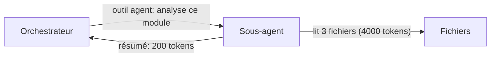

# 315 — Outils de réduction (snip, minimal-context-tools)

Durée estimée : 60 min · Complexité : ⭐⭐⭐ · Pré-requis : [Module 311](./311-tokens-contexte.md)

> Au-delà de la conception du code et du choix de modèle, trois catégories d'outils réduisent mécaniquement la consommation de tokens.

## Pourquoi ce module

Tu sais pourquoi les tokens comptent ([Module 311](./311-tokens-contexte.md)) et comment tes patterns de design influencent la consommation ([Module 314](./314-patterns-sobriete.md)). Mais même avec un code bien structuré, l'agent charge des fichiers entiers, exécute des commandes verbeuses et accumule des milliers de tokens inutiles dans le contexte.

Ce module présente les trois familles d'outils qui réduisent mécaniquement cette consommation : les sous-agents pour isoler les lectures, les CLI ciblés pour extraire uniquement l'information pertinente, et snip pour filtrer les sorties terminal avant qu'elles n'atteignent le modèle.

À la fin de ce module, tu sais :

- utiliser l'outil `agent` pour isoler les lectures de fichiers dans un sous-agent ;
- remplacer `read_file` par des CLI ciblés (ast-grep, rg, jq) pour réduire de 80 à 95 % les tokens chargés ;
- installer et configurer snip pour filtrer les sorties shell ;
- mesurer le gain concret de chaque outil sur une session réelle.

## Pré-requis

- [Module 311 — Tokens & fenêtre de contexte](./311-tokens-contexte.md) — tu dois comprendre pourquoi les tokens comptent.
- [Module 208 — Workflows](../02-composition/208-workflows.md) — tu dois maîtriser l'orchestration par sous-agents.
- VS Code avec l'extension GitHub Copilot activée.
- Un terminal avec `brew` disponible (macOS) ou accès à un gestionnaire de paquets.

## Concepts clés

### 1 Sous-agents (outil `agent`)

Dans un `workflow` orchestré ([Module 208](../02-composition/208-workflows.md)), l'outil `agent` délègue une tâche à un sous-agent qui lit les fichiers, raisonne, et restitue une conclusion synthétique. L'orchestrateur ne reçoit pas les fichiers bruts — il reçoit un résumé. Ce pattern réduit massivement les tokens en transit entre les étapes.



Sans sous-agent, l'orchestrateur aurait chargé les 4000 tokens de fichiers dans son propre contexte.

Anti-pattern à éviter : le sous-agent qui copie-colle 500 lignes dans sa réponse. Le coût est juste déplacé, pas réduit. Le sous-agent doit restituer uniquement la **conclusion**, pas les fichiers entiers.

### 2 Outils ciblés (`minimal-context-tools`)

Par défaut, l'agent lit des fichiers entiers avec `read_file` et exécute des commandes shell verbeuses. Chaque opération injecte des centaines — parfois des milliers — de tokens dans le contexte. Les `minimal-context-tools` remplacent ces opérations par des CLI spécialisés qui extraient uniquement l'information pertinente :

| Skill | CLI sous-jacent | Ce qu'il fait | Économie typique |
|---|---|---|---|
| `extracting-code-structure` | **ast-grep** | Liste les fonctions, classes et exports d'un fichier sans charger le corps | 80–90 % |
| `searching-text` | **ripgrep** (`rg`) | Trouve les lignes pertinentes avec leur contexte immédiat, en un seul appel | 70–85 % |
| `querying-json` | **jq** | Extrait un champ précis d'un fichier JSON volumineux | 80–95 % |
| `querying-yaml` | **yq** | Extrait un champ d'un fichier YAML (docker-compose, GitHub Actions) | 80–95 % |
| `finding-files` | **fd** | Recherche de fichiers 13–23× plus rapide que `find`, avec des défauts sensés | 50–70 % |
| `replacing-text` | **sd** | Find & replace avec regex JavaScript, 2–12× plus rapide que `sed` | — |
| `analyzing-code-structure` | **ast-grep** | Pattern matching AST pour des éditions structurelles sans ambiguïté textuelle | 60–80 % |
| `analyzing-code` | **tokei** | Statistiques de code (lignes, commentaires, blancs) par langage | 90 %+ |
| `viewing-files` | **bat** | Affichage avec coloration syntaxique et intégration Git | 30–50 % |
| `fuzzy-selecting` | **fzf** | Sélection interactive avec preview, pour filtrer les résultats de recherche | — |

La différence est concrète : un `read_file` sur un fichier de 500 lignes consomme environ 6 000 à 8 000 tokens. Un `ast-grep` sur le même fichier pour en extraire la structure (signatures de fonctions, noms de classes, exports) en consomme 400 à 700. C'est 90 % d'économie sur une seule opération — et ces économies se cumulent à chaque appel d'outil dans une session.

L'intérêt va au-delà des tokens. Ces CLI sont **déterministes** — contrairement à un `grep` dont la sortie peut varier en verbosité, `rg` avec `--context` et `jq` avec un filtre précis produisent toujours une sortie prévisible et minimale. Moins de bruit entrant = moins d'hallucination sortante.

### 3 SNIP — réduction de tokens au niveau du shell

[snip](https://github.com/edouard-claude/snip) est un proxy CLI écrit en Go qui intercepte les commandes shell lancées par ton assistant IA et filtre leur sortie via des **pipelines YAML déclaratifs** avant qu'elle n'atteigne la fenêtre de contexte. Pas de résumé approximatif — des filtres déterministes par commande.

L'impact est concret :

| Commande | Avant | Après | Réduction |
|---|---:|---:|---:|
| `go test ./...` | 689 tokens | 16 tokens | **97,7 %** |
| `cargo test` | 591 tokens | 5 tokens | **99,2 %** |
| `git log` | 371 tokens | 53 tokens | **85,7 %** |
| `git status` | 112 tokens | 16 tokens | **85,7 %** |
| `git diff` | 355 tokens | 66 tokens | **81,4 %** |

L'installation et l'intégration se font en deux commandes :

```bash
# Installer snip (macOS / Linux)
brew install edouard-claude/tap/snip

# Intégrer avec Copilot
snip init --agent copilot
```

Snip supporte aussi Claude Code (`snip init`), Cursor (`--agent cursor`), Gemini CLI (`--agent gemini`), Codex (`--agent codex`) et une dizaine d'autres agents. 127 filtres couvrent git, go, cargo, npm, docker, kubectl, terraform, aws, gh et 80+ autres outils.

Si aucun filtre ne correspond à une commande, elle passe inchangée — zéro overhead. Snip traque les économies dans une base SQLite locale et affiche un rapport via `snip stats`.

## Mise en pratique

### Étape 1 — Installer les CLI minimal-context-tools

Installe les outils de base :

```bash
brew install ast-grep ripgrep jq yq fd sd tokei bat fzf
```

### Étape 2 — Comparer read_file vs extracting-code-structure

Sur un fichier de plus de 200 lignes :

```bash
# Outil naïf — tout le fichier
wc -c src/mon-fichier.ts  # ex: 8500 caractères ≈ 2500 tokens

# Outil ciblé — seulement la structure
ast-grep --pattern '$NAME($$$PARAMS): $RET { $$$ }' src/mon-fichier.ts
# ex: 12 lignes ≈ 200 tokens
```

### Étape 3 — Installer et mesurer snip

```bash
# Installer
brew install edouard-claude/tap/snip

# Intégrer avec Copilot
snip init --agent copilot
```

Lance une session Copilot et exécute 10–20 commandes habituelles (`git log`, `npm test`, `go test ./...`). Consulte le rapport :

```bash
snip stats
```

### Étape 4 — Mesurer le gain sur une session

Compare le nombre de tokens de deux sessions identiques (même tâche, même repo) — une sans snip, une avec. Le delta moyen mesuré est de 60 à 85 % de réduction sur les sessions CLI intensives.

## Pièges & anti-patterns

| Piège | Pourquoi c'est un problème | Solution |
|---|---|---|
| Sous-agent qui copie-colle 500 lignes | Le coût est déplacé, pas réduit | Le sous-agent ne doit restituer que la conclusion |
| Installer les CLI sans skills associés | L'agent ne sait pas quand les utiliser | Installer aussi le plugin `minimal-context-tools` |
| Snip avec `--no-filter` en permanence | Désactive tout le gain | Ne l'utiliser que pour le debug |
| Oublier `snip stats` | Pas de mesure = pas d'amélioration | Consulter les stats après chaque session intensive |

## Exercice ⭐⭐⭐

### Énoncé

**Partie 1 — Minimal-context-tools**

1. Choisis 3 fichiers de plus de 200 lignes dans ton projet.
2. Pour chaque fichier, compare le nombre de tokens entre `read_file` complet et `ast-grep` (structure seule).
3. Calcule le pourcentage d'économie moyen.

**Partie 2 — SNIP**

1. Installe snip dans ton workspace.
2. Choisis 3 commandes terminal fréquentes (`npm test`, `npm run build`, `git log --oneline -20`).
3. Pour chaque commande, mesure le nombre de lignes avant et après snip.
4. Calcule le pourcentage de réduction moyen.

### Résultat attendu

```yaml
# Partie 1
fichier_1: { read_file: 2400 tokens, ast_grep: 280 tokens, economie: "88%" }
fichier_2: { read_file: 3100 tokens, ast_grep: 350 tokens, economie: "89%" }
fichier_3: { read_file: 1800 tokens, ast_grep: 200 tokens, economie: "89%" }
moyenne: "89%"

# Partie 2
commande_1: { avant: 420 lignes, apres: 12 lignes, reduction: "97%" }
commande_2: { avant: 180 lignes, apres: 25 lignes, reduction: "86%" }
commande_3: { avant: 95 lignes, apres: 18 lignes, reduction: "81%" }
moyenne: "88%"
```

## Validation

Tu as réussi ce module si :

- Tu as mesuré le gain des `minimal-context-tools` sur au moins 3 fichiers, avec un pourcentage d'économie documenté.
- Tu as installé snip et produit une mesure chiffrée du gain sur au moins 3 commandes.
- Tu sais expliquer la différence entre un sous-agent qui résume et un sous-agent qui copie-colle.

## Pour aller plus loin

- **Plugin `minimal-context-tools`** — explore le dépôt `sebastiendegodez/copilot-instructions` pour voir comment les skills wrappent les CLI.
- **Pipelines snip personnalisés** — crée un filtre YAML custom pour une commande spécifique à ton projet.
- [Module 314 — Patterns de sobriété](./314-patterns-sobriete.md) — les principes de design qui complètent ces outils.
- [Module 311 — Tokens & fenêtre de contexte](./311-tokens-contexte.md) — le cadre théorique.

## Sources

- [snip — edouard-claude/snip](https://github.com/edouard-claude/snip) — le dépôt source, documentation des 127 filtres et benchmarks.
- [minimal-context-tools — sebastiendegodez/copilot-instructions](https://github.com/SebastienDegodez/copilot-instructions) — le plugin qui package les skills de réduction.
- [ast-grep](https://ast-grep.github.io/) — documentation officielle du pattern matching AST.
- [ripgrep](https://github.com/BurntSushi/ripgrep) — documentation officielle.
