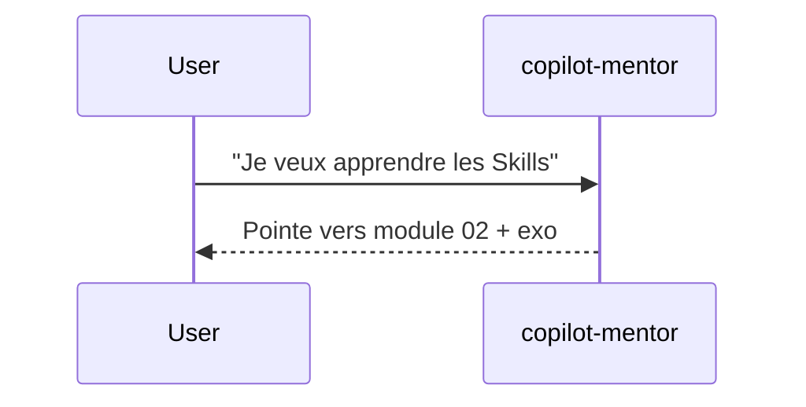

# Spec 01 — Gabarit de module (autonome)

**But** : Définir la structure exacte de chaque page de module du parcours. Ce gabarit est **autosuffisant** — toute la mise en forme et les règles y sont décrites, aucune référence externe n'est nécessaire.

---

## 1. Frontmatter Docusaurus

Chaque module commence par un frontmatter YAML :

```yaml
---
id: 01-instructions
title: "01 — Instructions personnalisées"
sidebar_position: 1
description: "Premier levier de personnalisation : .github/copilot-instructions.md et .instructions.md scopés."
---
```

## 2. En-tête de page

Sous le titre H1, deux lignes obligatoires :

```markdown
**Durée** : ~45 min · **Complexité** : ⭐⭐ · **Pré-requis** : Module 00

> Pourquoi ce module — phrase d'accroche en italique citation (1–2 lignes max).
```

Échelle de complexité :

| Étoiles | Sens |
|---|---|
| ⭐ | Lecture passive, aucune commande à lancer |
| ⭐⭐ | Quelques commandes shell, un fichier à créer |
| ⭐⭐⭐ | Multi-fichiers, raisonnement de design, eval à exécuter |

## 3. Sections obligatoires (dans cet ordre)

### 3.1 Objectif

Liste à puces : 3 à 5 résultats observables après le module.

```markdown
## Objectif

À la fin de ce module, tu sais :

- Créer un fichier `.github/copilot-instructions.md` pertinent.
- Scoper une instruction à un sous-dossier via `applyTo`.
- Mesurer l'impact d'une instruction sur une réponse Copilot.
```

### 3.2 Ce que tu vas apprendre

Mini sommaire interne (4 à 7 items numérotés). Sert de roadmap dans la page.

### 3.3 Contenu pédagogique

Texte explicatif **entrecoupé de diffs git progressifs** (voir §5). Chaque concept est introduit par :

1. Une phrase d'intention (« On veut que Copilot connaisse notre stack »)
2. Un diff git montrant le `+` à ajouter
3. Un paragraphe d'observation (« Maintenant Copilot répond en TypeScript strict »)

### 3.4 Exercice (hands-on)

Encadré clairement séparé :

```markdown
## Exercice

**Énoncé** — En 10 minutes, tu vas …

**Étapes guidées** :

1. …
2. …
3. …

**Critère de réussite** : la commande X retourne Y.
```

### 3.5 Validation — « Tu es prêt si… »

Checklist binaire (cochée mentalement, pas de quiz interactif) :

```markdown
## Validation

Tu peux passer au module suivant si :

- [ ] Ton repo contient un `.github/copilot-instructions.md` non vide.
- [ ] Tu sais expliquer la différence entre instruction globale et instruction scopée.
- [ ] Tu as observé un avant/après dans une vraie conversation Copilot.
```

### 3.6 Pour aller plus loin (optionnel)

Liens internes vers la `reference/`, `cookbook/`, autres modules. **Pas** de liens externes obligatoires.

### 3.7 Module suivant

Une ligne :

```markdown
**Suivant** : [02 — Prompts personnalisés](./02-prompts.md)
```

## 4. Ton et style

- **Tutoiement systématique**.
- **Phrases courtes**, voix active.
- **Aucun emoji** sauf les ⭐ de complexité et les ✅/❌ dans les tableaux comparatifs.
- Anglicismes techniques tolérés quand le terme français est moins clair : *prompt*, *agent*, *skill*. Toujours en italique à la première occurrence.

## 5. Diffs git progressifs

Format préféré pour montrer une évolution de fichier :

````markdown
```diff
  # .github/copilot-instructions.md
  
  Tu es un assistant de code pour ce projet.
+ 
+ ## Stack
+ - TypeScript strict
+ - Vitest pour les tests
+ - Pas de `any` ni de `as unknown`
```
````

Règles :

- Toujours 1 ligne de contexte au-dessus et en-dessous quand possible.
- Une seule intention par diff (n'agrège pas 3 changements indépendants).
- Le chemin du fichier est en commentaire dans la première ligne.

## 6. Mermaid

Pour les schémas de séquence (notamment agents) :

````markdown

````

Garder les diagrammes **sous 12 nœuds**. Si plus complexe, splitter.

## 7. Tableaux comparatifs

Format Markdown standard, 2 à 4 colonnes max :

```markdown
| Critère | Instruction | Skill |
|---|---|---|
| Auto-chargée | ✅ | ❌ |
| Procédurale | ❌ | ✅ |
```

## 8. Code blocks

- Spécifier toujours le langage : ` ```bash `, ` ```yaml `, ` ```ts `.
- Commandes shell sans `$` en préfixe.
- Pour montrer la sortie, séparer en deux blocs (commande puis sortie).

## 9. Longueur cible

- Module ⭐ : 400–700 mots
- Module ⭐⭐ : 700–1200 mots
- Module ⭐⭐⭐ : 1200–2000 mots

Au-delà de 2000 mots → split en deux modules.

## 10. Anti-patterns à éviter

- Pavé de théorie sans diff
- Exercice sans critère de réussite mesurable
- Capture d'écran de l'IDE Copilot (préférer le diff)
- Vidéo embarquée (rend le site non-autonome)
- Lien externe en sortie obligatoire (« Lis ce post de blog avant de continuer »)
