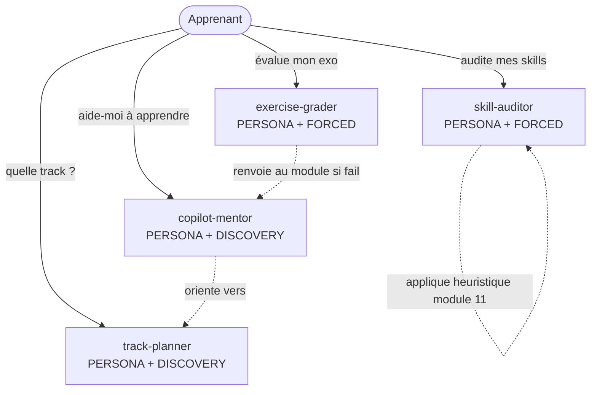

# Spec 06 — Agents : vue d'ensemble

**But** : Cataloguer les 4 agents livrés avec le site et leurs responsabilités. Chaque agent fait l'objet d'un *handoff packet* Genesis dans les specs 07–10.

---

## 1. Décision de design (Step 3.5 macro)

Les 4 agents sont **distincts** car :

| Critère | copilot-mentor | exercise-grader | track-planner | skill-auditor |
|---|---|---|---|---|
| Trigger | Apprentissage général | Soumission d'exercice | Demande d'orientation | Audit d'un repo de skills |
| Lifecycle | Long, multi-tours | Court, déterministe | Court, conversationnel | Long, analytique |
| Tools | Read-only docs | Read code + run tests | Read profile | Read skills + eval runner |
| Identité | Pédagogue | Examinateur | Conseiller | Auditeur |

Un agent monolithique violerait le SRP (« and » entre 4 capacités hétérogènes). Refactor-pattern **R1 SPLIT** appliqué.

## 2. Carte de responsabilités

## 3. Découpage des invocations

| Agent | Mode dispatch | Déclencheur typique (FR) |
|---|---|---|
| copilot-mentor | DISCOVERY | « explique-moi … », « par où commencer », « je débute » |
| exercise-grader | FORCED | « vérifie mon exercice du module N », « check ma soluce » |
| track-planner | DISCOVERY | « quelle track pour moi », « combien de temps pour … » |
| skill-auditor | FORCED | « audite mes skills », « est-ce que ce skill est utile » |

## 4. Composition externe

Les 4 agents dépendent **uniquement** du site (specs 02–11) — pas de skill externe obligatoire. Optionnel : `apm` pour la distribution. Aucune **PHANTOM DEPENDENCY** : chaque agent se suffit à lui-même si copié dans `.github/agents/`.

## 5. Anti-patterns évités

- **Super-agent** « copilot-coach » fourre-tout → split en 4.
- **Sidecar redondant** : pas d'agent « explainer » qui doublonne mentor.
- **Bundle leakage** : les evals (spec 09) restent hors du `.agent.md` distribué — placés en `evals/<agent>/`.
- **Toolless assertion** : skill-auditor doit *lire* les fichiers (pas asserter à partir d'un souvenir) → outils `read_file`, `grep_search` déclarés.

## 6. Lien vers les handoff packets

- [Spec 07 — copilot-mentor](./07-agent-copilot-mentor.md)
- [Spec 08 — exercise-grader](./08-agent-exercise-grader.md)
- [Spec 09 — track-planner](./09-agent-track-planner.md)
- [Spec 10 — skill-auditor](./10-agent-skill-auditor.md)
