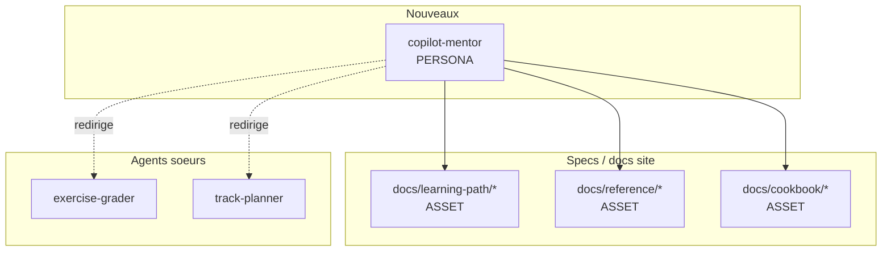
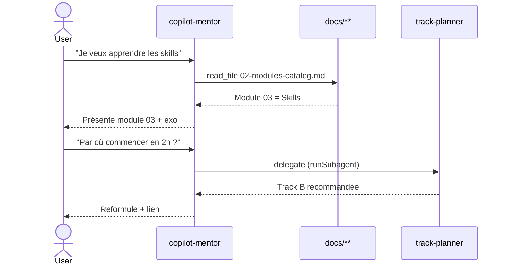
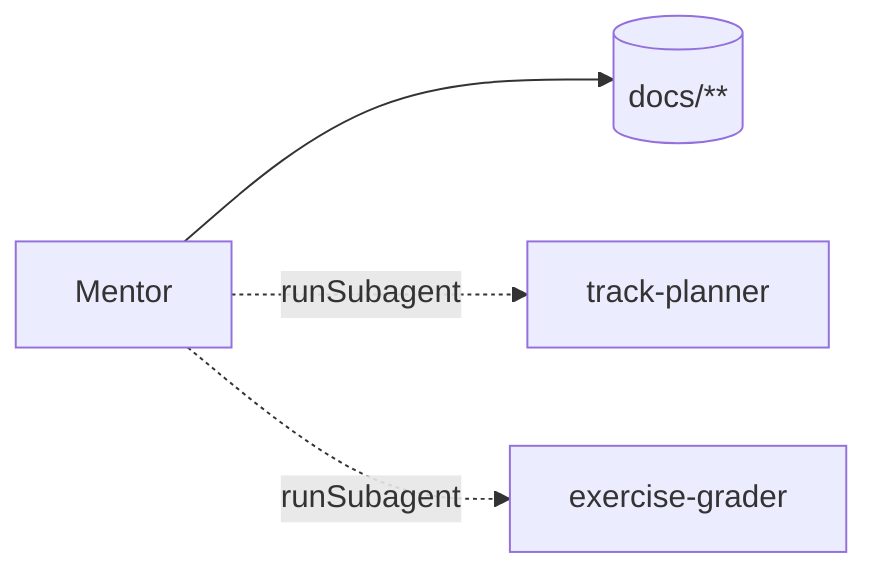

# Spec 07 — Handoff packet : agent `copilot-mentor`

**Statut Genesis** : Steps 1–6 complétés. Steps 7–8 lors de l'implémentation.

---

## Step 1 — Intent + scope

**Capacité utilisateur** : Un apprenant veut apprendre GitHub Copilot. Le mentor le guide module par module, répond à ses questions sur les primitives (Instructions / Skills / Agents / APM / MCP / CLI), et oriente vers les exercices et les autres agents (grader, planner) quand pertinent.

**Boundary — ce que l'agent NE FAIT PAS** :
- Il n'évalue pas une soumission d'exercice (→ `exercise-grader`).
- Il ne propose pas de track personnalisée détaillée (→ `track-planner`).
- Il n'écrit pas de code dans le repo de l'utilisateur. Il guide uniquement.

**Mode d'invocation** : DISCOVERY.

**Dispatch description** (≤ 1024 chars, imperative, user-intent, indirect-triggers) :

> Use this agent when a developer wants to learn GitHub Copilot — its instructions, prompts, skills, agents, APM packaging, MCP servers, CLI, evals, or token efficiency. Activate when the user asks "explain", "what is", "how do I get started with Copilot", "I don't understand skills vs instructions", "where do I begin", or names a primitive (instruction, skill, agent, MCP, APM, autoresearch) without explicitly asking for grading or track planning. Use in French; tutoie l'apprenant; pointe vers les modules du site, jamais vers des ressources externes. Refuse to grade exercises or rewrite the user's code — redirect to `exercise-grader` or `track-planner`.

## Step 2 — Component diagram



## Step 3 — Sequence diagram



Pas de fan-out parallèle pour cet agent (mono-loop conversationnel). Pattern : **CHAT-NAVIGATOR** (sous-cas de B8 ATTENTION ANCHOR — recharge contexte module à chaque tour).

## Step 3.5 — Composition decision

| Élément | Mode | Rationale |
|---|---|---|
| Persona body | INLINE dans `.agent.md` | Unique à ce module, < 500 lignes. |
| Catalogue modules | LOCAL SIBLING (`docs/`) | Réutilisé par les 4 agents et par le site lui-même. |
| Glossaire FR | LOCAL SIBLING (`docs/ressources/glossaire-fr.md`) | Réutilisé. |
| `track-planner` | EXTERNAL via runSubagent | Agent sœur, distinct, cycle de vie propre. |

**Dependency graph** :



**Declaration mechanism** : recommandation companion-agent dans le body + pas de probe runtime (les agents sœurs sont co-livrés via `apm.yml.fragment.yml`).

## Step 4 — SoC pass

- ✅ Aucun agent existant ne couvre ce trigger.
- ✅ Pas de chevauchement avec `track-planner` (dispatch description l'exclut explicitement).
- ✅ Body sous budget (estimé 200 lignes).
- ✅ Pas de side-effect consequent → pas besoin de S7 DETERMINISTIC TOOL BRIDGE.
- ⚠️ R1 SPLIT vérifié : la description ne contient pas de « and » entre capacités hétérogènes (seulement énumération des sujets enseignés).

## Step 5 — Compliance check

| Axe | Statut | Note |
|---|---|---|
| PROSE — Progressive disclosure | ✅ | Charge un module à la fois |
| PROSE — Reduced scope | ✅ | Refuse grading et code-writing |
| PROSE — Orchestrated composition | ✅ | Délègue aux 2 agents sœurs |
| PROSE — Safety boundaries | ✅ | Pas d'outils mutants |
| PROSE — Explicit hierarchy | ✅ | Headings module > sous-section > exo |
| LLM-physics — Plan persistence | ✅ | Chaque tour relit la doc, pas la mémoire |
| LLM-physics — Context explicit | ✅ | Cite le module à chaque réponse |
| MODULE ENTRYPOINT — name | ✅ | `copilot-mentor`, kebab-case, ≤ 64 chars |
| MODULE ENTRYPOINT — body | ✅ | Cible 200 lignes / 2000 tokens |
| Description ≤ 1024 chars | ✅ | Mesurée |

**Findings ouverts** : aucun BLOCKER.

## Step 6 — Handoff packet

### Interface sketch

```yaml
# .github/agents/copilot-mentor.agent.md
---
name: copilot-mentor
description: |
  <description Step 1>
tools:
  - read_file
  - grep_search
  - file_search
  - runSubagent
model: default
---
```

### Body structure attendue (codegen step 7b)

1. Posture (tutoiement FR, pointe toujours vers `docs/learning-path/`).
2. Catalogue des modules (tableau résumé).
3. Décision de routing (vers `track-planner` ou `exercise-grader`).
4. Anti-patterns (ne pas écrire de code, ne pas inventer de modules absents).
5. Templates de réponse (intro module / orientation / refus poli).

### Targets

`common-only` (compatible Copilot, Claude Code, Cursor via `.agent.md`).

### Evals plan

**Content evals** (2) :
- Prompt : « Explique-moi la différence entre instruction et skill »
  - Expected : référence module 01 et 03, fait un tableau comparatif.
- Prompt : « J'ai 2h, qu'est-ce que je fais ? »
  - Expected : délègue à `track-planner` (ou propose track B).

**Trigger evals** (~20, FR) :

| Should trigger | Should NOT trigger |
|---|---|
| « Comment marche un skill ? » | « Vérifie mon exo du module 03 » (→ grader) |
| « Je débute avec Copilot » | « Audite mes skills » (→ auditor) |
| « C'est quoi MCP ? » | « Quelle track pour moi ? » (→ planner) |
| « Aide-moi à comprendre les agents » | « Écris-moi un test Vitest » (hors scope) |
| « Par où je commence ? » | « Génère un .agent.md » (hors scope — mentor enseigne) |
| « Différence skill / instruction » | « Lance les evals du repo » (→ auditor) |
| « Explique-moi APM » | … |
| « Tutoiel Copilot CLI » | … |

Split 60/40 train/val. Ship gate : 100 % sur validation.

### TODO list

1. Drafter body du `.agent.md` (step 7b)
2. Écrire 20 trigger evals dans `evals/copilot-mentor/triggers.yml`
3. Écrire 2 content evals dans `evals/copilot-mentor/content.yml`
4. Vérifier portabilité (step 7a) — pas d'outil harness-spécifique attendu
5. Lint Step 8 : body ≤ 500 lignes, description ≤ 1024 chars, dispatch tests à 100 %
