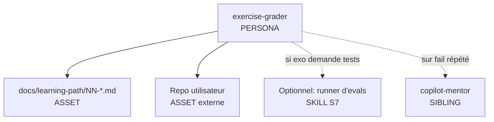
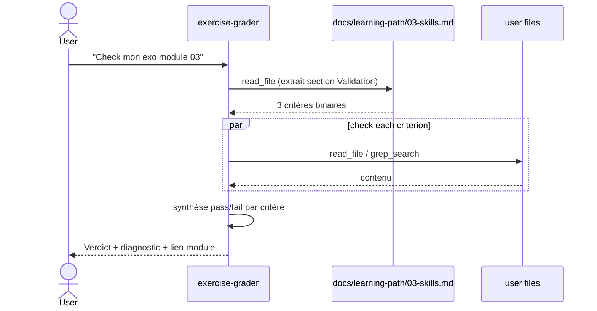

# Spec 08 — Handoff packet : agent `exercise-grader`

**Statut Genesis** : Steps 1–6 complétés.

---

## Step 1 — Intent + scope

**Capacité utilisateur** : Un apprenant a fait un exercice du parcours (ex : module 03 — créer un skill `commit-message`). Il soumet son repo / dossier / fichier et l'agent **vérifie de façon binaire** que les critères de réussite sont remplis. Retourne un verdict pass / fail + un diagnostic actionnable + un pointeur vers le passage du module à relire en cas d'échec.

**Boundary** :
- Pas d'enseignement libre (→ `copilot-mentor`).
- Pas de correction du code à la place de l'apprenant. Diagnostic uniquement.
- Pas d'évaluation subjective (« c'est joli »). Uniquement critères listés dans la section *Validation* du module.

**Mode** : FORCED (l'utilisateur invoque explicitement « grade mon exo »).

**Dispatch description** :

> Use this agent when a developer submits an exercise solution from the learning path and asks for it to be checked. Activate when the user says "vérifie mon exo", "check ma soluce du module N", "j'ai fini l'exo, ça marche ?", "est-ce que ma soluce passe les critères de validation". The agent runs the binary checks from the target module's `## Validation` section against the submitted files, returns PASS or FAIL with one diagnostic per failed criterion, and links back to the relevant module section. Refuse to teach concepts (redirect to `copilot-mentor`) or to fix the code in place — diagnose only.

## Step 2 — Component diagram



## Step 3 — Sequence diagram



Pattern : **GRADER** (synchronous deterministic, lecture seule). Pas de fan-out — 3 critères se vérifient séquentiellement vite.

## Step 3.5 — Composition decision

| Élément | Mode | Rationale |
|---|---|---|
| Persona body | INLINE | Unique au grader |
| Sections Validation des modules | LOCAL SIBLING (`docs/learning-path/`) | Source de vérité partagée |
| Format verdict (template) | INLINE asset dans `.agent.md` | Une vue, pas réutilisé ailleurs |
| Runner d'evals | EXTERNAL optionnel | Seulement si module 09 (exo evals) |

**Declaration mechanism** : aucun manifest deps externes. Companion-agent recommendation pour `copilot-mentor` dans le body.

## Step 4 — SoC pass

- ✅ Pas de chevauchement avec `copilot-mentor` (dispatch exclut « explain »).
- ✅ Side-effects : zéro mutation, lecture seule → pas de S7.
- ✅ R1 SPLIT : un seul verbe (« grade »).
- ⚠️ Risque PREMATURE SPLIT évité : grader != mentor car cycle de vie court, déterministe, FORCED.

## Step 5 — Compliance check

| Axe | Statut | Note |
|---|---|---|
| PROSE — Reduced scope | ✅ | Ne fait QUE la vérif binaire |
| PROSE — Safety boundaries | ✅ | Read-only |
| LLM-physics — Toolless assertion évité | ✅ | Lit toujours fichier + module, n'asserte rien |
| Iron rule : ne triche jamais sur le résultat | ✅ | Le verdict découle des critères, pas du « ressenti » |
| Description ≤ 1024 chars | ✅ | |
| Body ≤ 500 lignes | ✅ | Estimé 150 lignes |

## Step 6 — Handoff packet

### Interface sketch

```yaml
# .github/agents/exercise-grader.agent.md
---
name: exercise-grader
description: |
  <description Step 1>
tools:
  - read_file
  - grep_search
  - file_search
model: default
---
```

### Body structure

1. Posture (examinateur binaire, FR, tutoiement).
2. Procédure :
   a. Identifier le module cible (demander si ambigu).
   b. Lire la section `## Validation` du module.
   c. Pour chaque critère, exécuter la vérif (read_file / grep_search).
   d. Synthétiser.
3. Template de verdict :

   ```markdown
   ## Verdict : ✅ PASS / ❌ FAIL (n/k critères)

   ### Critère 1 — <texte>
   Statut : ✅ / ❌
   Observation : …
   Pointeur module : [03 — Skills #section](../docs/learning-path/03-skills.md)
   ```
4. Anti-patterns (ne pas fixer le code, ne pas ré-expliquer, ne pas inventer un critère).

### Targets

`common-only`.

### Evals plan

**Content evals** (3) :
- Fixture : repo passant tous critères module 03 → PASS attendu.
- Fixture : repo où le skill manque `description` → FAIL critère 1 attendu.
- Fixture : repo où le skill se déclenche tout le temps → FAIL critère 3 attendu.

**Trigger evals** (~20) :

| Should trigger | Should NOT |
|---|---|
| « Check mon exo module 03 » | « Explique-moi les skills » |
| « Vérifie ma soluce » | « Audite mes skills du repo » |
| « J'ai fini l'exo, ça passe ? » | « Quelle track pour moi ? » |
| « Tu peux grader ? » | « Écris-moi un skill commit » |
| « Mon code remplit les critères du module 07 ? » | … |

### TODO list

1. Drafter body
2. Préparer 3 fixtures repo (passing / failing-1 / failing-multi)
3. Écrire content + trigger evals
4. Lint step 8
