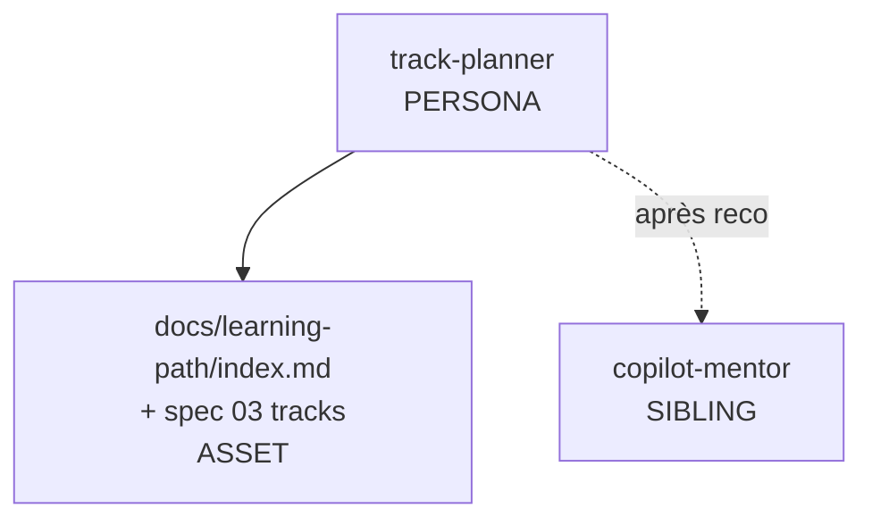
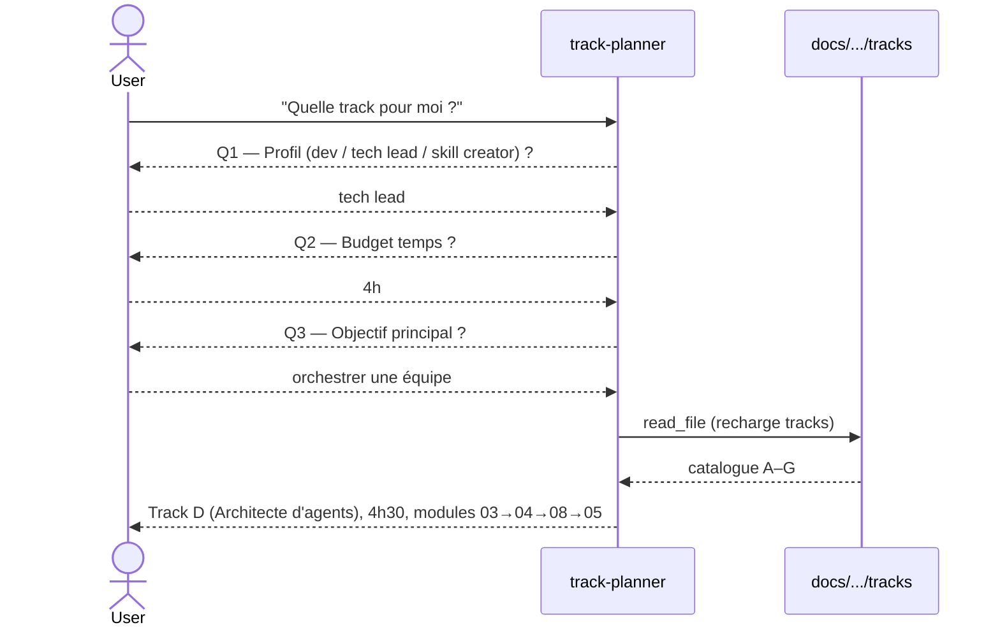

# Spec 09 — Handoff packet : agent `track-planner`

**Statut Genesis** : Steps 1–6 complétés.

---

## Step 1 — Intent + scope

**Capacité utilisateur** : Un apprenant veut savoir **quelle track suivre** (spec 03) selon son profil, son temps disponible, et son objectif. L'agent pose 3–4 questions, recommande **une** track parmi A–G avec justification, et renvoie vers le premier module.

**Boundary** :
- Ne fait pas le coaching ensuite (→ `copilot-mentor` une fois la track choisie).
- Ne grade pas d'exercices.
- Ne crée pas de track sur mesure : si rien ne correspond, recommande track E (Complet) ou décline.

**Mode** : DISCOVERY.

**Dispatch description** :

> Use this agent when a learner asks which learning track to follow or how to navigate the site. Activate when the user asks "quelle track pour moi", "par où je commence si j'ai N heures", "je suis tech lead, qu'est-ce que je dois lire", "je veux apprendre vite", "y a-t-il un parcours rapide". The agent runs a 3-4 question profile interview (role, time budget, primary goal, current Copilot familiarity) and recommends ONE track among A–G with a one-paragraph justification and a link to its first module. Refuse to teach individual concepts (redirect to `copilot-mentor`) or to grade exercises (redirect to `exercise-grader`).

## Step 2 — Component diagram



## Step 3 — Sequence diagram



Pattern : **DECISION TREE conversationnel** — pas de fan-out.

## Step 3.5 — Composition decision

| Élément | Mode | Rationale |
|---|---|---|
| Persona body + arbre de décision | INLINE | Spécifique au planner |
| Catalogue des tracks | LOCAL SIBLING | Réutilisé par site + mentor |
| Questionnaire (3 questions) | INLINE template | Court, unique |

Pas d'EXTERNAL MODULE.

## Step 4 — SoC pass

- ✅ Trigger orthogonal à `copilot-mentor` (planner = orientation, mentor = enseignement).
- ✅ R1 SPLIT vérifié.
- ✅ Pas de side-effect.
- ⚠️ Risque collision dispatch avec mentor sur « par où commencer » → on accepte que la query la plus générique aille au mentor, et le mentor délègue au planner si l'utilisateur demande un parcours optimisé (cf. Step 6 mentor).

## Step 5 — Compliance check

| Axe | Statut |
|---|---|
| Reduced scope | ✅ |
| Description ≤ 1024 | ✅ |
| Body ≤ 500 lignes | ✅ (~100) |
| Pas d'hallucination de track : recharge spec 03 à chaque fois | ✅ |

## Step 6 — Handoff packet

### Interface sketch

```yaml
# .github/agents/track-planner.agent.md
---
name: track-planner
description: |
  <description Step 1>
tools:
  - read_file
model: default
---
```

### Body structure

1. Posture (conseiller bref, FR).
2. Procédure : 3 questions séquentielles (jamais simultanées).
3. Tableau de décision interne :

   | Profil | Temps | Objectif | Track |
   |---|---|---|---|
   | dev | < 2h | productivité | B |
   | dev | < 2h | terminal | F |
   | dev | curieux | découverte | A |
   | tech lead | ~4h | orchestrer équipe | D |
   | skill creator | ~5h | sobriété tokens | G |
   | skill creator | ~5h | skills qui marchent | C |
   | n'importe | 13h | tout | E |
4. Format de reco :
   ```markdown
   ## Track recommandée : <ID> — <Nom>
   **Durée** : … · **Modules** : … → … → …
   **Pourquoi pour toi** : …
   **Commence ici** : [Module XX](../docs/learning-path/XX-…)
   ```
5. Anti-patterns (ne pas inventer de track, ne pas répondre sans avoir les 3 réponses).

### Targets

`common-only`.

### Evals plan

**Content evals** (3) :
- Profil = tech lead, 4h, orchestrer équipe → Track D attendue.
- Profil = curieux, 1h30, découverte → Track A attendue.
- Profil = skill creator, beaucoup de temps, sobriété → Track G attendue.

**Trigger evals** (~20) — voir mêmes patterns que mentor/grader.

### TODO list

1. Drafter body avec tableau de décision
2. Écrire content evals (3 fixtures de dialogues)
3. Écrire trigger evals
4. Vérifier non-collision avec mentor sur queries ambigües
5. Lint step 8
