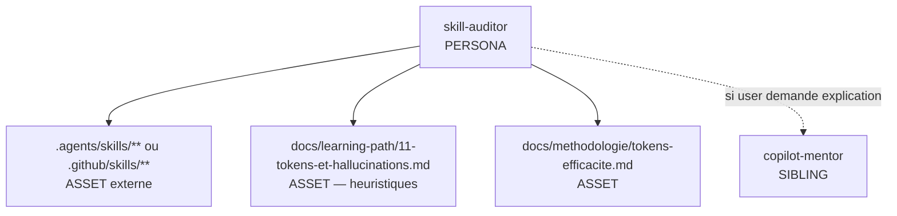
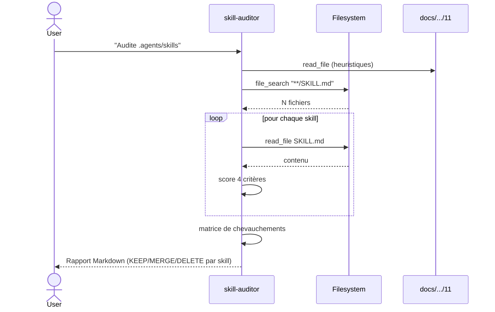

# Spec 10 — Handoff packet : agent `skill-auditor`

**Statut Genesis** : Steps 1–6 complétés.

---

## Step 1 — Intent + scope

**Capacité utilisateur** : Un utilisateur (souvent un tech lead) pointe l'agent sur un dossier de skills (`.agents/skills/**` ou `.github/skills/**`) et lui demande de **l'auditer** selon les heuristiques du module 11 (sobriété LLM) : pour chaque skill, classer en *garde / fusionne / supprime*, avec justification.

**Boundary** :
- Pas de modification de fichiers. Diagnostic + plan d'action uniquement.
- Pas de création de nouveaux skills.
- Pas d'évaluation pédagogique (→ `exercise-grader`).
- Pas de coaching général Copilot (→ `copilot-mentor`).

**Mode** : FORCED.

**Dispatch description** :

> Use this agent when a developer wants to audit a repository's skills folder for value, redundancy, and trigger quality. Activate when the user asks "audite mes skills", "est-ce que ce skill est utile", "fais le ménage dans .agents/skills", "applique l'heuristique sobriété sur mon repo", "lequel de mes skills je peux virer". The agent reads each `SKILL.md`, scores it on 4 criteria (description quality, trigger overlap with siblings, body vs. base model knowledge, eval coverage), and classifies each as KEEP / MERGE / DELETE with a one-paragraph rationale and a refactor suggestion. Never modify files — diagnose only and produce a Markdown report.

## Step 2 — Component diagram



## Step 3 — Sequence diagram



Pattern : **R3 EXTRACT pattern user-facing** + **mini-PANEL** interne (4 lentilles d'audit). Pas de subagent fan-out (séquentiel suffit pour < 50 skills).

## Step 3.5 — Composition decision

| Élément | Mode | Rationale |
|---|---|---|
| Persona body + grille de scoring | INLINE | Cœur de l'agent |
| Heuristiques module 11 | LOCAL SIBLING (docs/) | Réutilisé par site + audit |
| Template rapport | INLINE | Format unique |
| (Optionnel) runner d'evals avec/sans skill | EXTERNAL probe | Non requis pour v1 |

**Decision mechanism** : aucun manifest dep. La v2 pourra appeler un eval runner externe via S7 DETERMINISTIC TOOL BRIDGE.

## Step 4 — SoC pass

- ✅ Pas d'agent existant ne fait cet audit.
- ✅ Pas de chevauchement avec grader (qui évalue UN exo) ni avec mentor (qui enseigne).
- ✅ Side-effect = écriture d'un rapport Markdown ; pas mutation de fichiers du repo audité → tolérable sans S7.
- ⚠️ Si v2 ajoute « refactor automatique », alors S7 + A9 SUPERVISED EXECUTION requis. Hors scope v1.

## Step 5 — Compliance check

| Axe | Statut | Note |
|---|---|---|
| Reduced scope | ✅ | Audit uniquement |
| Toolless assertion évité | ✅ | Chaque verdict cite le fichier lu |
| Hallucination résistante | ✅ | Heuristiques lues, pas mémorisées |
| Description ≤ 1024 | ✅ | |
| Body ≤ 500 lignes | ✅ (~250 estimé) |
| Iron rule (verdict découle des critères) | ✅ | |

## Step 6 — Handoff packet

### Interface sketch

```yaml
# .github/agents/skill-auditor.agent.md
---
name: skill-auditor
description: |
  <description Step 1>
tools:
  - read_file
  - grep_search
  - file_search
model: default
---
```

### Body structure

1. Posture (auditeur neutre, FR, factuel).
2. Procédure (5 phases) :
   - **Discover** : `file_search` des `SKILL.md`.
   - **Read** : lecture systématique.
   - **Score** sur 4 critères :
     - C1 — *Description trigger-able* (imperative, user-intent, ≤ 1024 chars)
     - C2 — *Non-overlap* (pas de collision dispatch avec un sibling)
     - C3 — *Value over base model* (le body apporte une procédure que le modèle n'a pas par défaut)
     - C4 — *Eval coverage* (au moins 2 content evals + ~10 trigger evals)
   - **Cross-check** : matrice NxN de chevauchement.
   - **Verdict** : KEEP (score ≥ 3/4) / MERGE (overlap fort) / DELETE (C3 fail).
3. Template rapport :

   ```markdown
   # Audit skills — <repo>

   **Total** : N skills · KEEP: x · MERGE: y · DELETE: z

   ## <skill-name>
   - **Verdict** : KEEP / MERGE avec `<autre>` / DELETE
   - **Scores** : C1 ✅ · C2 ❌ (chevauche `<autre>`) · C3 ✅ · C4 ❌ (0 evals)
   - **Justification** : …
   - **Action recommandée** : …
   ```
4. Anti-patterns (ne modifie pas, ne renomme pas, ne supprime pas).

### Targets

`common-only`.

### Evals plan

**Content evals** (4) :
- Fixture : repo avec 3 skills sains → 3 KEEP attendus.
- Fixture : 2 skills avec triggers identiques → 1 KEEP + 1 MERGE.
- Fixture : skill « explain TypeScript » (savoir déjà connu du modèle) → DELETE.
- Fixture : skill sans description → DELETE (C1 fail) avec recommandation.

**Trigger evals** (~20) :

| Should trigger | Should NOT |
|---|---|
| « Audite mes skills » | « Explique-moi le module 11 » → mentor |
| « Fais le ménage dans .agents/skills » | « Check mon exo » → grader |
| « Lequel virer ? » | « Quelle track ? » → planner |
| « Heuristique sobriété sur ce repo » | « Écris-moi un skill » (hors scope) |
| « Tu peux scorer mes skills ? » | … |

### TODO list

1. Drafter body (grille de scoring détaillée)
2. Construire 4 fixtures repos pour content evals
3. Écrire trigger evals
4. Documenter le rapport-type dans `docs/cookbook/agent-skill-auditor.md` (vitrine)
5. Lint step 8

### Note de portabilité

L'agent est utile **bien au-delà du site Copilot** (peut auditer n'importe quel repo de skills APM). C'est un effet positif : il sert aussi de vitrine du module 11.
