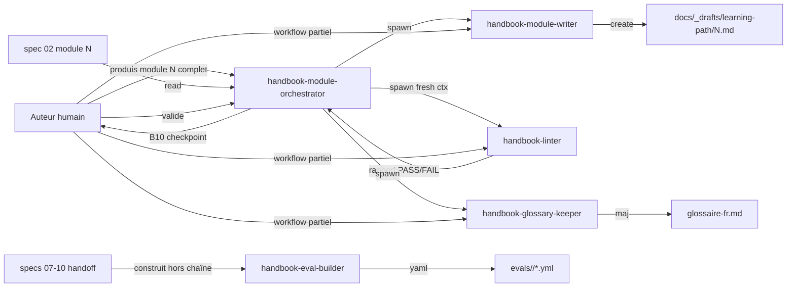

# Spec 12 — Agents d'authoring (vue d'ensemble)

**But** : Définir un second jeu d'agents, **non distribués**, qui servent à **construire et maintenir** le site lui-même. Strictement disjoint des 4 agents publics (specs 06–10).

---

## 1. Pourquoi un second jeu

Les agents `copilot-mentor`, `exercise-grader`, `track-planner`, `skill-auditor` sont destinés aux **apprenants** une fois le site en ligne. Pour **écrire le site**, on a besoin d'agents complémentaires aux concerns différents :

| Concern | Agent public | Agent d'authoring |
|---|---|---|
| Lieu d'exécution | Repo de l'apprenant | Repo source du site |
| Public | Lecteur du site | Auteur(s) du site |
| Lifecycle | Distribué via APM | Local au repo source, jamais publié |
| Mutation | Read-only ou guidance | Écrit dans `docs/_drafts/`, lit partout |

Cette séparation respecte SRP : un agent qui *enseigne* n'a rien à faire dans la *production* du matériel pédagogique.

## 2. Les 5 agents d'authoring

| Agent | Rôle | Mode dispatch | Mutation |
|---|---|---|---|
| `handbook-module-orchestrator` | Piloter writer → linter (boucle bornée 3 rounds) → checkpoint humain → keeper pour un module complet | DISCOVERY | Écrit uniquement la plan store `.spec-handbook-copilot/runtime/<NN-slug>/` ; délègue le reste |
| `handbook-module-writer` | Drafter une page module depuis spec 02 + gabarit spec 01 | FORCED | Écrit dans `docs/_drafts/learning-path/` |
| `handbook-linter` | Auditer une page existante contre spec 01 + spec 11 | FORCED | Read-only (rapport stdout) |
| `handbook-eval-builder` | Générer trigger + content evals d'un agent public depuis son packet Genesis | FORCED | Écrit dans `evals/<agent>/` |
| `handbook-glossary-keeper` | Détecter termes orphelins, maintenir `glossaire-fr.md` + cross-links | FORCED | Écrit dans `docs/ressources/glossaire-fr.md` uniquement |

> **Point d'entrée recommandé** : `handbook-module-orchestrator`. Les 3 autres agents (writer, linter, keeper) restent appelables individuellement pour les workflows partiels (juste linter un module existant, juste maj le glossaire après édition manuelle). `handbook-eval-builder` est **hors chaîne** : sa surface de déclenchement est différente (specs d'agents publics, pas modules).

## 3. Carte des responsabilités

## 4. SoC strict — chaque agent a un seul concern

| Agent | Concern unique | Anti-overlap |
|---|---|---|
| orchestrator | Séquencer la pipeline + persister le plan + checkpoint humain | Ne drafte pas, ne lint pas, ne propose pas de glossaire — pure orchestration |
| writer | Produire un draft conforme au gabarit | Ne lint pas, ne corrige pas un module existant |
| linter | Mesurer la conformité d'un draft ou module final | N'écrit jamais dans `docs/` ; juste un rapport |
| eval-builder | Convertir un packet Genesis en evals exécutables | Ne juge pas la qualité du packet (c'est l'auteur qui décide) ; pas dans la chaîne module |
| keeper | Cohérence terminologique | Ne renomme pas dans les modules ; seul fichier édité = `glossaire-fr.md` |

## 5. Mode draft non-destructif pour `module-writer`

Décision : le writer écrit toujours dans `docs/_drafts/learning-path/<N>-<slug>.md`, jamais directement dans `docs/learning-path/`. L'auteur valide à la main avant de déplacer le fichier.

Raison : un agent qui drafte un module de 1500 mots peut hallucinier la pédagogie. La review humaine est non-négociable.

## 6. Distribution

- **Pas** d'entrée dans `apm.yml.fragment.yml` (spec 05 §5).
- Restent dans le repo source sous `.github/agents/handbook-*.agent.md`.
- Documentés dans le `README.md` du livrable (section « Pour les contributeurs »).

## 7. Index des packets

| Spec | Fichier | Agent |
|---|---|---|
| 13 | `13-agent-handbook-module-writer.md` | Drafter de module |
| 14 | `14-agent-handbook-linter.md` | Audit de conformité |
| 15 | `15-agent-handbook-eval-builder.md` | Générateur d'evals |
| 16 | `16-agent-handbook-glossary-keeper.md` | Gardien du glossaire |
| 17 | `17-agent-handbook-module-orchestrator.md` | Orchestrateur de la chaîne module |

## 8. Anti-patterns évités

- **Méga-agent « handbook-bot »** qui ferait tout → violerait SRP, dispatch confus.
- **Agent qui édite n'importe où** dans `docs/` → risque d'écrasement silencieux.
- **Réutiliser les agents publics** pour l'authoring → leur prompt est tuné pour enseigner, pas pour produire.
- **Orchestrator qui drafte ou lint en interne** au lieu de déléguer → STAGE COLLAPSE, perte de testabilité par stage, fresh-context perdu pour le linter.
- **Auto-mv vers `docs/learning-path/`** depuis l'orchestrator → contourne la review humaine non-négociable (§5).

## 9. Open questions

- Faut-il un 5ème agent `handbook-track-consistency-checker` qui vérifie que les modules listés dans un track existent ? → différable, le linter peut couvrir ça.
- Doit-on versionner les evals générées par `eval-builder` ou les régénérer à chaque CI ? → versionner pour permettre review en PR.
