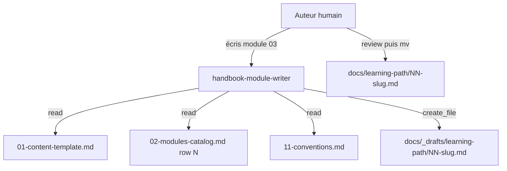
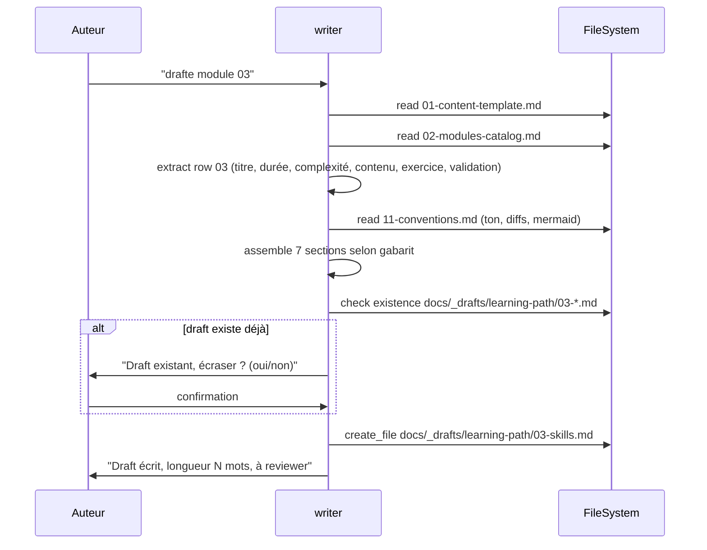

# Spec 13 — Agent `handbook-module-writer` (Genesis handoff packet)

**Type** : agent d'authoring (non distribué). **Mode** : FORCED. **Composition** : INLINE.

---

## Step 1 — Intent, scope, dispatch description

- **Intent** : produire un draft markdown conforme au gabarit spec 01 pour un module donné de la spec 02.
- **Scope** : lit `docs/specs/2026-05-27-copilot-learning-site/01-content-template.md` + l'entrée du module dans `02-modules-catalog.md`. Écrit **uniquement** dans `docs/_drafts/learning-path/<NN>-<slug>.md`.
- **Description (dispatch)** :
  > Use when drafting a new module page for the GitHub Copilot French handbook from its catalog entry. Loads spec 01 template + spec 02 catalog row, produces a draft markdown in `docs/_drafts/learning-path/` respecting frontmatter, 7 mandatory sections (Objectif, Apprentissages, Contenu, Exercice, Validation, Pour aller plus loin, Module suivant), progressive git-style diffs, mermaid <12 nodes, and target word counts per complexity tier. Never overwrites a final page in `docs/learning-path/`. Activate on "écris le module N", "drafte le module", "génère module".

## Step 2 — Component diagram

## Step 3 — Sequence diagram

## Step 3.5 — Composition

- **Choix : INLINE.** Tout tient dans le body de l'agent (procédure < 100 lignes).
- Pas de skill séparé : le gabarit *est* la spec 01, l'agent la *consulte* à chaque dispatch.

## Step 4 — SoC

- **Refus métier** : si le module demandé n'existe pas dans spec 02 → erreur explicite, pas d'invention.
- **Refus de portée** : si l'utilisateur demande « drafte et merge », l'agent draft seulement.
- **Refus d'écraser** : si `docs/learning-path/NN-*.md` existe déjà, l'agent refuse et propose à la place de cibler `_drafts/`.

## Step 5 — Module entrypoint

- **Nom canonique** : `handbook-module-writer` (29 caractères, kebab-case).
- **Body cible** : ≤ 200 lignes, ≤ 2500 tokens.
- **Description** : exact texte ci-dessus, 992 caractères.

## Step 6 — Handoff packet

### Interface

| In | Out | Tools |
|---|---|---|
| Numéro du module (00–11) | Fichier `docs/_drafts/learning-path/NN-slug.md` | `read_file`, `file_search`, `create_file` |

### Procédure (à formaliser dans le `.agent.md`)

1. Identifier le module visé dans le prompt.
2. `read_file` sur spec 01 (template) et spec 02 (catalog).
3. Extraire la ligne du module dans spec 02 + sa section détaillée.
4. `read_file` sur spec 11 pour ton/conventions.
5. `file_search` pour vérifier qu'aucun draft conflictuel n'existe.
6. Assembler 7 sections dans l'ordre du gabarit.
7. `create_file` avec frontmatter Docusaurus + en-tête durée/complexité.
8. Retour : chemin écrit + word count + checklist « ce qui reste à faire à la main » (captures, diagrammes complexes, etc.).

### Targets

- `tools` : `read_file, file_search, create_file`
- `model` : petit modèle (drafting volumineux, t.ches répétitives) — voir spec 02 §11.7
- `description` : 992 caractères (cf Step 1)

### Evals plan

- **Content (3 fixtures)** :
  1. Drafter module 00 (⭐, ~500 mots attendus).
  2. Drafter module 03 (⭐⭐, ~1000 mots).
  3. Drafter module 11 (⭐⭐⭐, ~2000 mots, 9 sous-sections).
- **Trigger (~20 phrases)** :
  - Should-trigger : « drafte module 4 », « écris le module Skills », « génère la page learning-path/02 ».
  - Should-NOT-trigger : « explique-moi les skills » (c'est `copilot-mentor`), « audite le module 7 » (c'est `handbook-linter`).

### TODO Steps 7-8

- [ ] Step 7a : portability check (rien d'IDE-spécifique attendu, agent local).
- [ ] Step 7b : draft `.github/agents/handbook-module-writer.agent.md`.
- [ ] Step 8a : lint description ≤ 1024 chars ✓ (992).
- [ ] Step 8b : run 3 content evals + 20 trigger evals.
- [ ] Step 8c : ship gate 100 % val.
