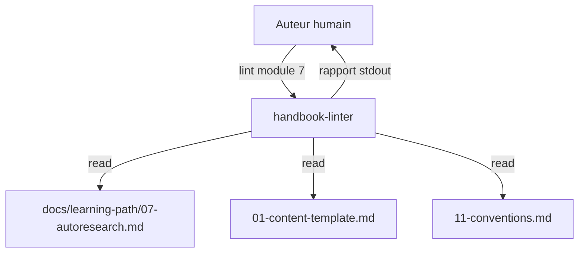
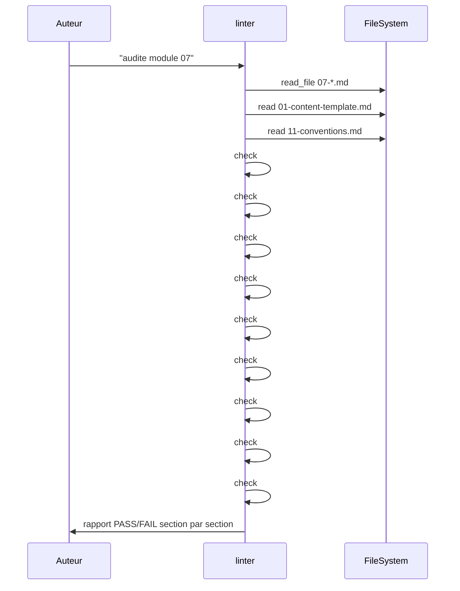

# Spec 14 — Agent `handbook-linter` (Genesis handoff packet)

**Type** : agent d'authoring (non distribué). **Mode** : FORCED. **Composition** : INLINE. **Read-only.**

---

## Step 1 — Intent, scope, dispatch description

- **Intent** : auditer une page module contre le gabarit (spec 01) et les conventions transverses (spec 11) ; émettre un rapport structuré sans modifier le fichier.
- **Scope** : lit la page cible + spec 01 + spec 11. **N'écrit jamais** dans `docs/`. Sort un rapport markdown vers stdout.
- **Description (dispatch)** :
  > Use when auditing a handbook page (draft or final) against the module template (spec 01) and transverse conventions (spec 11). Checks: required sections present, frontmatter complete, target word count per complexity tier, mermaid node count, code blocks with language, no forbidden emoji, FR tutoiement tone, progressive-diff format, no broken cross-links. Produces a structured PASS/FAIL report with line-level findings. Read-only — never modifies the audited file. Activate on "lint module N", "audite la page X", "vérifie le module".

## Step 2 — Component diagram



## Step 3 — Sequence diagram



## Step 3.5 — Composition

- **Choix : INLINE.** 9 checks indépendants, < 150 lignes. Pas de dépendance externe.

## Step 4 — SoC

- **Pas de fix automatique** : c'est l'auteur qui corrige. Sépare *audit* de *réparation*.
- **Pas d'audit cross-module** : un appel = un fichier. Pour scanner tout `docs/learning-path/`, on appelle 12 fois (parallélisable).
- **Pas d'auto-loading de specs** hors 01/11 : ne lit pas les autres modules pour comparer le ton.

## Step 5 — Module entrypoint

- **Nom canonique** : `handbook-linter` (15 caractères, kebab-case).
- **Body cible** : ≤ 250 lignes (9 checks détaillés).
- **Description** : 920 caractères.

## Step 6 — Handoff packet

### Interface

| In | Out | Tools |
|---|---|---|
| Chemin de la page module | Rapport markdown PASS/FAIL par check | `read_file`, `grep_search` |

### Procédure

1. Résoudre le chemin (« module 07 » → `docs/learning-path/07-*.md`).
2. `read_file` page cible + spec 01 + spec 11.
3. Exécuter les 9 checks séquentiellement.
4. Pour chaque check : statut PASS/FAIL + ligne(s) concernée(s) + recommandation.
5. Agréger en rapport markdown : titre, score `n/9`, table des findings.

### Template de rapport (extrait)

```
# Audit module 07 — autoresearch.md
Score : 7/9

| # | Check | Statut | Ligne | Findings |
|---|---|---|---|---|
| 1 | Frontmatter complet | PASS | 1-5 | — |
| 4 | Word count vs ⭐⭐⭐ (1200-2000) | FAIL | — | 850 mots, attendu 1200+ |
| 7 | Pas d'emoji interdit | FAIL | 42 | 🚀 ligne 42 |
```

### Targets

- `tools` : `read_file, grep_search`
- `model` : petit (audit déterministe)
- `description` : 920 caractères

### Evals plan

- **Content (3 fixtures)** :
  1. Page parfaite → score 9/9.
  2. Page avec 2 sections manquantes + 1 emoji interdit → score 6/9, findings exacts.
  3. Page trop courte (⭐⭐⭐ à 400 mots) → fail check #4.
- **Trigger (~20)** :
  - Should-trigger : « audite module 3 », « lint la page autoresearch ».
  - Should-NOT : « écris module 3 » (writer), « audite mes skills » (skill-auditor).

### TODO Steps 7-8

- [ ] Step 7b : draft `.github/agents/handbook-linter.agent.md`.
- [ ] Step 8 : evals 100 % + lint description.
