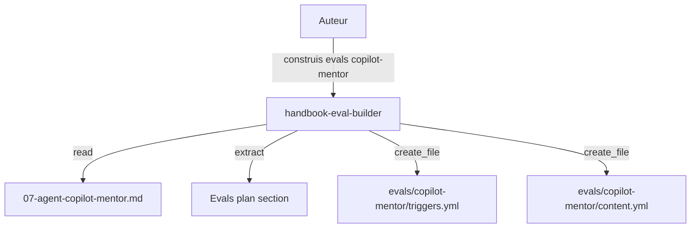
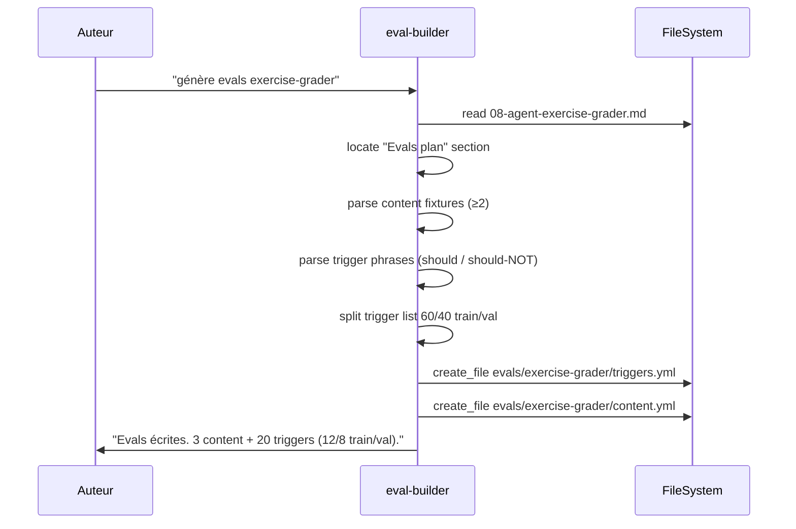

# Spec 15 — Agent `handbook-eval-builder` (Genesis handoff packet)

**Type** : agent d'authoring (non distribué). **Mode** : FORCED. **Composition** : INLINE.

---

## Step 1 — Intent, scope, dispatch description

- **Intent** : convertir le « Evals plan » d'un agent public (specs 07–10) en fichiers d'evals exécutables (`triggers.yml`, `content.yml`).
- **Scope** : lit la spec d'un agent public. Écrit dans `evals/<agent-name>/`. Ne juge pas la qualité du packet — il transcrit.
- **Description (dispatch)** :
  > Use when generating executable eval files for a public agent from its Genesis handoff packet (specs 07–10). Reads the agent spec's "Evals plan" section, extracts content fixtures and trigger phrases (should-trigger + should-NOT-trigger), produces `evals/<agent>/triggers.yml` (~20 phrases, 60/40 train/val split) and `evals/<agent>/content.yml` (≥2 scenarios with expected behavior). Activate on "construis les evals de copilot-mentor", "génère evals exercise-grader", "build evals for track-planner".

## Step 2 — Component diagram



## Step 3 — Sequence diagram



## Step 3.5 — Composition

- **Choix : INLINE.** Conversion mécanique markdown → yaml. ~150 lignes.

## Step 4 — SoC

- **Pas de génération créative** : si une fixture content manque dans le packet, l'agent **refuse** et signale plutôt que d'inventer.
- **Pas de lint du packet** : la cohérence du packet est la responsabilité de l'auteur, pas de l'eval-builder.
- **Format yaml stable** : schéma défini (cf §Template).

## Step 5 — Module entrypoint

- **Nom canonique** : `handbook-eval-builder` (21 caractères).
- **Body** : ≤ 200 lignes.
- **Description** : 887 caractères.

## Step 6 — Handoff packet

### Interface

| In | Out | Tools |
|---|---|---|
| Nom d'un agent public (copilot-mentor, etc.) | 2 fichiers yaml dans `evals/<agent>/` | `read_file`, `file_search`, `create_file` |

### Templates de sortie

```yaml
# evals/copilot-mentor/triggers.yml
schema_version: 1
agent: copilot-mentor
split:
  train: [...]  # 12 phrases
  val: [...]    # 8 phrases
should_trigger:
  - "explique-moi les skills"
  - "comment marche APM"
should_not_trigger:
  - "drafte le module 3"  # handbook-module-writer
  - "audite mon skill"    # skill-auditor
```

```yaml
# evals/copilot-mentor/content.yml
schema_version: 1
agent: copilot-mentor
fixtures:
  - id: explain-skills
    prompt: "Je débute, c'est quoi un skill ?"
    expected_behavior:
      - cite module 03
      - tutoiement FR
      - aucune ligne de code générée
      - propose un exercice du module 03
```

### Procédure

1. Résoudre le nom d'agent → fichier spec.
2. `read_file` la spec.
3. Localiser la section « Evals plan ».
4. Extraire content fixtures (≥ 2) + trigger phrases.
5. Si < 2 content fixtures → refus avec message « packet incomplet, ajoute X dans la spec d'abord ».
6. Split trigger list 60/40 train/val (préserver équilibre should / should-NOT).
7. `create_file` les 2 yaml.
8. Retour : chemins + comptes + warnings éventuels.

### Targets

- `tools` : `read_file, file_search, create_file`
- `model` : petit (transformation déterministe)
- `description` : 887 caractères

### Evals plan

- **Content (2 fixtures)** :
  1. Build evals pour `copilot-mentor` (spec 07) → 2 fichiers conformes au schéma.
  2. Build evals pour un packet incomplet (1 seule content fixture) → refus avec message exact.
- **Trigger (~16)** :
  - Should-trigger : « construis evals X », « génère trigger evals », « build content evals ».
  - Should-NOT : « écris un eval » au sens TDD (hors scope), « refactor evals » (pas de l'authoring).

### TODO Steps 7-8

- [ ] Step 7b : draft `.github/agents/handbook-eval-builder.agent.md`.
- [ ] Step 8 : evals + lint.
