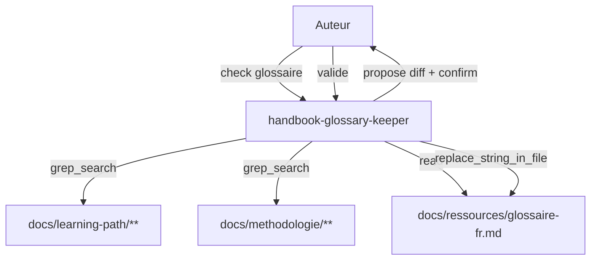
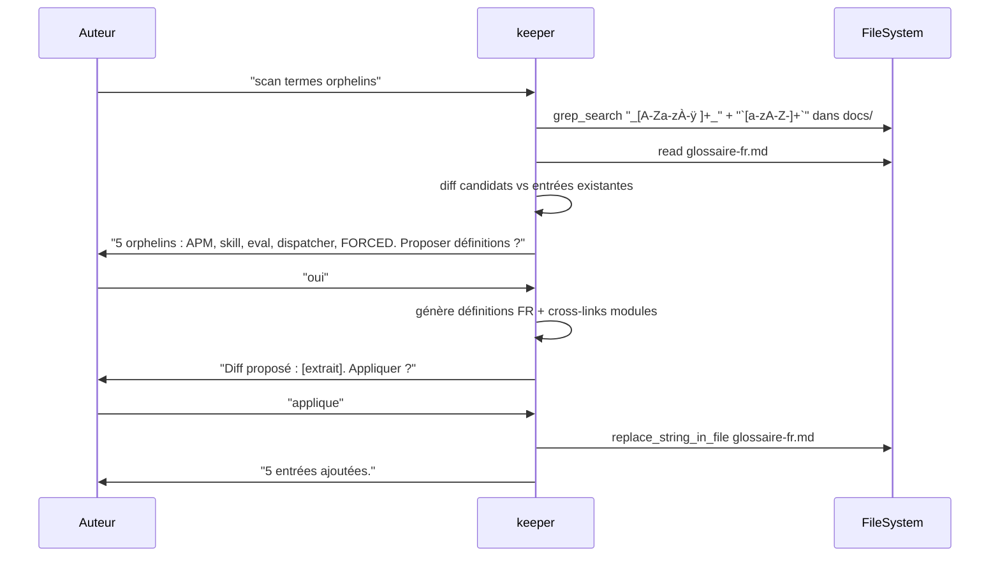

# Spec 16 — Agent `handbook-glossary-keeper` (Genesis handoff packet)

**Type** : agent d'authoring (non distribué). **Mode** : FORCED. **Composition** : INLINE. **Édition contrôlée.**

---

## Step 1 — Intent, scope, dispatch description

- **Intent** : maintenir `docs/ressources/glossaire-fr.md` à jour en détectant les termes techniques introduits dans les modules sans entrée correspondante.
- **Scope** : scanne `docs/learning-path/**/*.md` et `docs/methodologie/**/*.md` pour des marqueurs (italiques, backticks, sigles capitalisés). Compare au glossaire actuel. Édite **uniquement** `docs/ressources/glossaire-fr.md`. Demande confirmation avant écriture.
- **Description (dispatch)** :
  > Use when auditing or updating the French handbook glossary (`docs/ressources/glossaire-fr.md`) for orphan technical terms introduced in module pages. Scans `docs/learning-path/` and `docs/methodologie/` for italicized terms, backticked tokens, and uppercase acronyms; cross-references the current glossary; proposes FR definitions for orphans with cross-links to the modules where they appear. Asks for confirmation before editing. Touches only the glossary file — never the module pages. Activate on "check le glossaire", "scan termes orphelins", "audit glossaire", "ajoute X au glossaire".

## Step 2 — Component diagram



## Step 3 — Sequence diagram



## Step 3.5 — Composition

- **Choix : INLINE.** Logique de diff lexical + génération courte. Pas d'asset partagé.

## Step 4 — SoC

- **Un seul fichier modifiable** : `docs/ressources/glossaire-fr.md`. Toute autre édition est refusée.
- **Pas d'auto-apply** : confirmation explicite avant `replace_string_in_file`. Évite la dérive lexicale silencieuse.
- **Pas de définition créative pour termes ambigus** : si un terme a plusieurs sens possibles (« context » → contexte LLM ou contexte git ?), l'agent demande quel sens retenir avant de générer.

## Step 5 — Module entrypoint

- **Nom canonique** : `handbook-glossary-keeper` (24 caractères, kebab-case).
- **Body** : ≤ 200 lignes.
- **Description** : 951 caractères.

## Step 6 — Handoff packet

### Interface

| In | Out | Tools |
|---|---|---|
| Aucun argument (scan complet) ou terme spécifique | Diff proposé + édition après confirmation | `read_file`, `grep_search`, `replace_string_in_file` |

### Procédure

1. Mode scan complet : grep `_[A-Za-zÀ-ÿ]+_`, `\`[a-zA-Z-]+\``, et `\b[A-Z]{2,}\b` dans `docs/`.
2. `read_file` `glossaire-fr.md` → set des termes définis.
3. Diff : candidats - définis = orphelins (filtrer bruit : mots français italiques, etc.).
4. Présenter liste orphelins à l'utilisateur, demander quels traiter.
5. Pour chaque orphelin retenu : générer définition FR + lister modules d'apparition (cross-links).
6. Présenter diff complet (entrées triées alphabétiquement, format markdown du glossaire existant).
7. Sur confirmation : `replace_string_in_file` une fois, insertion bloc.
8. Retour : nombre d'entrées ajoutées + chemin.

### Format d'entrée

```markdown
### APM

Agent Package Manager. Système de distribution d'agents et skills pour Copilot.
Apparaît dans : [Module 02 — Setup](../learning-path/02-setup.md), [Module 09 — APM](../learning-path/09-apm.md).
```

### Targets

- `tools` : `read_file, grep_search, replace_string_in_file`
- `model` : moyen (génération de définitions FR de qualité)
- `description` : 951 caractères

### Evals plan

- **Content (3 fixtures)** :
  1. Corpus avec 5 termes orphelins explicites → 5 propositions cohérentes + cross-links.
  2. Corpus à jour (aucun orphelin) → message « glossaire à jour, rien à faire ».
  3. Terme ambigu (« context ») → agent demande désambiguïsation au lieu d'inventer.
- **Trigger (~16)** :
  - Should-trigger : « scan glossaire », « check termes orphelins », « audite glossaire ».
  - Should-NOT : « définis X » sans mention glossaire (c'est `copilot-mentor`), « rename term Y » (refactor, hors scope).

### TODO Steps 7-8

- [ ] Step 7b : draft `.github/agents/handbook-glossary-keeper.agent.md`.
- [ ] Step 8 : evals + lint description.
