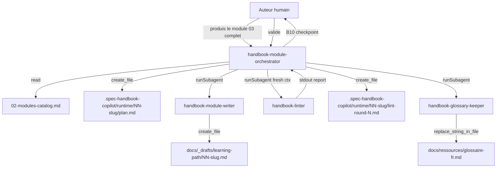
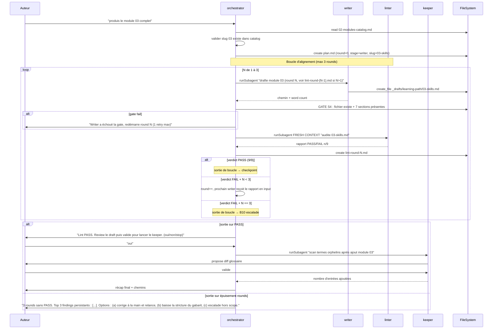
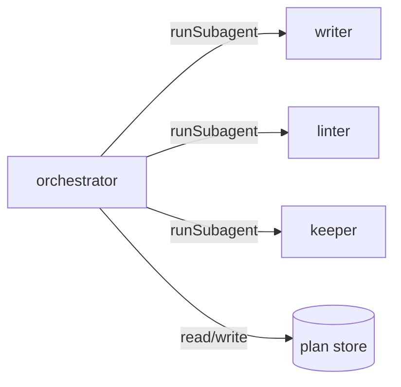

# Spec 17 — Agent `handbook-module-orchestrator` (Genesis handoff packet)

**Type** : agent d'authoring (non distribué). **Mode** : DISCOVERY. **Composition** : INLINE + LOCAL SIBLINGS (writer, linter, keeper).

---

## 1. Pourquoi cet agent

Avant cette spec, l'auteur appelait à la main `handbook-module-writer` → review humaine → `handbook-linter` → re-correction → `handbook-glossary-keeper`. Quatre dispatches manuels, pas de plan persisté, pas de boucle bornée, et la review humaine pouvait être oubliée entre les étapes.

Cet agent encapsule la chaîne dans un **point d'entrée unique** (pattern A3 ORCHESTRATOR-SAGA) avec une **boucle d'alignement bornée** writer ↔ linter (pattern A8 ALIGNMENT LOOP), un **checkpoint humain explicite** (B10) avant la passe glossaire, et un **plan persisté** (B4 PLAN MEMENTO) pour permettre la reprise après interruption.

Hors-scope explicite : `handbook-eval-builder`. Sa surface de déclenchement est différente (il transforme un packet Genesis d'agent public en YAML d'evals, jamais un module). Le mêler à cette chaîne serait un STAGE COLLAPSE.

---

## Step 1 — Intent, scope, dispatch description

- **Intent** : produire un module handbook complet et conforme en pilotant writer → linter (boucle d'alignement) → checkpoint humain → keeper, avec plan persisté et reprise possible.
- **Scope** :
  - Lit `02-modules-catalog.md` pour valider le slug en entrée.
  - Écrit/lit dans `.spec-handbook-copilot/runtime/<NN-slug>/plan.md` (et `lint-round-N.md`).
  - Spawne `handbook-module-writer`, `handbook-linter`, `handbook-glossary-keeper`.
  - **N'écrit jamais directement dans `docs/`** : les sous-agents le font à leur compte.
- **Description (dispatch)** :
  > Use when producing a complete handbook module page end-to-end from a catalog slug — drives the writer → linter alignment loop → human checkpoint → glossary keeper pipeline, persists a plan under `.spec-handbook-copilot/runtime/<NN-slug>/`, and gates between stages on deterministic checks. Runs a bounded alignment loop (max 3 rounds) between writer and linter until the lint report passes; escalates to human checkpoint on third failure. Activate on "produis le module N complet", "drafte et lint le module skills", "construis le module 03 de bout en bout", "pipeline complet sur le module APM". This is the entry point — never call `handbook-module-writer`, `handbook-linter`, or `handbook-glossary-keeper` directly when you want the full chain. Out of scope: `handbook-eval-builder` (different trigger surface, runs on agent specs 07–10, not module pages).

  (Longueur : ~1010 caractères, sous le cap de 1024.)

---

## Step 2 — Component diagram



Légende :
- `orch` = ORCHESTRATOR (nouveau, INLINE).
- `writer`, `linter`, `keeper` = MODULE ENTRYPOINT (existants, LOCAL SIBLINGS).
- `plan`, `roundN` = ASSET (artefacts persistés dans la plan store).

---

## Step 3 — Sequence diagram



Threading : **single-loop sequential** entre les stages, avec **fresh context** pour chaque spawn linter. Pas de fan-out — c'est volontairement séquentiel parce que les stages ont une dépendance d'ordre (no draft → no lint → no keeper).

---

## Step 3.1 — Tradeoff check

Deux patterns en tension à l'étape 3 :

| Slot | Option A | Option B | Choix | Raison |
|---|---|---|---|---|
| Topologie globale | A2 PIPELINE (3 stages séquentielles indépendantes) | A3 ORCHESTRATOR-SAGA (orchestrateur + plan durable + reprise) | **A3** | Reprise après interruption critique (sessions Copilot peuvent être coupées) + plan persisté = audit. |
| Writer ↔ linter | Single-pass + abandon sur FAIL | A8 ALIGNMENT LOOP bornée | **A8 (max 3)** | Le linter produit un rapport actionable ; le writer peut corriger. Sans boucle, l'auteur ferait le ping-pong à la main. Cap à 3 pour éviter l'infinite loop. |
| Lint spawn | Contexte partagé (héritage writer) | C3 FRESH CONTEXT (spawn isolé) | **FRESH** | Le linter doit voir le draft comme un lecteur cold. Hériter du contexte writer = PANEL-IN-ONE-CONTEXT. |
| Checkpoint humain | Implicite (auteur fait `mv` à la fin) | B10 HUMAN CHECKPOINT explicite avant keeper | **B10 explicite** | Spec 12 §5 : « la review humaine est non-négociable ». L'inverser dans le code (gate explicite) au lieu de compter sur la discipline de l'auteur. |

Référence matrices : `pattern-tradeoffs.md` → threading topology + synthesis style + plan persistence.

---

## Step 3.5 — Composition

| Box | Mode | Rationale |
|---|---|---|
| `handbook-module-orchestrator` (nouveau) | INLINE | Procédure d'orchestration ~150 lignes, pas réutilisable hors handbook FR. |
| `handbook-module-writer` (existant) | LOCAL SIBLING | Dans `.github/agents/`, même repo, dépendance par référence. |
| `handbook-linter` (existant) | LOCAL SIBLING | Idem. |
| `handbook-glossary-keeper` (existant) | LOCAL SIBLING | Idem. |
| Plan store (`.spec-handbook-copilot/runtime/<slug>/`) | INLINE | Même répertoire que le pipeline `handbook-chapter-*` qui réutilise la même substrate (le plan store est par-slug, pas de collision). |

**Pas d'EXTERNAL MODULE.** Pas de PHANTOM DEPENDENCY à déclarer. Tous les sous-agents vivent dans `.github/agents/` du repo source ; la dépendance est implicite à la résolution du dispatcher de la harness.

Dependency graph :



---

## Step 4 — SoC

- **Existing module check** :
  - `handbook-chapter-orchestrator` couvre la chaîne *chapter* (architect → writer → reviewer), trigger sur « construis un chapitre sur X ». Trigger nouns/verbs différents (chapter vs module). **Pas de DISPATCH COLLISION** mais frontière à documenter dans la description (« module page from spec 02 catalog » vs « chapter from topic prompt »).
  - Le writer, linter, keeper restent FORCED-mode et individuellement appelables pour les workflows partiels (juste linter un module existant, etc.). L'orchestrator les **compose** sans les remplacer.
- **R1 SPLIT triggers** :
  - Description sans conjonction « and X and Y » → OK.
  - Body multi-lens ? Non : un seul concern = piloter la pipeline. Le drafting est dans writer, l'audit dans linter, la glossaire dans keeper.
  - **Pas de split**.
- **R2 FUSE** : pas applicable (l'orchestrator a une vraie raison d'exister séparée des sous-agents).
- **R3 EXTRACT** : la grammaire `<NN-slug>` est partagée avec writer/linter ; on garde la dérivation INLINE dans le body de l'orchestrator. Pas d'asset extrait.
- **R4 INLINE** : non, plus d'un caller potentiel.
- **S7 DETERMINISTIC TOOL BRIDGE** : la dérivation du slug à partir du catalog est une **fact-that-must-be-true**. L'orchestrator DOIT `read_file` sur `02-modules-catalog.md` et vérifier que le slug existe avant tout spawn. **Pas d'inférence depuis le prompt user seul**.
- **A9 SUPERVISED EXECUTION** : appliqué — chaque gate S4 entre stages est un check déterministe (fichier existe ? sections présentes ? verdict parseable ?).

---

## Step 5 — Compliance check

| Item | Statut | Note |
|---|---|---|
| MODULE ENTRYPOINT spec : `name` regex + parent dir | PASS | `handbook-module-orchestrator` (32 chars, kebab-case). |
| Body ≤ 500 lignes / ≤ 5000 tokens | PASS attendu | Cible ~200 lignes (cf step 7b). |
| Description ≤ 1024 caractères | PASS | ~1010. |
| Description impérative + intent-first + indirect triggers | PASS | « Use when producing a complete handbook module page end-to-end ». |
| ASCII only | PASS | (accents FR sont UTF-8 ; spec genesis tolère le contenu FR — le **frontmatter** reste ASCII pur). |
| Single responsibility | PASS | « Piloter la chaîne writer → linter → keeper ». |
| Pas de syntaxe per-harness | PASS attendu | À vérifier à step 7b ; le body emploie `runSubagent`, présent dans `runtime-affordances/common.md`. |
| PROSE — Progressive Disclosure | PASS | Sous-agents et template chargés lazy par les sous-agents eux-mêmes. |
| PROSE — Reduced Scope | PASS | Pas d'eval-builder, pas de mv vers `docs/learning-path/` final. |
| PROSE — Orchestrated Composition | PASS | C'est littéralement le pattern de cet agent. |
| PROSE — Safety Boundaries | PASS | Checkpoint B10 explicite, retry borné à 3, refus si slug absent du catalog. |
| PROSE — Explicit Hierarchy | PASS | « This is the entry point — never call sub-agents directly when you want the full chain ». |
| LLM truth #1 (context degrades) | PASS | Plan reload entre rounds + fresh context pour linter. |
| LLM truth #5 (plan before execution) | PASS | `plan.md` persisté avant tout spawn writer. |
| LLM truth #6 (harness bridges) | PASS | Utilise `runSubagent` (substrate) ; pas de syntaxe Claude/Copilot spécifique. |

Aucun BLOCKER. Trois HIGH à valider à step 7b :
1. Lint description sur cap 1024 chars (vérifier compteur final).
2. Vérifier que le slug `<NN-slug>` ne crashe pas si le module a une numérotation à un chiffre (`03-skills` vs `3-skills`).
3. Vérifier que `runSubagent` est bien disponible en mode Copilot (cf `tools` frontmatter de `handbook-chapter-orchestrator` qui le déclare déjà).

---

## Step 6 — Handoff packet

### Interface

| In | Out | Tools |
|---|---|---|
| Identifiant de module (numéro `03`, slug `skills`, ou topic « le module APM ») | Draft conforme + lint PASS + glossaire à jour + plan persisté | `read_file`, `create_file`, `replace_string_in_file`, `file_search`, `runSubagent` |

### État persisté (plan store)

`.spec-handbook-copilot/runtime/<NN-slug>/` contient :

- `plan.md` — métadonnées de session : slug, topic, round courant, stage courant, timestamp.
- `lint-round-N.md` — verdict du linter pour chaque round (N=1..3).
- (Le draft lui-même reste dans `docs/_drafts/learning-path/<NN-slug>.md` ; le keeper modifie `docs/ressources/glossaire-fr.md`.)

### Procédure (à formaliser dans le `.agent.md`, step 7b)

**Phase 1 — Bootstrap**

1. Résoudre l'identifiant utilisateur en `<NN-slug>` via `read_file` sur `02-modules-catalog.md`. Refus si absent (cf S7).
2. Si `.spec-handbook-copilot/runtime/<NN-slug>/plan.md` existe → demander resume vs restart. Ne JAMAIS écraser silencieusement.
3. `create_file` `plan.md` avec round=0, stage=writer, timestamp ISO, slug, topic verbatim.

**Phase 2 — Writer ↔ linter alignment loop (max 3 rounds)**

Pour N de 1 à 3 :

1. **Writer spawn** : `runSubagent` `handbook-module-writer` avec task = « Drafte module `<NN-slug>` round `N`. Lis `plan.md` ; si N>1, lis aussi `lint-round-{N-1}.md` et corrige les findings. »
2. **Gate S4 — draft check** : `file_search` confirme l'existence de `docs/_drafts/learning-path/<NN-slug>.md`. `read_file` partiel pour vérifier que les 7 sections sont présentes (heuristique : grep des titres). Si fail → 1 retry max ; après second fail → Phase 3 escalade.
3. **Linter spawn FRESH CONTEXT** : `runSubagent` `handbook-linter` avec task = « Audite `docs/_drafts/learning-path/<NN-slug>.md` (round `N`). Lis uniquement la cible + specs 01 et 11. **Ne lis pas les rounds précédents.** »
4. Persister rapport en `lint-round-N.md`.
5. Branchement :
   - PASS (9/9) → sortie de boucle, aller Phase 3 success.
   - FAIL et N < 3 → round++, retour à étape 1 (writer reçoit le rapport en input).
   - FAIL et N == 3 → sortie boucle, aller Phase 3 REJECT.

**Phase 3 — Exit**

- **Success** :
  1. Reporter à l'auteur : chemin draft, score lint, résumé par round.
  2. **B10 HUMAN CHECKPOINT** explicite : « Review le draft puis confirme `oui`/`non`/`stop` pour lancer le keeper. » Pas d'auto-keeper.
  3. Sur `oui` : `runSubagent` `handbook-glossary-keeper` avec task = « Scan termes orphelins introduits par le module `<NN-slug>`. »
  4. Récap final : chemins écrits, comptes, et rappel « tu dois encore `mv docs/_drafts/learning-path/<NN-slug>.md docs/learning-path/` à la main ».
- **REJECT (3 rounds épuisés)** : reporter le top 3 findings persistants du round 3 et présenter 3 options : (a) corriger à la main puis relancer, (b) ajuster spec 01 si le gabarit est trop strict pour ce module, (c) escalader hors scope. Pas d'auto-relance.

### Targets

- `tools` : `read_file, create_file, replace_string_in_file, file_search, runSubagent`
- `model` : moyen (orchestration légère, pas de drafting). Aligné sur `handbook-chapter-orchestrator`.
- `description` : ~1010 caractères (cf Step 1).
- `invocation mode` : DISCOVERY.

### Module composition table

| Box | Mode | Notes |
|---|---|---|
| orchestrator | INLINE (nouveau) | Body ≤ 200 lignes, dans `.github/agents/handbook-module-orchestrator.agent.md`. |
| writer | LOCAL SIBLING | Existant. Pas de modif. |
| linter | LOCAL SIBLING | Existant. Pas de modif. |
| keeper | LOCAL SIBLING | Existant. Pas de modif. |
| plan store | INLINE artifact | Sous `.spec-handbook-copilot/runtime/<NN-slug>/`, partagé conceptuellement avec `handbook-chapter-*` (slugs disjoints). |

### Targets déclarés

`common-only`. Le `.agent.md` n'utilise que `runSubagent`, `read_file`, `create_file`, `replace_string_in_file`, `file_search` — tous dans `runtime-affordances/common.md`. Aucun besoin de syntaxe per-harness.

### Anti-patterns à éviter (à inscrire dans le body)

- **Drafter de la prose soi-même.** Tu orchestres. Si tu écris du contenu handbook, tu as dérivé. Délègue toujours au writer.
- **Linter soi-même.** Idem. Le verdict du linter est l'autorité.
- **Sauter le fresh-context du linter.** Hériter du contexte du writer = PANEL-IN-ONE-CONTEXT, le linter perd son indépendance.
- **Dépasser 3 rounds.** Le cap est la sécurité. Toujours escalader humain.
- **Auto-lancer le keeper.** Le checkpoint B10 est obligatoire.
- **Auto-mv vers `docs/learning-path/`.** Spec 12 §5 : non-négociable, c'est l'auteur qui fait le `mv`.
- **Écraser un `plan.md` existant** sans demander resume vs restart.

### Evals plan

- **Content (3 fixtures, TOUTES doivent montrer un delta `with_skill` vs `without_skill`)** :
  1. **Happy path round 1** — slug `03-skills`, draft propre dès round 1, lint PASS, checkpoint oui → keeper s'exécute. Attendu : 1 `plan.md` + 1 `lint-round-1.md` + 1 draft + glossaire mis à jour. Sans le skill : l'agent appellerait writer puis demanderait à l'auteur de copier-coller le rapport linter, fragile.
  2. **Convergence round 3** — slug `07-autoresearch`, round 1 FAIL (2 findings), round 2 FAIL (1 finding), round 3 PASS. Attendu : 3 `lint-round-N.md` persistés, draft final propre, checkpoint déclenché normalement.
  3. **Épuisement (REJECT path)** — slug `11-conventions`, 3 rounds FAIL consécutifs (gabarit ⭐⭐⭐ trop strict pour ce module structurel). Attendu : pas d'auto-keeper, B10 explicite avec top-3 findings + 3 options proposées.
- **Trigger (~20 phrases, split 60/40 train/val)** :
  - **Should-trigger** : « produis le module 03 complet », « pipeline complet sur le module APM », « drafte et lint le module skills puis maj le glossaire », « construis le module 07 de bout en bout », « lance la chaîne sur le module 02 », « full handbook pipeline pour le module 09 », « écris le module 11 et fais tout le suivi », « bootstrap module 04 jusqu'au glossaire ».
  - **Should-NOT-trigger** :
    - « drafte juste le module 03 » → c'est `handbook-module-writer` seul.
    - « audite le module 07 » → c'est `handbook-linter` seul.
    - « scan le glossaire » → c'est `handbook-glossary-keeper` seul.
    - « construis un chapitre sur les MCP transports » → c'est `handbook-chapter-orchestrator` (autre famille).
    - « génère les evals de copilot-mentor » → c'est `handbook-eval-builder` (hors scope explicite).
    - « refactor le module 03 » → édition manuelle, pas une production from-scratch.
    - « publie le module 03 » → l'orchestrator ne publie pas (no auto-mv).
    - « explique-moi comment marche APM » → c'est `copilot-mentor` (agent public).

### TODO Steps 7-8

- [ ] Step 7a : portability check — confirmer que `runSubagent` apparaît bien dans `runtime-affordances/common.md` côté Copilot et que `handbook-chapter-orchestrator` l'utilise déjà (preuve d'existence).
- [ ] Step 7b : drafter `.github/agents/handbook-module-orchestrator.agent.md` en s'inspirant verbatim de la structure de `handbook-chapter-orchestrator.agent.md` (mêmes sections : Invocation mode, Single-writer interlock, Reference truth, Procedure Phase 1/2/3, Anti-patterns).
- [ ] Step 8a : lint description ≤ 1024 chars (recompter sur le texte final).
- [ ] Step 8b : run 3 content evals + 20 trigger evals via `handbook-eval-builder` sur cette spec (récursivité du système d'authoring).
- [ ] Step 8c : real-task refinement — produire au moins un vrai module (suggéré : `03-skills`) avec l'orchestrator, capturer la trace, ajuster le body si la trace révèle un décalage.
- [ ] Step 8d : mettre à jour `06-agents-overview.md` (note : l'orchestrator est d'authoring, pas public — il n'apparaît PAS dans le catalogue des 4 agents publics) et **spec 12** pour ajouter la ligne orchestrator au tableau et le mentionner dans la carte des responsabilités.

---

## Notes pour le step 7b (caller-side)

Le body emploiera la même structure éprouvée que `handbook-chapter-orchestrator.agent.md` :

```markdown
# handbook-module-orchestrator

## Invocation mode
DISCOVERY. Single entry point.

## Single-writer interlock
You are the only writer under `.spec-handbook-copilot/runtime/<NN-slug>/`.

## Reference truth
The design packet at `docs/specs/2026-05-27-copilot-learning-site/17-agent-handbook-module-orchestrator.md` is the source of truth.

## Procedure
### Phase 1 — Bootstrap
...
### Phase 2 — Writer ↔ linter alignment loop (max 3 rounds)
...
### Phase 3 — Exit
...

## Anti-patterns to avoid
- Drafting prose yourself.
- ...
```

Le body sera en anglais (reasoning), les artefacts produits par les sous-agents restent en français (draft handbook, glossaire). Cohérent avec le pattern de `handbook-chapter-orchestrator`.
